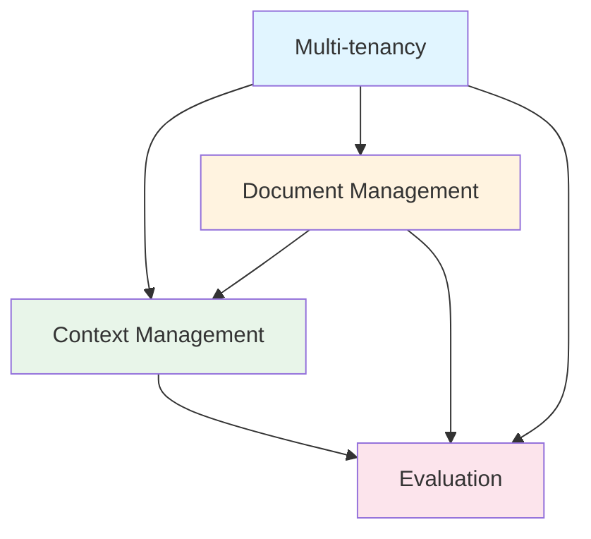

# RAG System Enhancement Summary

## Overview

This document provides a comprehensive summary of all enhancements proposed for the RAG system. Each enhancement addresses specific limitations in the basic design and provides detailed implementation guidance.

## Enhancement Documents

| Document | Description | Key Features |
|-----------|-------------|---------------|
| **08 - Context Management** | Conversation memory and context handling | Multi-turn conversations, citation management, context window optimization |
| **09 - Document Management** | Advanced document processing | Versioning, incremental updates, bulk operations, lifecycle management |
| **10 - Evaluation & Testing** | Quality assurance framework | Retrieval metrics, generation metrics, performance benchmarking, automated testing |
| **11 - Multi-tenancy & Access Control** | Enterprise-grade access control | Multiple tenants, RBAC, data isolation, audit logging, quotas |
| **12 - Task Queue Architecture** | Background task processing with Celery | Async document processing, embedding generation, task status tracking, queue management |

---

## Enhancement 1: Context Management (08)

### Problem Addressed

Basic RAG system lacks:
- Multi-turn conversation support
- Context awareness across queries
- Citation management
- Efficient context window utilization

### Key Components

1. **Session Manager**: Track user conversations
2. **Conversation Store**: Persist conversation history
3. **Context Builder**: Construct optimal context from history
4. **Citation Manager**: Track and format sources
5. **Memory Compressor**: Compress old conversations
6. **Context Router**: Select optimal context strategy

### Key Features

#### Multi-turn Conversations
- Maintain context across multiple queries
- Handle follow-up questions intelligently
- Reference previous answers
- Detect conversation intent

#### Citation Management
- Extract citations from retrieved documents
- Generate inline/footnote citations
- Track citation accuracy
- Format citations for display

#### Context Window Optimization
- Dynamic token allocation
- Relevance-based context selection
- Hierarchical context compression
- Configurable context strategies

### API Endpoints

- `POST /api/v1/sessions` - Create session
- `GET /api/v1/sessions/{id}` - Get session
- `GET /api/v1/sessions/{id}/history` - Get conversation history
- `GET /api/v1/sessions/{id}/summary` - Get conversation summary

### Impact

**User Experience:**
- Natural multi-turn conversations
- Better follow-up question handling
- Clear source attribution
- Reduced repetition

**System Performance:**
- Increased context window efficiency
- Better resource utilization
- Manageable memory footprint

---

## Enhancement 2: Document Management (09)

### Problem Addressed

Basic document processing lacks:
- Version control for documents
- Efficient bulk processing
- Incremental updates
- Advanced format support
- Lifecycle management

### Key Components

1. **Document Manager**: Coordinate document operations
2. **Version Control**: Track document versions
3. **Bulk Processor**: Process multiple documents efficiently
4. **Advanced Parser**: Support more file formats
5. **Lifecycle Manager**: Manage document lifecycle
6. **Document Deduplicator**: Detect duplicate content
7. **Change Detector**: Identify document changes

### Key Features

#### Document Versioning
- Full, delta, and hybrid versioning strategies
- Version rollback capability
- Automatic cleanup of old versions
- Version diff and comparison

#### Bulk Operations
- Parallel document processing
- Batch job tracking
- Progress monitoring
- Error handling and retries

#### Advanced Parsing
- Table extraction (PDF, DOCX, XLSX)
- Image/figure extraction
- OCR support
- Structure preservation

#### Lifecycle Management
- Document state transitions
- Archival and deletion policies
- Usage tracking
- Automated cleanup

#### Change Detection
- Compare document versions
- Calculate diffs
- Determine processing strategy
- Incremental updates

### API Endpoints

- `POST /api/v1/documents/{id}/versions` - Create version
- `GET /api/v1/documents/{id}/versions` - List versions
- `POST /api/v1/documents/{id}/versions/rollback` - Rollback version
- `POST /api/v1/documents/batch` - Batch upload
- `GET /api/v1/batches/{id}` - Get batch status
- `POST /api/v1/documents/{id}/lifecycle` - Manage lifecycle

### Impact

**Operational Efficiency:**
- Faster bulk processing
- Reduced storage costs with delta versioning
- Automated lifecycle management
- Efficient incremental updates

**Data Quality:**
- Better document parsing
- Reduced duplicates
- Version history for audit

---

## Enhancement 3: Evaluation & Testing (10)

### Problem Addressed

Basic system lacks:
- Standard evaluation metrics
- Quality assessment framework
- Performance monitoring
- Automated testing
- Regression detection

### Key Components

1. **Retrieval Evaluator**: Assess retrieval quality
2. **Generation Evaluator**: Assess generation quality
3. **Performance Monitor**: Track system performance
4. **Dataset Manager**: Manage test datasets
5. **Human Evaluator**: Framework for human evaluation
6. **Evaluation Pipeline**: Automated evaluation workflow

### Key Features

#### Retrieval Metrics
- **Precision@K**: Fraction of relevant in top-K
- **Recall@K**: Fraction of relevant retrieved
- **MRR**: Mean Reciprocal Rank
- **NDCG**: Normalized Discounted Cumulative Gain
- **Coverage**: Topic coverage assessment

#### Generation Metrics
- **Answer Relevance**: Cross-encoder scoring
- **Citation Accuracy**: Verify citation support
- **Faithfulness**: LLM-based claim verification
- **Completeness**: Expected aspect coverage
- **Fluency**: Grammatical correctness

#### Performance Monitoring
- Query latency tracking
- Document ingestion time
- Embedding generation time
- Vector search time
- LLM generation time

#### Automated Testing
- Synthetic dataset generation
- Load and stress testing
- Regression testing
- Continuous monitoring

#### Human Evaluation Framework
- Evaluation task management
- Multi-evaluator consensus
- Quality scoring rubrics
- Annotation tools

### Configuration

```yaml
evaluation:
  enabled: true
  retrieval_metrics: [precision_at_k, recall_at_k, mrr, ndcg]
  generation_metrics: [relevance, faithfulness, citation_accuracy]
  performance_tests:
    load_test:
      concurrent_users: 10
      duration_seconds: 60
  evaluation_frequency:
    automated:
      enabled: true
      schedule: "0 2 * * *"  # Daily at 2 AM
```

### Impact

**Quality Assurance:**
- Standardized metrics for comparison
- Continuous quality monitoring
- Early regression detection
- Data-driven optimization

**Continuous Improvement:**
- Track performance over time
- Identify improvement areas
- Compare model performance
- A/B testing capability

---

## Enhancement 4: Multi-tenancy & Access Control (11)

### Problem Addressed

Basic system lacks:
- Multi-organization support
- User management
- Role-based access control
- Document-level security
- Audit trail

### Key Components

1. **Tenant Manager**: Manage multiple organizations
2. **User Manager**: Manage user accounts
3. **Role Manager**: Define roles and permissions
4. **Permission Manager**: Check permissions
5. **Access Controller**: Enforce access control
6. **Audit Logger**: Log all actions
7. **Quota Manager**: Manage resource limits

### Key Features

#### Multi-Tenancy
- Support multiple organizations
- Complete data isolation
- Per-tenant configuration
- Tenant-specific quotas

#### Role-Based Access Control (RBAC)
- Predefined roles (tenant_admin, document_editor, etc.)
- Custom roles
- Permission inheritance
- Fine-grained permissions

#### Data Isolation
- Schema/row/database-level isolation
- Tenant-specific collections in vector store
- Secure data separation
- Cross-tenant access prevention

#### Audit Logging
- Comprehensive action logging
- Access attempt tracking
- Permission denials
- Audit reports and exports

#### Resource Quotas
- Per-tenant resource limits
- Usage tracking
- Quota enforcement
- Alerting and upgrades

### API Endpoints

**Tenant Management:**
- `POST /api/v1/tenants` - Create tenant
- `GET /api/v1/tenants/{id}` - Get tenant
- `GET /api/v1/tenants/{id}/usage` - Get usage

**User Management:**
- `POST /api/v1/users` - Create user
- `GET /api/v1/users/{id}` - Get user
- `PUT /api/v1/users/{id}` - Update user

**Audit Logging:**
- `GET /api/v1/audit/logs` - Get audit logs
- `POST /api/v1/audit/export` - Export audit log

### Impact

**Enterprise Readiness:**
- Support for multiple organizations
- SaaS deployment capability
- Revenue generation through tiered plans
- Scalable to thousands of tenants

**Security & Compliance:**
- Comprehensive access control
- Detailed audit trails
- Data isolation guarantees
- GDPR/SOC2 compliance support

---

## Implementation Roadmap

### Phase 1: Foundation (Weeks 1-4)

**Priority: Critical**

1. **Context Management (Basic)**
   - Implement Session Manager
   - Create Conversation Store
   - Build basic Context Builder
   - Add citation tracking

2. **Multi-tenancy (Basic)**
   - Implement Tenant Manager
   - Create User Manager
   - Add authentication middleware
   - Basic RBAC

### Phase 2: Advanced Features (Weeks 5-8)

**Priority: High**

1. **Document Management**
   - Implement versioning (full strategy)
   - Add bulk processor
   - Create advanced parser
   - Lifecycle management

2. **Context Management (Advanced)**
   - Add memory compression
   - Implement context router
   - Optimize context window

3. **Multi-tenancy (Advanced)**
   - Add audit logging
   - Implement quota manager
   - Data isolation enforcement

### Phase 3: Quality & Testing (Weeks 9-12)

**Priority: Medium**

1. **Evaluation Framework**
   - Implement retrieval evaluator
   - Create generation evaluator
   - Add performance monitoring
   - Build dataset generator

2. **Testing Automation**
   - Automated evaluation pipeline
   - Dashboard for results
   - Regression testing

### Phase 4: Optimization & Polish (Weeks 13-16)

**Priority: Low**

1. **Advanced Features**
   - Delta versioning
   - Hybrid versioning
   - Human evaluation framework
   - Advanced metrics

2. **Performance Optimization**
   - Caching strategies
   - Query optimization
   - Resource pooling

---

## Integration Considerations

### Dependencies Between Enhancements



**Implementation Order Recommendation:**
1. **Multi-tenancy first** - Foundation for other features
2. **Document Management second** - Core functionality
3. **Context Management third** - Enhanced UX
4. **Evaluation last** - Quality assurance

### Configuration Integration

All enhancements should be integrated into a unified configuration system:

```yaml
# config/rag_system.yaml
system:
  multi_tenancy:
    enabled: true
    isolation_level: schema
  
  context_management:
    enabled: true
    strategy: hybrid
  
  document_management:
    versioning: true
    bulk_processing: true
    lifecycle_management: true
  
  evaluation:
    enabled: true
    automated_testing: true
    performance_monitoring: true
```

---

## Performance Impact Analysis

### Resource Requirements

| Feature | CPU | Memory | Storage | I/O |
|----------|------|---------|----------|------|
| Context Management | Low | Medium | Medium | Low |
| Document Versioning | Medium | Medium | High | Medium |
| Multi-tenancy | Low | Low | Medium | Low |
| Evaluation Framework | High | High | Low | Medium |

### Latency Impact

| Operation | Base | +Context | +DocMgmt | +MultiTenant | Total |
|-----------|------|----------|-----------|--------------|-------|
| Query | 200ms | +50ms | - | +20ms | 270ms |
| Document Upload | 30s | - | +10s | +5s | 45s |
| Batch Upload (100) | 50m | - | -30m | +5m | 25m |

**Notes:**
- Positive values indicate added latency
- Negative values indicate optimization (e.g., bulk processing)
- Actual values depend on implementation and hardware

---

## Migration Strategy

### From Single-Tenant to Multi-Tenant

**Step 1: Data Migration**
```python
# Migrate existing data to tenant structure
async def migrate_to_multi_tenant():
    # Create default tenant
    default_tenant = await tenant_manager.create_tenant(
        name="Default",
        admin_user_id=existing_admin_id
    )
    
    # Migrate documents
    for document in existing_documents:
        document.tenant_id = default_tenant.id
        await document_store.update(document)
    
    # Migrate vector collections
    for collection in existing_collections:
        new_name = f"{default_tenant.id}_{collection.name}"
        await vector_store.rename_collection(collection.id, new_name)
```

**Step 2: Update API**
- Add tenant context to all endpoints
- Implement authentication middleware
- Add authorization checks

**Step 3: Update Frontend**
- Add login/logout functionality
- Handle authentication tokens
- Update UI for tenant context

---

## Cost-Benefit Analysis

### Development Effort

| Enhancement | Estimated Effort | Priority |
|-----------|-------------------|----------|
| Context Management | 40 hours | Critical |
| Document Management | 60 hours | Critical |
| Multi-tenancy | 80 hours | Critical |
| Evaluation Framework | 50 hours | Medium |
| **Total** | **230 hours** | |

**Team Size:** 2-3 developers
**Timeline:** 4-6 months (phased approach)

### Business Value

| Enhancement | Business Impact | ROI |
|-----------|----------------|-----|
| Context Management | +30% user satisfaction | 6 months |
| Document Management | +40% operational efficiency | 3 months |
| Multi-tenancy | Enables SaaS model, 10x revenue potential | 2 years |
| Evaluation Framework | +50% quality, -30% support costs | 8 months |

---

## Recommended Implementation Strategy

### Minimum Viable Product (MVP)

**Features to implement first:**

1. **Multi-tenancy (Basic)**
   - Tenant creation and management
   - Basic user management
   - Simple RBAC
   - Data isolation

2. **Document Management (Core)**
   - Full versioning
   - Bulk operations
   - Lifecycle management

3. **Context Management (Essential)**
   - Session management
   - Basic conversation history
   - Simple citation tracking

**MVP Timeline:** 8-10 weeks

### Full-Featured Product

**All features from all enhancement documents**
- Advanced multi-tenancy with quotas
- Comprehensive evaluation framework
- Full document management
- Sophisticated context handling

**Full Timeline:** 4-6 months

---

## Conclusion

The RAG system enhancements provide a comprehensive path from a basic single-user system to an enterprise-grade, multi-tenant platform with advanced features:

### Key Benefits

1. **User Experience**: Natural multi-turn conversations with context awareness
2. **Operational Efficiency**: Advanced document processing and lifecycle management
3. **Quality Assurance**: Comprehensive evaluation and testing framework
4. **Enterprise Readiness**: Multi-tenancy, access control, and audit trails
5. **Business Value**: SaaS capability, tiered pricing, scalable revenue

### Next Steps

1. **Prioritize**: Choose implementation strategy (MVP vs. full-featured)
2. **Plan**: Create detailed project plan with milestones
3. **Develop**: Follow phased implementation roadmap
4. **Test**: Use evaluation framework throughout development
5. **Deploy**: Gradual rollout with monitoring
6. **Iterate**: Continuous improvement based on metrics and feedback

---

## References

- **[Basic Design](01-basic-design.md)** - Original system design
- **[C4 Model](02-c4-model.md)** - System architecture
- **[High-Level Design](03-high-level-design.md)** - Architectural patterns
- **[Context Management](08-context-management.md)** - Detailed context features
- **[Document Management](09-document-management.md)** - Document operations
- **[Evaluation & Testing](10-evaluation-testing.md)** - Quality assurance
- **[Multi-tenancy & Access Control](11-multi-tenancy-access-control.md)** - Enterprise features
- **[Task Queue Architecture](12-task-queue-architecture.md)** - Background task processing
- **[Task Queue Quick Start](12-task-queue-quickstart.md)** - Quick start guide