# C4 Model - RAG System Architecture

## Overview

This document provides a comprehensive C4 model for the RAG system, documenting the architecture from high-level context to detailed component design. The C4 model consists of four levels:

1. **Context Diagram** - System boundaries and external actors
2. **Container Diagram** - Major containers and their interactions
3. **Component Diagram** - Internal components of each container
4. **Code Diagram** - Key classes and their relationships

## 1. Context Diagram

The Context Diagram shows the RAG System in the center and the external actors that interact with it.

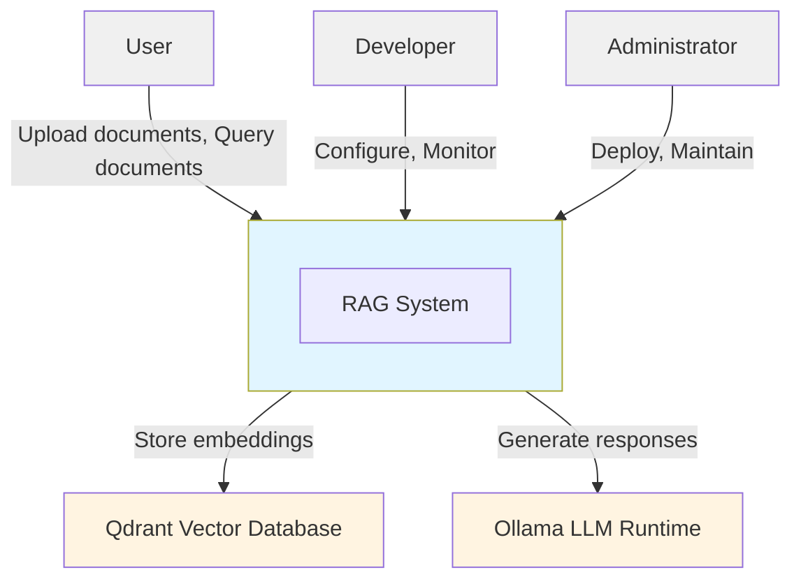

### Actors and Descriptions

| Actor | Type | Description |
|-------|------|-------------|
| **User** | Person | End users who upload documents and query the system via API or UI |
| **Developer** | Person | Developers who configure and monitor the system |
| **Administrator** | Person | DevOps engineers who deploy and maintain the system |
| **Qdrant** | System | Vector database that stores document embeddings |
| **Ollama** | System | Local LLM runtime for generating responses |

### Interactions

- **User → RAG System**: Upload documents, query documents, retrieve responses
- **Developer → RAG System**: Configuration, monitoring, debugging
- **Administrator → RAG System**: Deployment, maintenance, scaling
- **RAG System → Qdrant**: Store and retrieve vector embeddings
- **RAG System → Ollama**: Generate responses using local LLM models

## 2. Container Diagram

The Container Diagram shows the major containers (applications, data stores, etc.) within the RAG System and how they interact.

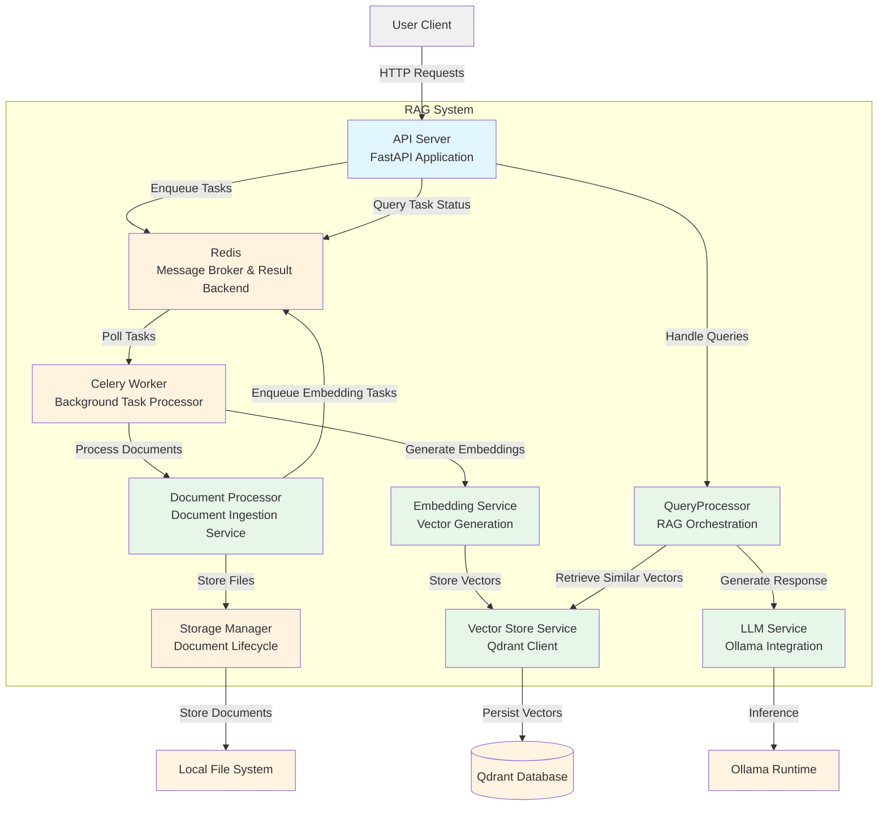

### Containers and Descriptions

| Container | Technology | Responsibilities |
|-----------|------------|------------------|
| **API Server** | FastAPI, Python | REST API endpoints, request validation, authentication, response formatting, task enqueueing |
| **Redis** | Redis 7 | Message broker for task queues, result backend for task status and results |
| **Celery Worker** | Celery 5.3.4 | Background task processor, listens to queues and executes tasks asynchronously |
| **Document Processor** | Python | Parse documents, extract text, chunking, metadata extraction |
| **Embedding Service** | sentence-transformers | Generate vector embeddings for text chunks |
| **Vector Store Service** | qdrant-client | Manage Qdrant operations (CRUD, search, collections) |
| **LLM Service** | Ollama API | Manage local LLM models, generate responses, handle streaming |
| **QueryProcessor** | Python | Orchestrate RAG pipeline: query embedding, retrieval, context construction, response generation |
| **Storage Manager** | Python | Store original documents, manage metadata, track processing status, handle file lifecycle and cleanup |

### Container Interactions

1. **Document Ingestion Flow (with Task Queue):**
   - User uploads document → API Server
   - API Server validates and saves file → Storage Manager
   - API Server enqueues `process_document_task` → Redis (queue: "documents")
   - API Server returns task ID immediately (non-blocking)
   - Celery Worker polls Redis queue → Picks up task
   - Celery Worker executes task → Document Processor
   - Document Processor parses and chunks document
   - Document Processor enqueues `generate_embeddings_task` → Redis (queue: "embeddings")
   - Celery Worker (or another worker) picks up embedding task
   - Celery Worker generates embeddings → Embedding Service
   - Embedding Service stores vectors → Vector Store Service → Qdrant Database
   - Task results and status saved to Redis result backend
   - User can query task status via API → Redis result backend

2. **Query Flow:**
   - User sends query → API Server → QueryProcessor
   - QueryProcessor generates query embedding → Vector Store Service
   - Vector Store Service retrieves similar vectors → QueryProcessor
   - QueryProcessor constructs context → LLM Service
   - LLM Service generates response → QueryProcessor → API Server → User

3. **Document Deletion Flow:**
   - User requests deletion → API Server
   - API Server enqueues deletion task → Task Queue
   - Task Queue deletes file → Storage Manager → Local File System
   - Task Queue deletes vectors → Vector Store Service → Qdrant Database
   - Storage Manager removes metadata

## 3. Component Diagram

### 3.1 API Server Components

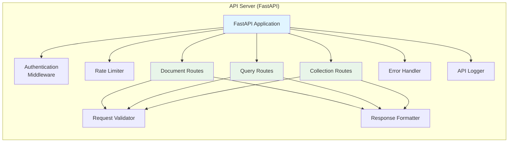

**API Server Components:**

- **FastAPI Application**: Main application entry point
- **Authentication Middleware**: JWT token validation
- **Rate Limiter**: Prevent API abuse
- **Document Routes**: Endpoints for document management
- **Query Routes**: Endpoints for querying the system
- **Collection Routes**: Endpoints for collection management
- **Request Validator**: Pydantic-based validation
- **Response Formatter**: Standardize API responses
- **Error Handler**: Centralized error handling
- **API Logger**: Request/response logging

### 3.2 Document Processor Components

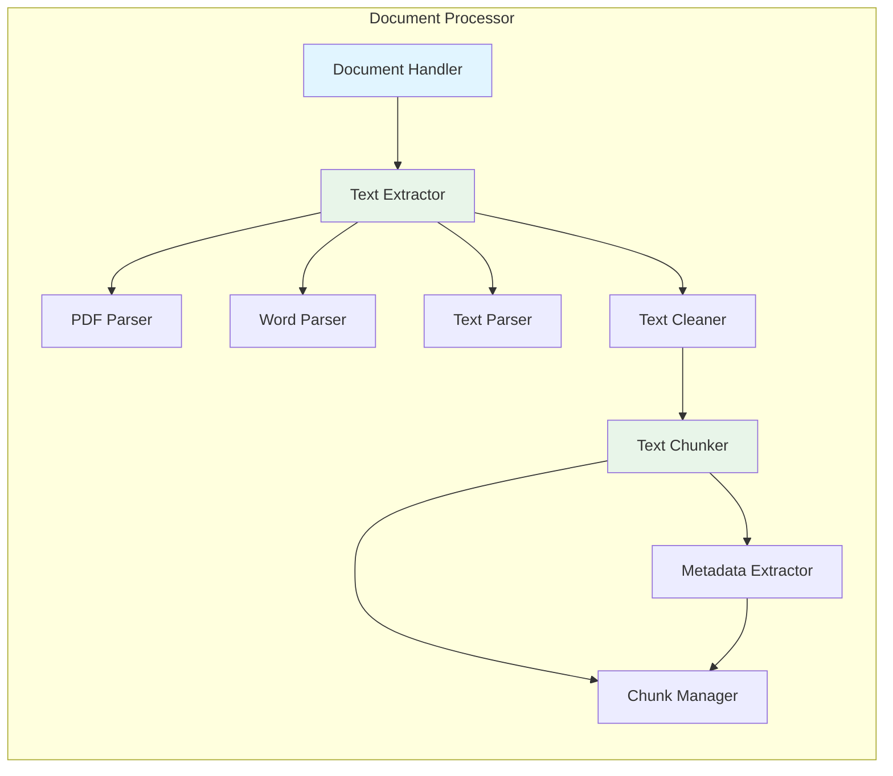

**Document Processor Components:**

- **Document Handler**: Main orchestrator for document processing
- **Text Extractor**: Detects file type and delegates to appropriate parser
- **PDF Parser**: Extracts text from PDF files
- **Word Parser**: Extracts text from DOCX files
- **Text Parser**: Reads plain text and markdown files
- **Text Cleaner**: Normalizes text, removes special characters
- **Text Chunker**: Splits text into manageable chunks
- **Metadata Extractor**: Extracts metadata (title, author, date)
- **Chunk Manager**: Manages chunk lifecycle and storage

### 3.3 Embedding Service Components

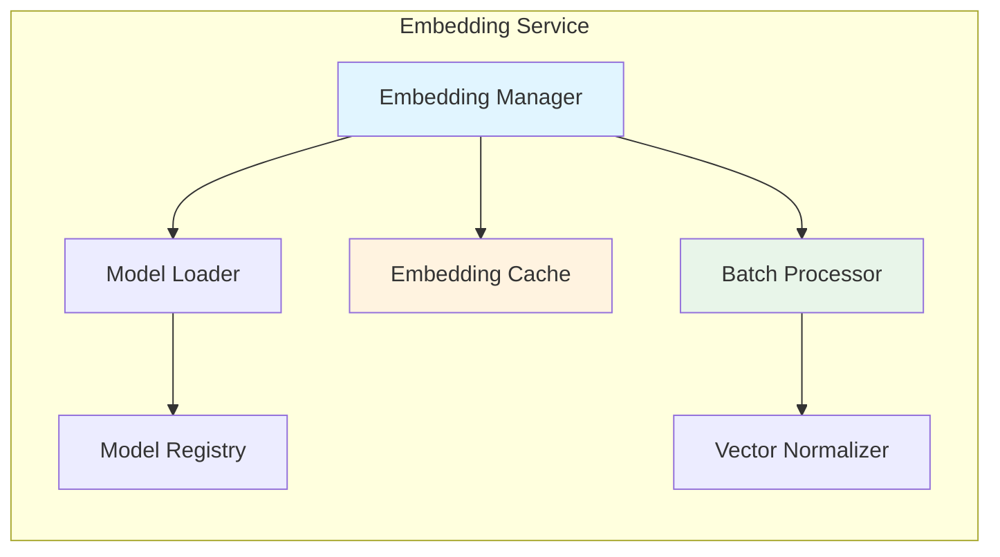

**Embedding Service Components:**

- **Embedding Manager**: Main orchestrator for embedding generation
- **Model Loader**: Loads and manages embedding models
- **Embedding Cache**: Caches embeddings to avoid recomputation
- **Batch Processor**: Processes multiple chunks in batches for efficiency
- **Vector Normalizer**: Normalizes vectors for consistent similarity calculations
- **Model Registry**: Manages available embedding models

### 3.4 Vector Store Service Components

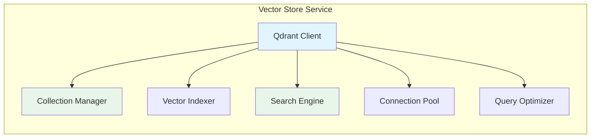

**Vector Store Service Components:**

- **Qdrant Client**: Main interface to Qdrant database
- **Collection Manager**: Creates, deletes, and manages collections (handles all collection-related operations)
- **Vector Indexer**: Indexes vectors for efficient search
- **Search Engine**: Performs similarity searches
- **Connection Pool**: Manages connections to Qdrant
- **Query Optimizer**: Optimizes queries for performance

**Note**: Collection management operations (create, delete, list collections) are handled by the Vector Store Service through the Collection Manager component, not by a separate service.

### 3.5 LLM Service Components

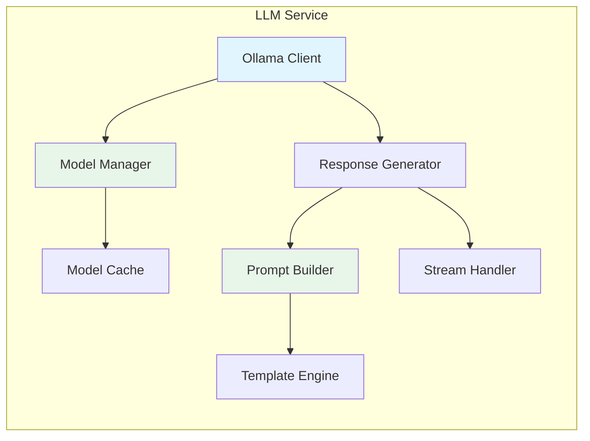

**LLM Service Components:**

- **Ollama Client**: Main interface to Ollama runtime
- **Model Manager**: Manages LLM model loading and unloading
- **Prompt Builder**: Constructs prompts with context and templates
- **Response Generator**: Generates responses using LLM
- **Stream Handler**: Handles streaming responses
- **Model Cache**: Caches loaded models
- **Template Engine**: Manages prompt templates

### 3.6 Query Processor Components

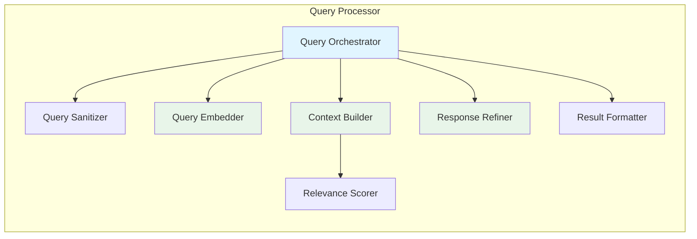

**Query Processor Components:**

- **Query Orchestrator**: Main orchestrator for RAG pipeline
- **Query Embedder**: Generates embeddings for user queries
- **Query Sanitizer**: Cleans and validates user queries
- **Context Builder**: Constructs context from retrieved documents
- **Relevance Scorer**: Scores and ranks retrieved chunks
- **Response Refiner**: Post-processes and refines LLM responses
- **Result Formatter**: Formats final response for API

### 3.7 Storage Manager Components

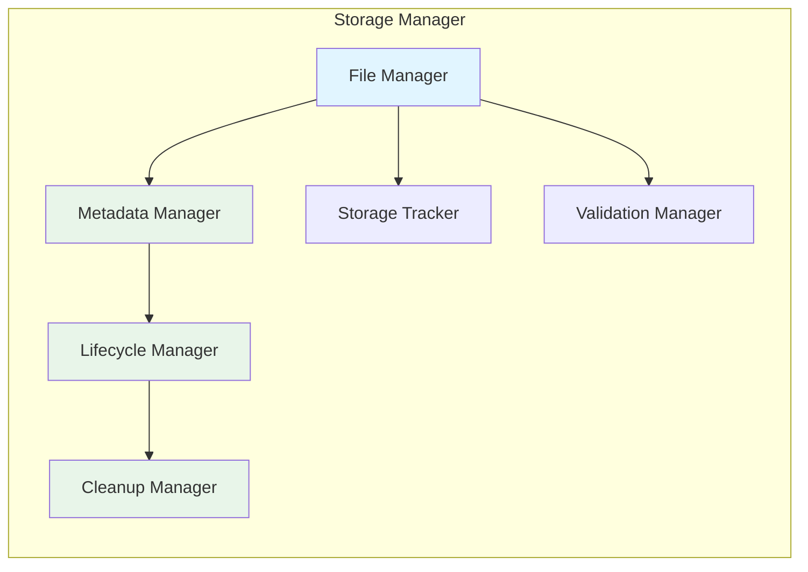

**Storage Manager Components:**

- **File Manager**: Handles file operations (upload, delete, retrieve)
- **Metadata Manager**: Manages document metadata and processing status
- **Lifecycle Manager**: Tracks document lifecycle stages
- **Cleanup Manager**: Implements cleanup policies and scheduled deletions
- **Storage Tracker**: Monitors storage usage and capacity
- **Validation Manager**: Validates file types, sizes, and integrity

### 3.8 Monitoring and Logging Components

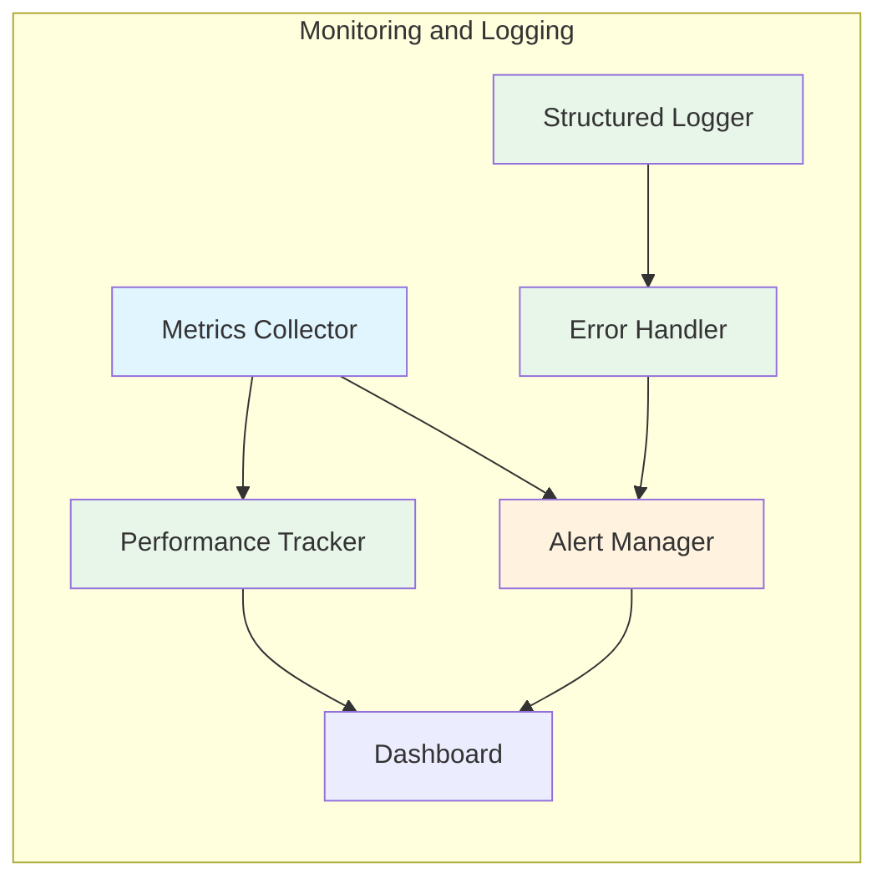

**Monitoring and Logging Components:**

- **Metrics Collector**: Collects application and system metrics
- **Structured Logger**: Centralized logging with structured output
- **Performance Tracker**: Tracks performance metrics (latency, throughput)
- **Error Handler**: Centralized error handling and reporting
- **Alert Manager**: Manages alert rules and notifications
- **Dashboard**: Metrics visualization dashboard (Grafana integration)

## 4. Code Diagram

### 4.1 Core Classes

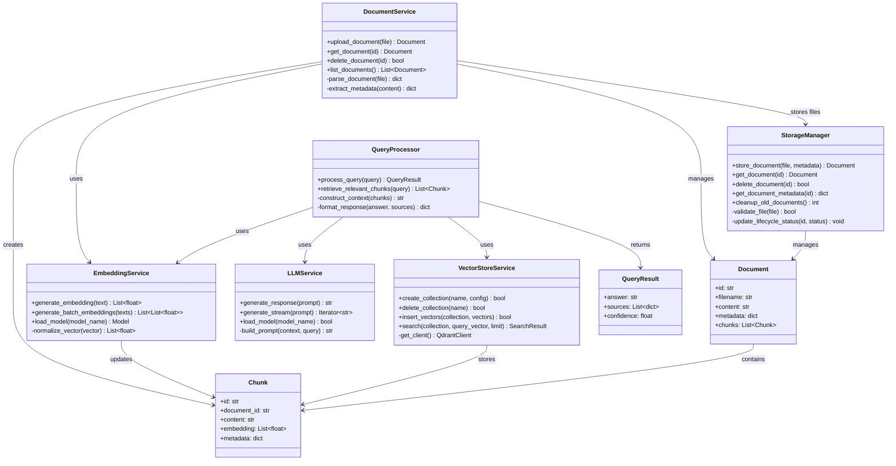

### 4.2 API Route Classes

```mermaid
classDiagram
    class BaseRouter {
        +router: APIRouter
        +setup_routes() None
    }

    class DocumentRouter {
        +router: APIRouter
        +POST /documents upload_document()
        +GET /documents list_documents()
        +GET /documents/{id} get_document()
        +DELETE /documents/{id} delete_document()
    }

    class QueryRouter {
        +router: APIRouter
        +POST /query query_documents()
        +GET /query/history get_query_history()
    }

    class CollectionRouter {
        +router: APIRouter
        +POST /collections create_collection()
        +GET /collections list_collections()
        +DELETE /collections/{name} delete_collection()
    }

    class RequestModel {
        +validate() bool
    }

    class ResponseModel {
        +to_dict() dict
    }

    BaseRouter <|-- DocumentRouter
    BaseRouter <|-- QueryRouter
    BaseRouter <|-- CollectionRouter
    DocumentRouter --> RequestModel : validates
    DocumentRouter --> ResponseModel : returns
    QueryRouter --> RequestModel : validates
    QueryRouter --> ResponseModel : returns
    CollectionRouter --> RequestModel : validates
    CollectionRouter --> ResponseModel : returns
```

### 4.3 Configuration Classes

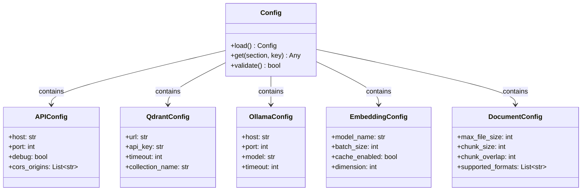

### 4.4 Exception Classes

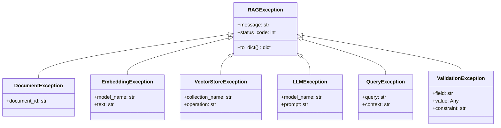

## Component Relationships

### Key Dependencies

1. **API Server** depends on:
   - Document Processor for document management
   - Query Processor for query handling
   - Configuration for settings

2. **Document Processor** depends on:
   - Embedding Service for vector generation
   - File Storage for document storage

3. **Query Processor** depends on:
   - Embedding Service for query embeddings
   - Vector Store Service for retrieval
   - LLM Service for response generation

4. **Embedding Service** depends on:
   - Model Registry for model management
   - Configuration for model settings

5. **Vector Store Service** depends on:
   - Qdrant client library
   - Configuration for connection settings

6. **LLM Service** depends on:
   - Ollama runtime
   - Configuration for model settings

### Data Flow Between Components

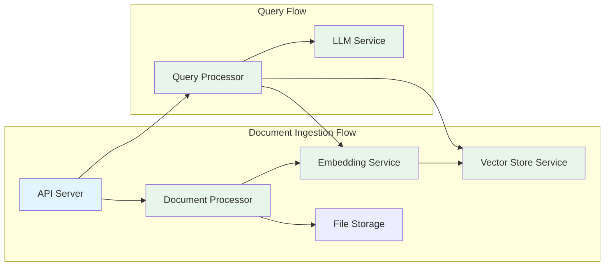

## Summary

The C4 model provides a comprehensive view of the RAG system architecture:

- **Context Level**: Shows external actors and their interactions with the system
- **Container Level**: Breaks down the system into major functional containers
- **Component Level**: Details the internal components of each container
- **Code Level**: Defines the key classes and their relationships

This layered approach enables understanding at different levels of abstraction, from high-level system boundaries to detailed implementation structures.

## Related Documents

- **[Basic Design](01-basic-design.md)** - System overview and components
- **[High-Level Design](03-high-level-design.md)** - Architectural patterns and deployment
- **[Data Flow](04-data-flow.md)** - Detailed data flow diagrams
- **[Sequence Diagrams](05-sequence-diagrams.md)** - Interaction sequences
