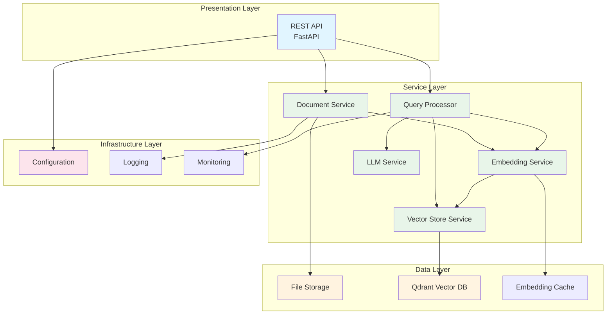
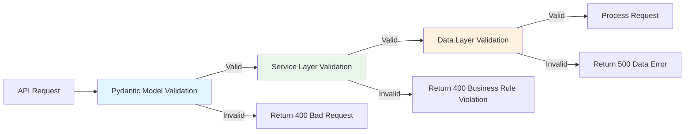
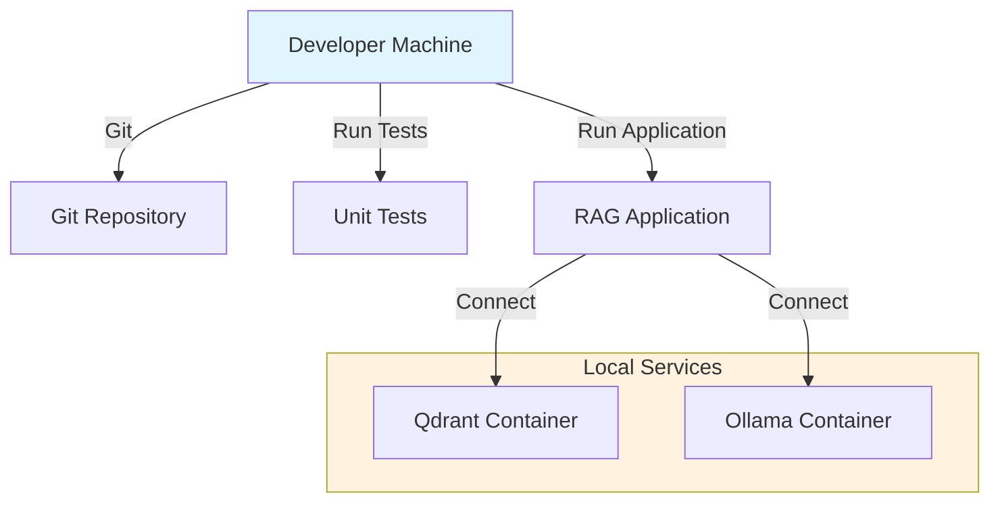
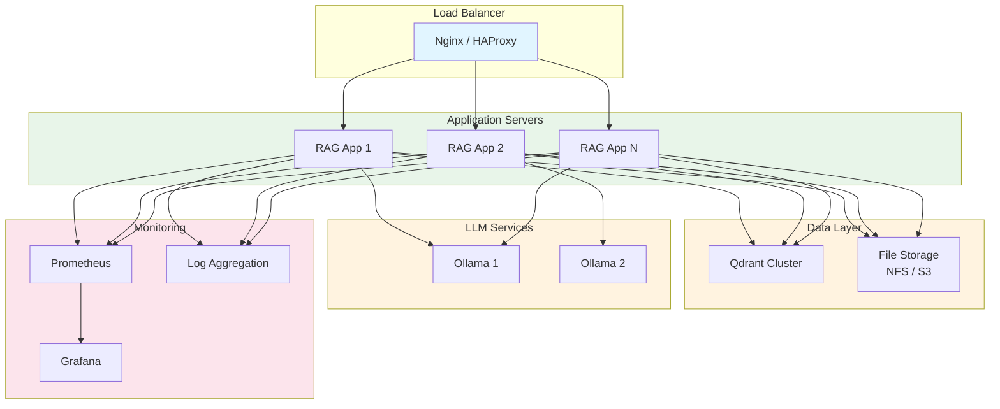
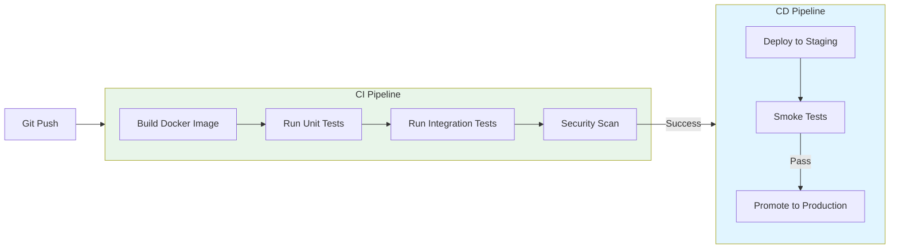
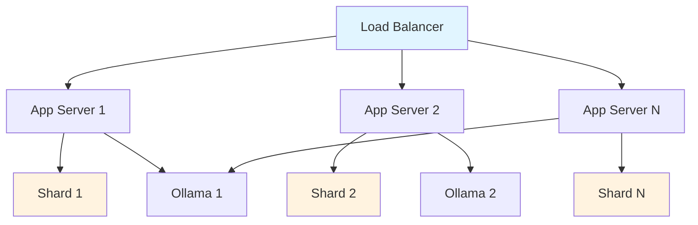
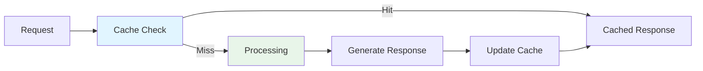
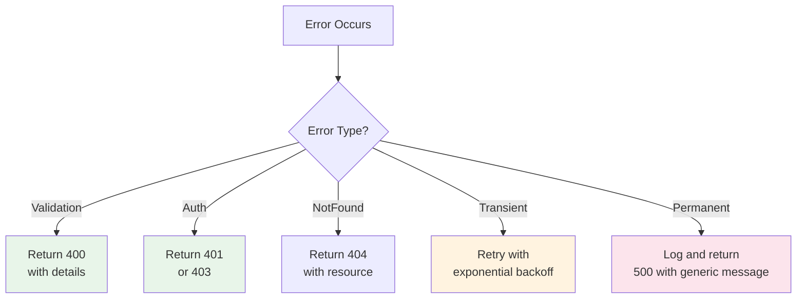

# High-Level Design - RAG System

## Overview

This document describes the high-level architecture, design patterns, deployment strategy, and key architectural decisions for the RAG (Retrieval-Augmented Generation) system.

## Architectural Style

### 1. Layered Architecture

The system follows a classic layered architecture pattern, providing clear separation of concerns and enabling independent evolution of each layer.



**Layer Responsibilities:**

1. **Presentation Layer**: Handles HTTP requests, validation, and response formatting
2. **Service Layer**: Contains business logic and orchestration
3. **Data Layer**: Manages data persistence and retrieval
4. **Infrastructure Layer**: Provides cross-cutting concerns (logging, config, monitoring)

**Layer to Folder Mapping:**

```
Presentation Layer
├── src/api/
│   ├── main.py              # FastAPI application entry point
│   ├── routes/              # API endpoint definitions
│   │   ├── documents.py     # Document management endpoints
│   │   ├── query.py         # Query processing endpoints
│   │   ├── collections.py   # Collection management endpoints
│   │   └── models.py        # Model management endpoints
│   └── models/              # Pydantic request/response models

Service Layer (Business Logic)
├── src/services/            # Core business logic services
│   ├── document_processor.py
│   ├── embedding_service.py
│   ├── vector_store.py
│   ├── llm_service.py
│   ├── query_processor.py
│   └── storage_manager.py
└── src/tasks/               # Background task processing
    ├── celery_app.py
    ├── document_tasks.py
    └── embedding_tasks.py

Data Layer
├── src/core/config.py       # Database/vector store configuration
├── src/utils/cache.py       # Data caching utilities

Infrastructure Layer
├── src/core/
│   ├── config.py            # Application configuration
│   ├── exceptions.py        # Custom exceptions
│   ├── logging.py           # Logging setup
│   └── monitoring.py       # Metrics and monitoring
└── src/utils/
    ├── text_chunker.py      # Text processing utilities
    └── validators.py        # Input validation utilities
```

## Validation Strategy

### Overview

Validation is implemented using a multi-layered approach with centralized validation utilities and Pydantic models for type safety and automatic validation.

### Validation Layers

1. **API Layer Validation (Pydantic Models)**
   - Request/response models using Pydantic for automatic validation
   - Type checking, required fields, and format validation
   - Located in `src/api/models/`

2. **Service Layer Validation (Custom Validators)**
   - Business logic validation (e.g., document size limits, collection names)
   - Centralized validation utilities in `src/utils/validators.py`
   - Reusable validator functions across services

3. **Data Layer Validation**
   - Data integrity checks before storage
   - Vector dimension validation for embeddings
   - Schema validation for Qdrant collections

### Validation Utilities (src/utils/validators.py)

```python
# Common validation functions

def validate_file_type(filename: str, allowed_types: List[str]) -> bool:
    """Validate file type against allowed list"""

def validate_file_size(size: int, max_size: int) -> bool:
    """Validate file size against maximum limit"""

def validate_collection_name(name: str) -> bool:
    """Validate collection name format and restrictions"""

def validate_query_length(query: str, max_length: int) -> bool:
    """Validate query text length"""

def validate_vector_dimension(vector: List[float], expected: int) -> bool:
    """Validate vector dimensions match expected size"""
```

### Validation Flow



### Key Validation Points

- **Document Upload**: File type, size, and format validation
- **Query Processing**: Query length, format, and collection existence
- **Collection Management**: Collection name format, uniqueness
- **Embedding Generation**: Vector dimensions, text length limits
- **Batch Operations**: Batch size limits, item validation

## Design Patterns

### 1. Repository Pattern

Used for data access abstraction, providing a clean separation between business logic and data access.

```python
class VectorStoreRepository:
    def __init__(self, qdrant_client: QdrantClient):
        self.client = qdrant_client

    def save(self, vectors: List[Vector]) -> bool:
        # Implementation
        pass

    def find_similar(self, query_vector: List[float], limit: int) -> List[Vector]:
        # Implementation
        pass
```

### 2. Factory Pattern

Used for creating embedding models and LLM instances.

```python
class EmbeddingModelFactory:
    @staticmethod
    def create(model_name: str) -> EmbeddingModel:
        if model_name == "minilm":
            return MiniLML6V2Model()
        elif model_name == "mpnet":
            return MPNetModel()
        else:
            raise ValueError(f"Unknown model: {model_name}")
```

### 3. Strategy Pattern

Used for different chunking strategies and embedding models.

```python
class ChunkingStrategy:
    def chunk(self, text: str) -> List[str]:
        raise NotImplementedError

class FixedSizeChunking(ChunkingStrategy):
    def chunk(self, text: str) -> List[str]:
        # Fixed-size chunking logic
        pass

class SemanticChunking(ChunkingStrategy):
    def chunk(self, text: str) -> List[str]:
        # Semantic chunking logic
        pass
```

### 4. Builder Pattern

Used for constructing complex prompts for the LLM.

```python
class PromptBuilder:
    def __init__(self):
        self._context = []
        self._query = ""

    def add_context(self, text: str) -> 'PromptBuilder':
        self._context.append(text)
        return self

    def set_query(self, query: str) -> 'PromptBuilder':
        self._query = query
        return self

    def build(self) -> str:
        # Construct final prompt
        pass
```

### 5. Observer Pattern

Used for monitoring and logging events across the system.

```python
class EventObserver:
    def on_event(self, event: Event):
        raise NotImplementedError

class LoggingObserver(EventObserver):
    def on_event(self, event: Event):
        logger.info(f"Event: {event.type}, Data: {event.data}")
```

### 6. Singleton Pattern

Used for managing shared resources like model caches and database connections.

```python
class ModelCache:
    _instance = None

    def __new__(cls):
        if cls._instance is None:
            cls._instance = super().__new__(cls)
            cls._instance._cache = {}
        return cls._instance
```

## System Layers and Boundaries

### Layer 1: API Layer

**Responsibilities:**
- HTTP request handling
- Authentication and authorization
- Request validation
- Response formatting
- Rate limiting

**Boundaries:**
- Exposes only REST endpoints
- No business logic
- Validates all inputs before passing to services

### Layer 2: Application Layer

**Responsibilities:**
- Use case orchestration
- Transaction management
- Business rule enforcement
- Service coordination

**Boundaries:**
- Orchestrates services
- Enforces business rules
- Manages transactions across services

### Layer 3: Domain Layer

**Responsibilities:**
- Domain models
- Business logic
- Domain services
- Specifications

**Boundaries:**
- Pure business logic
- No infrastructure dependencies
- Rich domain models

### Layer 4: Infrastructure Layer

**Responsibilities:**
- Data access
- External service integration
- Configuration management
- Logging and monitoring

**Boundaries:**
- Implements interfaces defined by domain layer
- Handles all external dependencies

## Technology Choices Rationale

### Python

**Why Python:**
- Extensive ecosystem for AI/ML (transformers, langchain, etc.)
- Excellent libraries for NLP (spaCy, NLTK)
- Strong support for async/await (FastAPI)
- Large community and good documentation
- Easy integration with C/C++ libraries (NumPy, PyTorch)

### FastAPI

**Why FastAPI:**
- Native async support
- Automatic API documentation (OpenAPI/Swagger)
- Type hints and Pydantic validation
- High performance (comparable to Node.js and Go)
- Modern and developer-friendly

### Qdrant

**Why Qdrant:**
- Open-source and self-hostable
- Excellent performance
- Rich API (HTTP, gRPC)
- Support for filtering and payload
- Easy deployment (Docker)
- Good Python client library
- Supports multiple distance metrics

### Ollama

**Why Ollama:**
- Runs locally (privacy-focused)
- Easy setup and management
- Support for multiple models (Llama 2, Mistral, etc.)
- Open-source
- Good performance on consumer hardware
- Simple HTTP API

### sentence-transformers

**Why sentence-transformers:**
- State-of-the-art sentence embeddings
- Easy to use
- Support for multiple models
- Good balance of accuracy and speed
- Active development

## Deployment Architecture

### Development Environment



**Setup:**
- Docker Compose for Qdrant and Ollama
- Virtual environment for Python dependencies
- Hot reload for development
- Local testing environment

### Production Deployment



**Deployment Strategy:**

1. **Application Servers**: Multiple instances behind load balancer
2. **Vector Database**: Qdrant cluster with replication
3. **LLM Services**: Dedicated servers with GPU support
4. **File Storage**: Distributed file system or object storage
5. **Monitoring**: Prometheus + Grafana for metrics
6. **Logging**: Centralized log aggregation (ELK or similar)

### Containerization

**Docker Setup:**

```yaml
# docker-compose.yml
version: '3.8'
services:
  rag-app:
    build: .
    ports:
      - "8000:8000"
    depends_on:
      - qdrant
      - ollama
    environment:
      - QDRANT_URL=http://qdrant:6333
      - OLLAMA_URL=http://ollama:11434

  qdrant:
    image: qdrant/qdrant:latest
    ports:
      - "6333:6333"
    volumes:
      - qdrant_data:/qdrant/storage

  ollama:
    image: ollama/ollama:latest
    ports:
      - "11434:11434"
    volumes:
      - ollama_data:/root/.ollama

volumes:
  qdrant_data:
  ollama_data:
```

### CI/CD Pipeline



## Security Considerations

### Authentication and Authorization

1. **JWT Tokens** for API authentication
2. **Role-Based Access Control (RBAC)** for document access
3. **API Key** management for external integrations

### Data Security

1. **Encryption at Rest** for sensitive documents
2. **TLS/SSL** for data in transit
3. **Input Validation** to prevent injection attacks
4. **Rate Limiting** to prevent abuse
5. **File Type Validation** to prevent malicious uploads

### Privacy

1. **Local Processing** - No data sent to external APIs
2. **Data Minimization** - Store only necessary data
3. **User Consent** - Clear data usage policies
4. **Data Retention** - Configurable retention policies

### Audit Logging

1. **Document Access Logs** - Track who accessed what
2. **Query Logs** - Track all queries (optionally)
3. **Admin Actions** - Log all administrative actions
4. **Security Events** - Log authentication failures, suspicious activity

## Scalability and Performance

### Scalability Strategies

#### 1. Horizontal Scaling

- **Application Servers**: Add more instances behind load balancer
- **Qdrant**: Use sharding and replication
- **Ollama**: Distribute models across multiple servers



#### 2. Caching

- **Embedding Cache**: Cache frequently used embeddings
- **Response Cache**: Cache common queries (with TTL)
- **Model Cache**: Keep loaded models in memory



#### 3. Async Processing

- **Background Tasks**: Document ingestion, embedding generation
- **Task Queues**: Use Celery or similar for job queue
- **Streaming Responses**: Stream LLM responses to users

### Performance Optimization

#### 1. Vector Search Optimization

- **Index Optimization**: Use appropriate indexing strategies
- **Batch Processing**: Process multiple embeddings at once
- **Query Optimization**: Optimize similarity search parameters
- **Filtering**: Use Qdrant's filtering capabilities

#### 2. Embedding Generation Optimization

- **Batch Processing**: Generate embeddings in batches
- **Model Selection**: Use appropriate model size for use case
- **Caching**: Cache embeddings for repeated text
- **GPU Acceleration**: Use GPU if available

#### 3. LLM Optimization

- **Model Selection**: Choose appropriate model size
- **Quantization**: Use quantized models for faster inference
- **Batch Processing**: Process multiple requests together
- **Context Limiting**: Optimize context window usage

### Performance Targets

| Metric | Target |
|--------|--------|
| API Response Time | < 200ms (p95) |
| Document Ingestion | 1-5 MB/second |
| Query Processing | < 3 seconds |
| Embedding Generation | 1000 chunks/minute |
| Vector Search | < 100ms |
| LLM Generation | 50-100 tokens/second |

### Monitoring Metrics

#### Application Metrics

- Request rate and latency
- Error rates by endpoint
- Document ingestion throughput
- Query processing time
- Cache hit rates

#### Database Metrics

- Qdrant query latency
- Index size and growth
- Memory usage
- Disk I/O

#### LLM Metrics

- Model loading time
- Inference time per token
- Memory usage
- Request queue length

#### System Metrics

- CPU usage
- Memory usage
- Disk usage
- Network I/O

## Error Handling Strategy

### Error Categories

1. **Client Errors (4xx)**:
   - Invalid input
   - Authentication failure
   - Rate limit exceeded
   - File too large

2. **Server Errors (5xx)**:
   - Database connection failure
   - LLM service unavailable
   - Internal processing errors
   - Timeout errors

### Error Handling Approach



### Retry Strategy

- **Transient Errors**: Retry with exponential backoff
- **Max Retries**: 3-5 attempts
- **Backoff Strategy**: 1s, 2s, 4s, 8s, 16s
- **Timeout**: 30 seconds per request

## Future Extensibility

### Planned Enhancements

1. **Multi-Modal Support**: Images, audio, video
2. **Advanced Chunking**: Semantic chunking, adaptive chunking
3. **Hybrid Search**: Combine vector search with keyword search
4. **Reranking**: Improve relevance with reranking models
5. **Chat History**: Support conversational queries
6. **Multi-Language**: Support for multiple languages
7. **Fine-tuning**: Fine-tune models on domain-specific data
8. **Real-time Updates**: Incremental document updates

### Plugin Architecture

Design for extensibility with plugins:

```python
class Plugin:
    name: str
    version: str

    def initialize(self, config: Config):
        pass

    def process(self, data: Any) -> Any:
        pass

class ChunkingPlugin(Plugin):
    def chunk(self, text: str) -> List[str]:
        pass

class RerankingPlugin(Plugin):
    def rerank(self, results: List[Result]) -> List[Result]:
        pass
```

## Summary

The high-level design provides a solid foundation for building a scalable, maintainable, and extensible RAG system. Key architectural decisions include:

- **Layered Architecture** for clear separation of concerns
- **Modular Monolith** for simplicity with future microservice potential
- **Design Patterns** for maintainable and extensible code
- **Local Processing** for privacy and cost-effectiveness
- **Horizontal Scalability** for growing demands
- **Comprehensive Monitoring** for operational excellence

The system is designed to evolve with changing requirements while maintaining stability and performance.

## Related Documents

- **[Basic Design](01-basic-design.md)** - System overview and components
- **[C4 Model](02-c4-model.md)** - Architectural diagrams
- **[Data Flow](04-data-flow.md)** - Detailed data flow diagrams
- **[Sequence Diagrams](05-sequence-diagrams.md)** - Interaction sequences
