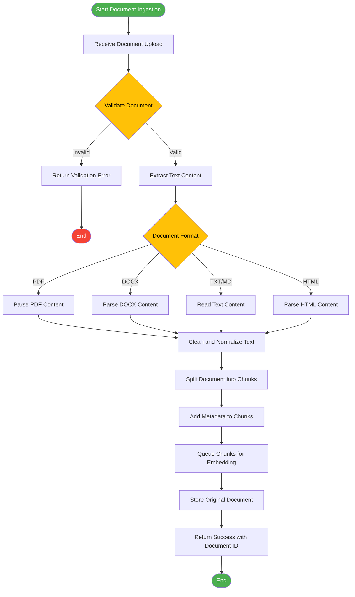
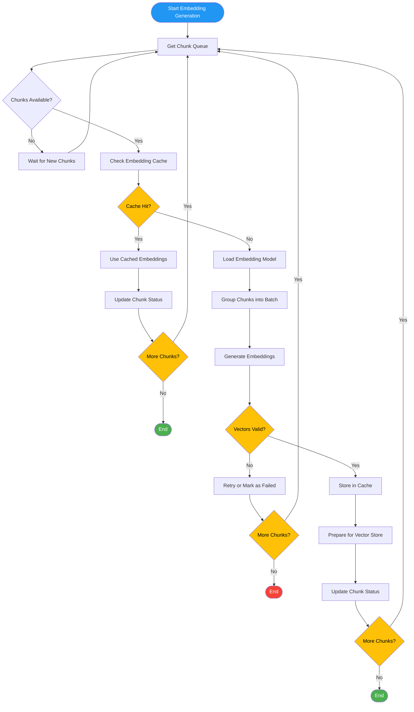
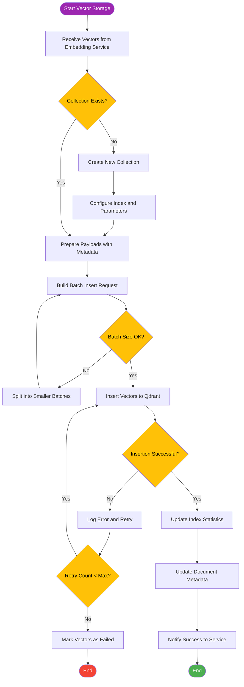
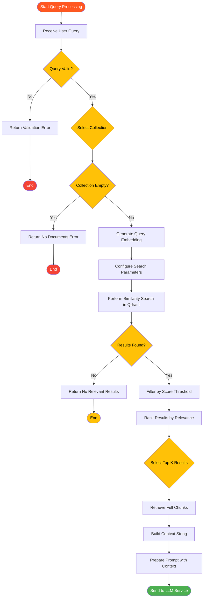
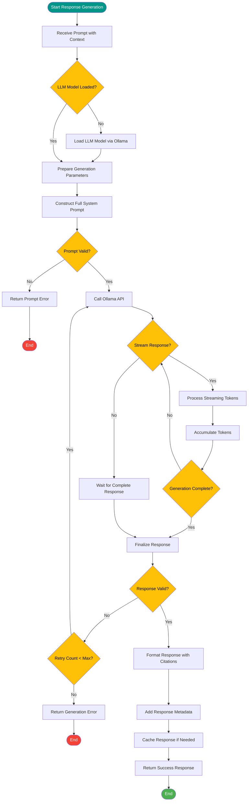
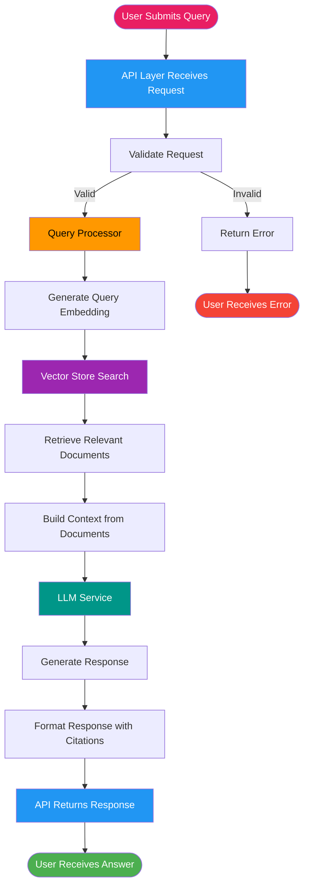
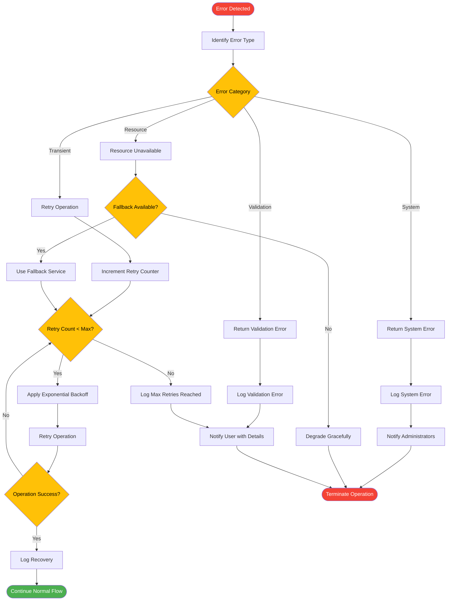

# Data Flow - RAG System

## Overview

This document provides detailed data flow diagrams showing how data moves through the RAG system during key operations. Each flowchart illustrates the step-by-step process of document ingestion, embedding generation, vector storage, query processing, and response generation.

## 1. Document Ingestion Flow

### Flow Description

The document ingestion flow handles the process of uploading and processing documents into the system. This includes file validation, text extraction, chunking, and preparing documents for embedding generation.

### Flowchart



### Data Transformation

**Input:**
- Document file (binary data)
- File metadata (name, size, type)

**Transformations:**
1. Binary → Text extraction
2. Text → Normalized text (whitespace, encoding)
3. Normalized text → Chunks (500-1000 tokens)
4. Chunks → Chunks with metadata

**Output:**
- Stored document record
- Queue of text chunks for embedding
- Document ID for tracking

---

## 2. Embedding Generation Flow

### Flow Description

The embedding generation flow converts text chunks into vector embeddings using the embedding service. This process includes batch processing, caching, and error handling.

### Flowchart



### Data Transformation

**Input:**
- Text chunks with metadata
- Chunk identifiers

**Transformations:**
1. Text → Embedding vector (384 or 768 dimensions)
2. Batch chunks → Batch vectors
3. Vectors → Normalized vectors (if required)

**Output:**
- Vector embeddings for each chunk
- Cache entries (if not already present)
- Updated chunk processing status

---

## 3. Vector Storage Flow

### Flow Description

The vector storage flow manages storing and indexing embeddings in Qdrant. This includes collection management, vector insertion, and indexing optimization.

### Flowchart



### Data Transformation

**Input:**
- Vector embeddings
- Chunk metadata
- Document ID

**Transformations:**
1. Vectors + metadata → Qdrant point structure
2. Multiple points → Batch insert request
3. Batch → Stored vectors with indexes

**Output:**
- Stored vector points in Qdrant
- Updated collection statistics
- Confirmation of successful storage

---

## 4. Query Processing Flow

### Flow Description

The query processing flow handles user queries by generating embeddings, performing similarity search, retrieving relevant documents, and preparing context for the LLM.

### Flowchart



### Data Transformation

**Input:**
- User query (text string)
- Collection ID (optional)

**Transformations:**
1. Query → Query embedding
2. Query embedding → Similarity search results
3. Search results → Filtered and ranked results
4. Top-K results → Context string
5. Context + query → Prompt for LLM

**Output:**
- Relevant document chunks
- Context string
- Prepared prompt for LLM

---

## 5. Response Generation Flow

### Flow Description

The response generation flow uses the LLM to generate context-aware answers based on the retrieved documents. This includes prompt construction, model inference, and response formatting.

### Flowchart



### Data Transformation

**Input:**
- Prompt with context
- Query
- Generation parameters (temperature, max_tokens, etc.)

**Transformations:**
1. Prompt + parameters → LLM inference request
2. LLM response → Raw text
3. Raw text → Formatted response
4. Formatted response → Response with metadata and citations

**Output:**
- Generated answer
- Source citations
- Response metadata (model used, tokens generated, etc.)

---

## 6. End-to-End RAG Flow

### Flow Description

This flowchart shows the complete RAG pipeline from user query to final response, integrating all the individual flows.

### Flowchart



### Key Data Transitions

1. **User Query** → Text string
2. **Query** → Embedding vector (384/768 dim)
3. **Embedding** → Similarity search results (score + document IDs)
4. **Results** → Document chunks (text + metadata)
5. **Chunks** → Context string
6. **Context + Query** → Prompt
7. **Prompt** → LLM response
8. **Response** → Formatted answer with citations

---

## 7. Error Handling Flow

### Flow Description

This flowchart shows how errors are handled throughout the system, including retry logic, fallback mechanisms, and error reporting.

### Flowchart



### Error Categories

1. **Transient Errors:** Network timeouts, temporary service unavailability
   - Strategy: Retry with exponential backoff
   
2. **Validation Errors:** Invalid input, malformed requests
   - Strategy: Return immediate error to user
   
3. **System Errors:** Service crashes, out of memory
   - Strategy: Log and notify administrators
   
4. **Resource Errors:** Database connection issues, model loading failures
   - Strategy: Use fallback or graceful degradation

---

## Data Flow Summary

### Primary Data Streams

| Flow | Input | Processing | Output |
|------|-------|------------|--------|
| Document Ingestion | File (binary) | Extract → Clean → Chunk → Add Metadata | Text chunks + Document ID |
| Embedding Generation | Text chunks | Cache check → Model inference → Batch process | Vector embeddings |
| Vector Storage | Vectors + Metadata | Prepare → Batch insert → Index | Stored vectors in Qdrant |
| Query Processing | Query text | Embed → Search → Filter → Rank | Relevant document chunks |
| Response Generation | Context + Query | Construct prompt → LLM inference → Format | Formatted answer + citations |

### Key Data Structures

**Document Chunk:**
```python
{
  "id": str,
  "text": str,
  "metadata": {
    "document_id": str,
    "page_number": int,
    "chunk_index": int,
    "source": str
  }
}
```

**Vector Point:**
```python
{
  "id": str,
  "vector": List[float],  # 384 or 768 dimensions
  "payload": {
    "text": str,
    "document_id": str,
    "metadata": dict
  }
}
```

**Search Result:**
```python
{
  "id": str,
  "score": float,
  "payload": {
    "text": str,
    "document_id": str,
    "metadata": dict
  }
}
```

**Response:**
```python
{
  "answer": str,
  "citations": List[dict],
  "sources": List[str],
  "metadata": {
    "model": str,
    "tokens_used": int,
    "retrieved_docs": int
  }
}
```

## Related Documents

- **[Basic Design](01-basic-design.md)** - System components and architecture
- **[C4 Model](02-c4-model.md)** - System architecture diagrams
- **[High-Level Design](03-high-level-design.md)** - Design patterns and deployment
- **[Sequence Diagrams](05-sequence-diagrams.md)** - Component interaction sequences
- **[Genomics/Bioinformatics Use Case](06-genomics-bioinformatics-use-case.md)** - Application to genomics and biomedical research
