```mermaid
sequenceDiagram
    autonumber
    participant User
    participant API
    participant BatchProcessor
    participant DocProcessor
    participant EmbeddingService
    participant VectorStore
    participant Queue
    
    User->>API: POST /api/v1/documents/batch<br/>(files[], config)
    API->>API: Validate batch request
    API->>API: Generate batch ID
    
    API->>BatchProcessor: Start batch processing
    activate BatchProcessor
    
    BatchProcessor->>Queue: Create job queue
    Queue-->>BatchProcessor: Queue created
    
    API-->>User: 202 Accepted<br/>(batch_id, status)
    
    loop For each document in batch
        BatchProcessor->>DocProcessor: Process document
        activate DocProcessor
        DocProcessor->>DocProcessor: Extract and chunk
        DocProcessor-->>BatchProcessor: Chunks ready
        deactivate DocProcessor
        
        BatchProcessor->>Queue: Enqueue chunks
        Queue-->>BatchProcessor: Queued
        
        BatchProcessor->>BatchProcessor: Update progress
    end
    
    alt Batch embeddings
        BatchProcessor->>EmbeddingService: Process batch chunks
        activate EmbeddingService
        EmbeddingService->>EmbeddingService: Generate embeddings
        EmbeddingService-->>BatchProcessor: Batch embeddings
        deactivate EmbeddingService
        
        BatchProcessor->>VectorStore: Store batch vectors
        activate VectorStore
        VectorStore-->>BatchProcessor: Stored
        deactivate VectorStore
    end
    
    BatchProcessor->>BatchProcessor: Finalize batch
    BatchProcessor->>Queue: Cleanup queue
    Queue-->>BatchProcessor: Cleanup done
    
    Note over User,Queue: Check Batch Status
    
    User->>API: GET /api/v1/batches/{id}
    API->>BatchProcessor: Get batch status
    BatchProcessor-->>API: Status details
    API-->>User: 200 OK<br/>(status, progress, results)
```

# Sequence Diagrams - RAG System

## Overview

This document provides sequence diagrams showing the key interactions and workflows between components in the RAG system. Each diagram illustrates the chronological flow of messages and operations between services during critical operations.

## 1. Document Upload and Indexing Sequence

### Description

Shows the complete sequence of interactions when a user uploads a document for indexing, including document processing, embedding generation, and vector storage.

### Sequence Diagram


### Key Interactions

1. **File Storage**: Original document is stored before processing
2. **Chunking**: Document is split into manageable chunks (500-1000 tokens)
3. **Batch Processing**: Embeddings are generated in batches for efficiency
4. **Caching**: Embeddings are cached to avoid recomputation
5. **Async Operations**: Document processing and embedding generation can be async

---

## 2. User Query Processing Sequence

### Description

Shows the sequence of interactions when a user submits a query, from receiving the request to returning the generated response.

### Sequence Diagram


### Key Interactions

1. **Query Embedding**: Real-time embedding generation for the user query
2. **Similarity Search**: Vector search to find relevant documents
3. **Context Building**: Retrieved chunks are assembled into a context string
4. **Response Generation**: LLM generates answer based on context
5. **Streaming Support**: Optional streaming of tokens for real-time responses

---

## 3. RAG Retrieval and Generation Sequence

### Description

Shows detailed interactions for the RAG retrieval and generation process, including context construction and prompt engineering.

### Sequence Diagram

```mermaid
sequenceDiagram
    autonumber
    participant QueryProcessor
    participant VectorStore
    participant ContextBuilder
    participant LLMService
    participant PromptEngine
    
    QueryProcessor->>QueryProcessor: Receive query embedding
    
    QueryProcessor->>VectorStore: Execute similarity search
    activate VectorStore
    VectorStore->>VectorStore: Calculate cosine similarity
    VectorStore->>VectorStore: Apply filters (score, metadata)
    VectorStore->>VectorStore: Sort by relevance
    VectorStore-->>QueryProcessor: Ranked search results
    deactivate VectorStore
    
    QueryProcessor->>ContextBuilder: Build context from results
    activate ContextBuilder
    
    loop For each retrieved document
        ContextBuilder->>ContextBuilder: Extract text
        ContextBuilder->>ContextBuilder: Format with metadata
        ContextBuilder->>ContextBuilder: Add to context buffer
    end
    
    ContextBuilder->>ContextBuilder: Check context length
    alt Context too long
        ContextBuilder->>ContextBuilder: Truncate or summarize
    end
    
    ContextBuilder-->>QueryProcessor: Constructed context
    deactivate ContextBuilder
    
    QueryProcessor->>PromptEngine: Prepare prompt
    activate PromptEngine
    
    PromptEngine->>PromptEngine: Load system template
    PromptEngine->>PromptEngine: Insert context
    PromptEngine->>PromptEngine: Insert user query
    PromptEngine->>PromptEngine: Add instructions
    PromptEngine->>PromptEngine: Validate prompt length
    
    PromptEngine-->>QueryProcessor: Final prompt
    deactivate PromptEngine
    
    QueryProcessor->>LLMService: Generate response
    activate LLMService
    
    LLMService->>LLMService: Prepare generation parameters
    LLMService->>LLMService: Call LLM model
    
    alt Streaming mode
        loop Token generation
            LLMService-->>QueryProcessor: Stream token
        end
    else Standard mode
        LLMService->>LLMService: Wait for complete response
        LLMService->>LLMService: Post-process response
        LLMService-->>QueryProcessor: Full response
    end
    
    LLMService->>LLMService: Extract citations
    LLMService->>LLMService: Format output
    LLMService-->>QueryProcessor: Final answer
    deactivate LLMService
    
    QueryProcessor->>QueryProcessor: Validate answer quality
    QueryProcessor-->>: Return response to API
```

### Key Interactions

1. **Retrieval**: Similarity search with filtering and ranking
2. **Context Building**: Construction of context from retrieved documents
3. **Prompt Engineering**: Template-based prompt construction with context injection
4. **Generation**: LLM inference with configured parameters
5. **Post-Processing**: Citation extraction and response formatting

---

## 4. Error Handling Sequence

### Description

Shows how errors are handled and propagated through the system, including retry logic and fallback mechanisms.

### Sequence Diagram


### Key Interactions

1. **Error Identification**: Classification of error types
2. **Retry Logic**: Exponential backoff for transient errors
3. **Logging**: Detailed error logging for debugging
4. **Monitoring**: Error metrics and alerts
5. **Fallbacks**: Alternative methods when primary fails

---

## 5. Collection Management Sequence

### Description

Shows interactions for creating, updating, and managing document collections in the vector store.

### Sequence Diagram


### Key Interactions

1. **Validation**: Name and configuration validation before creation
2. **Existence Check**: Verification of collection existence
3. **Configuration**: Setup of vector dimensions, distance metrics, and indexes
4. **Metadata Storage**: Tracking of collection metadata
5. **Cleanup**: Proper cleanup when deleting collections

---

## 6. Document Deletion Sequence

### Description

Shows the sequence for deleting a document and its associated vectors from the system.

### Sequence Diagram

```mermaid
sequenceDiagram
    autonumber
    participant User
    participant API
    participant DocumentService
    participant VectorStore
    participant Storage
    
    User->>API: DELETE /api/v1/documents/{id}
    API->>API: Validate document ID
    
    API->>DocumentService: Delete document
    activate DocumentService
    
    DocumentService->>DocumentService: Fetch document metadata
    DocumentService->>VectorStore: Delete document vectors
    activate VectorStore

    VectorStore->>VectorStore: Identify vector points
    VectorStore->>VectorStore: Query by document ID
    VectorStore->>VectorStore: Prepare delete batch
    VectorStore->>VectorStore: Execute deletion
    VectorStore-->>DocumentService: Vectors deleted
    deactivate VectorStore

    DocumentService->>Storage: Delete original file
    activate Storage
    Storage->>Storage: Remove file from disk
    Storage->>Storage: Clean up thumbnails

    alt File deletion succeeds
        Storage-->>DocumentService: File deleted
        deactivate Storage
        DocumentService->>DocumentService: Mark document as deleted
    else File deletion fails
        Storage-->>DocumentService: Deletion failed
        deactivate Storage
        DocumentService->>DocumentService: Log inconsistency
        DocumentService->>VectorStore: Revert vector deletion
        VectorStore-->>DocumentService: Vectors restored
        DocumentService-->>API: 500 Internal Server Error<br/>(partial deletion)
    end

    deactivate Storage
    
    DocumentService->>DocumentService: Remove from index
    DocumentService->>DocumentService: Update statistics
    DocumentService-->>API: Document deleted
    deactivate DocumentService
    
    API-->>User: 204 No Content
    
    Note over User,Storage: Bulk Delete Flow
    
    User->>API: DELETE /api/v1/documents<br/>(filter criteria)
    API->>DocumentService: Delete documents by filter
    activate DocumentService
    
    loop For each matching document
        DocumentService->>VectorStore: Delete vectors
        DocumentService->>Storage: Delete file
    end
    
    DocumentService->>DocumentService: Update collection stats
    DocumentService-->>API: Bulk delete complete
    deactivate DocumentService
    
    API-->>User: 200 OK<br/>(deleted_count)
```

### Key Interactions

1. **Metadata Lookup**: Fetch document information before deletion
2. **Vector Deletion**: Remove all associated vectors from Qdrant
3. **File Cleanup**: Delete original file from storage
4. **Statistics Update**: Update collection and system statistics
5. **Bulk Operations**: Support for deleting multiple documents

---

## 7. Model Management Sequence

### Description

Shows interactions for managing embedding and LLM models, including loading, switching, and caching.

### Sequence Diagram


### Key Interactions

1. **Model Loading**: Download and load models into memory
2. **Warm-up**: Pre-load models to avoid cold start latency
3. **Caching**: Cache loaded models for fast access
4. **Switching**: Seamlessly switch between models
5. **Validation**: Verify model compatibility and availability

---

## 8. Batch Processing Sequence

### Description

Shows how batch document processing works for efficiently handling multiple documents.

### Sequence Diagram



### Key Interactions

1. **Queue Management**: Job queue for tracking batch progress
2. **Parallel Processing**: Process multiple documents concurrently
3. **Progress Tracking**: Real-time status updates
4. **Batch Embeddings**: Process all chunks in a single batch
5. **Cleanup**: Remove temporary resources after completion

---

## Interaction Patterns Summary

### Common Patterns

1. **Request-Response**: Standard synchronous communication
2. **Async Processing**: Background tasks for long operations
3. **Error Propagation**: Errors bubble up with context
4. **Retry Logic**: Transient errors handled with retries
5. **Caching**: Frequently accessed data cached for performance

### Component Communication

| From | To | Interaction Type | Purpose |
|------|-----|------------------|---------|
| API | Services | Synchronous | Request processing |
| Services | Vector Store | Synchronous | Vector operations |
| Services | LLM Service | Async/Streaming | Generation |
| Services | Storage | Synchronous | File operations |
| All | Logger | Synchronous | Error logging |
| All | Monitoring | Synchronous | Metrics reporting |

### Data Flow Patterns

1. **Ingestion Flow**: User → API → DocProcessor → EmbeddingService → VectorStore
2. **Query Flow**: User → API → QueryProcessor → EmbeddingService → VectorStore → LLMService
3. **Management Flow**: Admin → API → ModelManager → Specific Services
4. **Batch Flow**: User → API → BatchProcessor → Multiple Services (parallel)

## Related Documents

- **[Basic Design](01-basic-design.md)** - System components and their responsibilities
- **[C4 Model](02-c4-model.md)** - System architecture and component relationships
- **[High-Level Design](03-high-level-design.md)** - Design patterns and deployment
- **[Data Flow](04-data-flow.md)** - Detailed data flow diagrams
- **[Genomics/Bioinformatics Use Case](06-genomics-bioinformatics-use-case.md)** - Application to genomics and biomedical research
