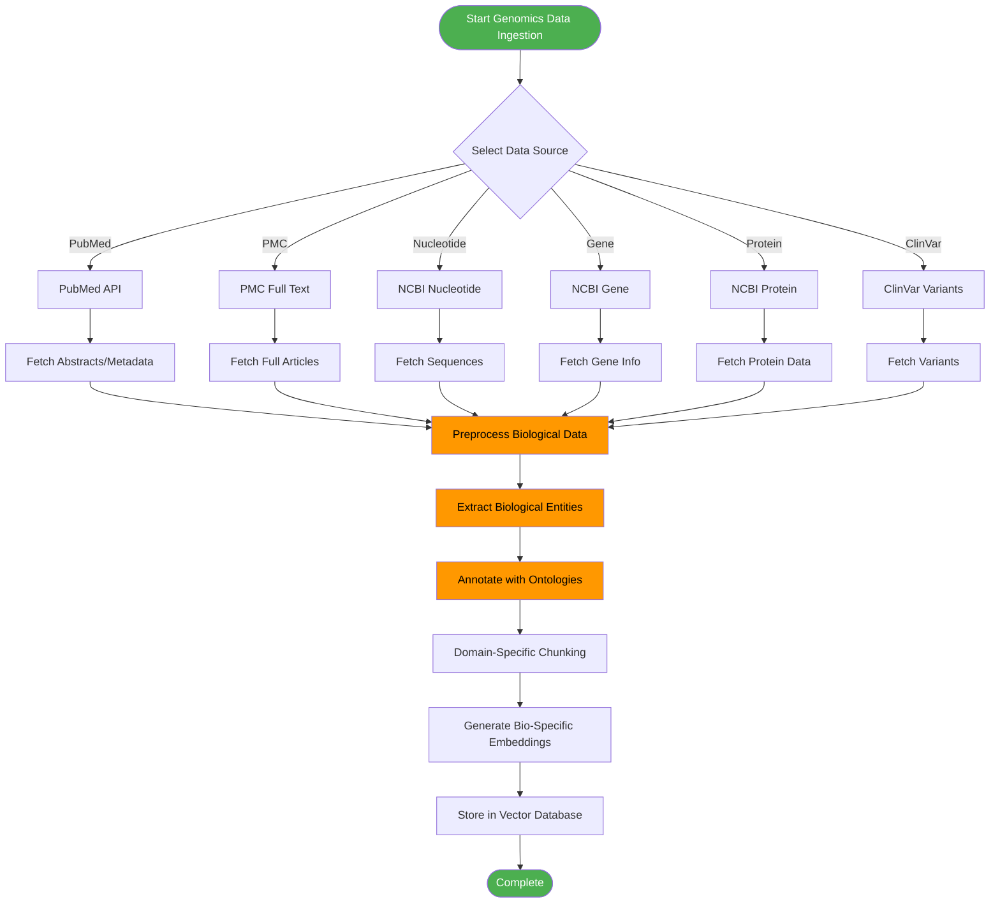

# Genomics/Bioinformatics Use Case - RAG System

## Overview

This document describes how the RAG system can be applied to Genomics and Bioinformatics domains, leveraging data from the National Center for Biotechnology Information (NCBI) at https://www.ncbi.nlm.nih.gov. The system enables intelligent querying and analysis of genomic, proteomic, and biomedical literature data.

## NCBI Data Sources

### Available Resources

NCBI provides a comprehensive suite of databases and tools for biological research:

| Resource | Description | Data Type | Use Case |
|----------|-------------|-----------|----------|
| **PubMed** | Biomedical literature database | Abstracts, citations | Literature search, research trends |
| **PubMed Central (PMC)** | Free full-text biomedical articles | Full-text articles | In-depth analysis, evidence retrieval |
| **Bookshelf** | Biomedical books and documents | Books, chapters | Educational content, reference material |
| **BLAST** | Basic Local Alignment Search Tool | Sequence alignments | Sequence similarity queries |
| **Nucleotide** | DNA/RNA sequence database | Nucleotide sequences | Gene sequences, variant analysis |
| **Genome** | Complete genome assemblies | Genomic data | Comparative genomics, gene location |
| **Gene** | Gene-specific information | Gene annotations | Gene function, expression, pathways |
| **Protein** | Protein sequences and structures | Protein data | Protein structure, function prediction |
| **SNP** | Single Nucleotide Polymorphisms | Genetic variations | Variant analysis, disease association |
| **ClinVar** | Clinical variants | Pathogenic variants | Clinical genetics, variant interpretation |
| **GEO** | Gene Expression Omnibus | Expression datasets | Gene expression analysis |
| **SRA** | Sequence Read Archive | Raw sequencing data | Re-analysis of sequencing data |

### Data Access Methods

1. **E-utilities API**: Programmatic access to NCBI databases
2. **FTP Downloads**: Bulk data retrieval for large datasets
3. **Direct Integration**: Real-time querying via API endpoints
4. **Pre-processed Datasets**: Download and index specific datasets

## System Architecture for Genomics Use Case

### Enhanced Data Ingestion Pipeline



### Domain-Specific Components

#### 1. Biological Data Preprocessor

**Responsibilities:**
- Parse FASTA, FASTQ, and other biological formats
- Extract gene symbols, protein names, variant IDs
- Normalize biological terminology
- Handle biological ontologies (GO, MeSH, SNOMED)

**Supported Formats:**
- FASTA/FASTQ sequences
- VCF (Variant Call Format)
- GFF/GTF (Gene Feature Format)
- XML/JSON from NCBI APIs
- PubMed abstracts
- Full-text articles

#### 2. Entity Recognizer

**Biological Entities to Extract:**
- Gene names and symbols
- Protein names
- Chemical compounds
- Diseases and phenotypes
- Genetic variants (rs IDs)
- Pathways and processes
- Organisms and species
- Biological processes

**Tools to Integrate:**
- BioNER (Biomedical Named Entity Recognition)
- PubTator Central
- SciSpacy (with biomedical models)
- Custom regex patterns for gene/protein names

#### 3. Ontology Annotator

**Ontologies to Support:**
- Gene Ontology (GO)
- Medical Subject Headings (MeSH)
- Human Phenotype Ontology (HPO)
- Sequence Ontology (SO)
- Disease Ontology (DO)
- Chemical Entities of Biological Interest (ChEBI)

#### 4. Domain-Specific Embedding Model

**Recommended Models:**
- **BioBERT**: BERT pretrained on biomedical literature
- **PubMedBERT**: BERT trained specifically on PubMed
- **BioLinkBERT**: BERT for linking biological entities
- **SciBERT**: BERT for scientific text
- **ProtBERT**: BERT for protein sequences

**Model Selection Criteria:**
- Domain relevance (biomedical vs. general)
- Task performance (classification, retrieval, generation)
- Computational requirements
- Language support

## Use Cases

### 1. Literature-Based Discovery

**Description:** Find connections between genes, diseases, and drugs using biomedical literature.

**Workflow:**
1. Upload PubMed abstracts or PMC articles
2. System extracts entities (genes, diseases, compounds)
3. Query: "What is the relationship between BRCA1 and breast cancer?"
4. System retrieves relevant literature and extracts findings
5. Returns synthesized answer with citations

**Query Examples:**
- "What genes are associated with Alzheimer's disease?"
- "What are the side effects of drug X in patients with condition Y?"
- "Find all studies about CRISPR applications in gene therapy"
- "What are the latest developments in CAR-T cell therapy?"

### 2. Gene Function Annotation

**Description:** Retrieve information about gene function, pathways, and interactions.

**Workflow:**
1. Ingest gene data from NCBI Gene database
2. Include Gene Ontology annotations
3. Query by gene symbol or ID
4. System retrieves function, pathways, interactions, and disease associations

**Query Examples:**
- "What is the function of the TP53 gene?"
- "What pathways is BRCA2 involved in?"
- "Show all genes in the Wnt signaling pathway"
- "What are the interacting partners of EGFR?"

### 3. Genetic Variant Interpretation

**Description:** Retrieve and interpret genetic variants for clinical applications.

**Workflow:**
1. Import ClinVar and dbSNP data
2. Query by variant ID (rs number) or genomic coordinates
3. Retrieve pathogenicity, clinical significance, and population frequencies

**Query Examples:**
- "What is the clinical significance of variant rs123456?"
- "Show all pathogenic variants in the CFTR gene"
- "What are the common variants associated with type 2 diabetes?"
- "Interpret this variant: chr17:43044295G>A"

### 4. Protein Structure and Function

**Description:** Query protein sequences, structures, and functional annotations.

**Workflow:**
1. Ingest protein data from NCBI Protein
2. Include PDB structures if available
3. Query by protein name, ID, or sequence

**Query Examples:**
- "What is the structure of the hemoglobin protein?"
- "Find all proteins with kinase domains"
- "What is the molecular weight of insulin?"
- "Show proteins similar to this sequence: [FASTA sequence]"

### 5. Comparative Genomics

**Description:** Compare genes or pathways across different organisms.

**Workflow:**
1. Import genome data from multiple species
2. Query cross-species comparisons
3. Retrieve orthologs, paralogs, and evolutionary relationships

**Query Examples:**
- "What are the human orthologs of this Drosophila gene?"
- "Compare the insulin signaling pathway between human and mouse"
- "What genes are conserved across vertebrates?"
- "Find species-specific genes in humans"

### 6. Clinical Decision Support

**Description:** Support clinical decisions using evidence from literature and databases.

**Workflow:**
1. Integrate clinical guidelines and literature
2. Query with patient characteristics
3. Retrieve relevant evidence and recommendations

**Query Examples:**
- "What are the treatment options for EGFR-mutant lung cancer?"
- "What is the prognosis for patients with this genetic variant?"
- "What drug interactions should be considered for this medication?"
- "What are the guidelines for genetic testing in breast cancer?"

## Data Integration Strategy

### 1. PubMed Integration

**API Endpoints:**
- E-utilities API: `https://eutils.ncbi.nlm.nih.gov/entrez/eutils/`
- PMC OAI Service: `https://www.ncbi.nlm.nih.gov/pmc/oai/`

**Data Retrieval Process:**

```python
from Bio import Entrez

def fetch_pubmed_articles(query, max_results=100):
    Entrez.email = "your.email@example.com"

    # Search for articles
    search_handle = Entrez.esearch(
        db="pubmed",
        term=query,
        retmax=max_results
    )
    search_results = Entrez.read(search_handle)
    search_handle.close()

    pmids = search_results["IdList"]

    # Fetch article details
    articles = []
    for pmid in pmids:
        fetch_handle = Entrez.efetch(db="pubmed", id=pmid, retmode="xml")
        article_data = Entrez.read(fetch_handle)
        articles.append(article_data)
        fetch_handle.close()

    return articles
```

**Data to Extract:**
- Abstract text
- Title
- Authors
- Publication date
- Journal information
- MeSH terms
- Keywords
- DOI

### 2. NCBI Gene Integration

**Data Retrieval:**

```python
def fetch_gene_info(gene_id):
    Entrez.email = "your.email@example.com"

    # Fetch gene information
    handle = Entrez.efetch(db="gene", id=gene_id, retmode="xml")
    gene_data = Entrez.read(handle)
    handle.close()

    return {
        "gene_id": gene_id,
        "symbol": gene_data["Gene-ref"]["Gene-ref_locus"],
        "description": gene_data["Gene-ref"]["Gene-ref_desc"],
        "chromosome": gene_data["Gene-ref"]["Gene-ref_maploc"],
        "go_terms": extract_go_terms(gene_data),
        "pathways": extract_pathways(gene_data)
    }
```

**Data to Extract:**
- Gene symbol and name
- Genomic location
- Function and description
- Gene Ontology terms
- Pathway memberships
- Associated diseases
- Homologs

### 3. ClinVar Integration

**Data Retrieval:**

```python
def fetch_clinvar_variant(variant_id):
    Entrez.email = "your.email@example.com"

    # Fetch ClinVar data
    handle = Entrez.esearch(db="clinvar", term=variant_id)
    results = Entrez.read(handle)
    handle.close()

    variant_ids = results["IdList"]

    if variant_ids:
        fetch_handle = Entrez.efetch(db="clinvar", id=variant_ids[0], retmode="xml")
        variant_data = Entrez.read(fetch_handle)
        fetch_handle.close()

        return {
            "variant_id": variant_id,
            "clinical_significance": extract_clinical_significance(variant_data),
            "conditions": extract_conditions(variant_data),
            "review_status": extract_review_status(variant_data),
            "evidence": extract_evidence(variant_data)
        }
```

**Data to Extract:**
- Variant ID and coordinates
- Clinical significance (pathogenic, benign, etc.)
- Associated conditions
- Review status
- Supporting evidence
- Population frequencies

## Query Processing Enhancements

### Biological Query Understanding

#### 1. Query Expansion

**Techniques:**
- Synonym expansion (gene symbols ↔ official names)
- MeSH term expansion
- Ontology-based expansion
- Spelling correction for gene/protein names

**Example:**
```
Query: "p53 cancer"
Expanded: "TP53 OR tumor suppressor protein 53 OR p53" AND "cancer OR neoplasm OR malignancy"
```

#### 2. Entity Recognition in Queries

**Process:**
1. Extract biological entities from user query
2. Normalize to standard identifiers
3. Retrieve related concepts
4. Construct enriched search query

**Example:**
```
Query: "What is the role of BRCA1 in breast cancer?"
Entities: BRCA1 (gene), breast cancer (disease)
Normalized: BRCA1 → Gene ID: 672, Breast cancer → MeSH: D001943
```

### Domain-Specific RAG Pipeline

```mermaid
flowchart LR
    Query[Biological Query] --> Recognize[Entity Recognition]
    Recognize --> Normalize[Normalize to IDs]
    Normalize --> Expand[Query Expansion]
    Expand --> Embed[Generate Embedding]
    Embed --> Search[Vector Search]
    Search --> Filter[Filter by Entity Type]
    Filter --> Rank[Re-Rank by Relevance]
    Rank --> BuildContext[Build Biological Context]
    BuildContext --> Generate[Generate Answer]
    Generate --> Verify[Fact-Check with Sources]
    Verify --> Citations[Add Citations]
    Citations --> Response[Final Response]
```



## Response Generation

### Answer Templates

#### 1. Gene Information Template

```
Gene: [Gene Symbol] ([Official Name])
- Gene ID: [NCBI Gene ID]
- Chromosomal Location: [Chromosome:Start-End]
- Function: [Brief description]

Key Functions:
- [GO term 1]
- [GO term 2]
- [GO term 3]

Pathway Involvement:
- [Pathway 1]
- [Pathway 2]

Disease Associations:
- [Disease 1] - [Evidence]
- [Disease 2] - [Evidence]

Sources:
- [Citation 1]
- [Citation 2]
```

#### 2. Variant Interpretation Template

```
Variant: [Variant ID]
- Genomic Coordinates: [Chr:Position]
- Nucleotide Change: [Reference>Alternate]
- Protein Change: [p.AminoAcidChange]

Clinical Significance: [Pathogenic/Benign/VUS]
- Review Status: [Review criteria met]
- Clinical Assertion: [Specific clinical significance]

Associated Conditions:
- [Condition 1] - [Evidence level]
- [Condition 2] - [Evidence level]

Population Data:
- gnomAD frequency: [frequency]
- 1000 Genomes: [frequency]

Sources:
- [ClinVar accession]
- [Literature citations]
```

### Fact-Checking and Validation

**Strategies:**
1. Cross-reference multiple sources
2. Check publication dates for currency
3. Verify with official databases
4. Highlight evidence quality
5. Note conflicting information

**Implementation:**

```python
def validate_claims(claims, retrieved_docs):
    validated_claims = []
    for claim in claims:
        supporting_sources = []
        for doc in retrieved_docs:
            if claim.lower() in doc["text"].lower():
                supporting_sources.append({
                    "source": doc["source"],
                    "pmid": doc.get("pmid"),
                    "confidence": calculate_confidence(claim, doc)
                })

        if supporting_sources:
            validated_claims.append({
                "claim": claim,
                "supported_by": supporting_sources,
                "evidence_level": determine_evidence_level(supporting_sources)
            })
        else:
            validated_claims.append({
                "claim": claim,
                "supported_by": [],
                "evidence_level": "No evidence found"
            })

    return validated_claims
```

## Configuration and Setup

### Environment Variables

```env
# NCBI API
NCBI_API_KEY=your_api_key
NCBI_EMAIL=your.email@example.com

# Biological Data Paths
GENE_DATA_PATH=/data/ncbi/gene/
VARIANT_DATA_PATH=/data/ncbi/clinvar/
PROTEIN_DATA_PATH=/data/ncbi/protein/

# Ontology Paths
GO_ONTOLOGY_PATH=/data/ontologies/go.obo
MESH_ONTOLOGY_PATH=/data/ontologies/mesh/

# Model Paths
BIO_BERT_PATH=/models/bio-bert/
PUBMED_BERT_PATH=/models/pubmed-bert/

# Vector Database
QDRANT_COLLECTION_GENOMICS=genomics_collection
QDRANT_COLLECTION_PUBMED=pubmed_collection
QDRANT_COLLECTION_VARIANTS=variants_collection
```

### Model Configuration

```yaml
# config/bio_models.yaml
embedding_models:
  pubmed_bert:
    name: "microsoft/BiomedNLP-PubMedBERT-base-uncased-abstract-fulltext"
    dimension: 768
    max_length: 512
    batch_size: 32

  bio_bert:
    name: "dmis-lab/biobert-v1.1"
    dimension: 768
    max_length: 512
    batch_size: 32

  prot_bert:
    name: "Rostlab/prot_bert"
    dimension: 1024
    max_length: 1024
    batch_size: 16

llm_models:
  default: "llama2-13b"
  biomedical: "medalpaca-7b"
  clinical: "clinical-llm-7b"

chunking:
  abstract_size: 512
  article_chunk_size: 1000
  sequence_chunk_size: 512
  overlap: 200
```

## Performance Considerations

### Data Volume Estimates

| Data Source | Records | Size | Vectors |
|-------------|---------|------|---------|
| PubMed | 35M abstracts | ~100GB | ~70M |
| PMC | 8M full-text | ~500GB | ~1.5B |
| NCBI Gene | 200M entries | ~50GB | ~200M |
| ClinVar | 2M variants | ~10GB | ~2M |
| Protein | 250M proteins | ~300GB | ~500M |

### Optimization Strategies

1. **Selective Ingestion**: Only ingest relevant data subsets
2. **Pre-filtering**: Filter by species, tissue, or condition
3. **Hierarchical Indexing**: Separate collections by data type
4. **Caching**: Cache frequent queries
5. **Parallel Processing**: Batch and parallelize ingestion

### Performance Targets

| Metric | Target |
|--------|--------|
| PubMed query response | < 2 seconds |
| Gene information query | < 1 second |
| Variant interpretation | < 3 seconds |
| Full-text article search | < 5 seconds |
| Batch ingestion rate | 10K records/hour |

## Security and Privacy

### Data Access Controls

1. **Clinical Data**: Implement HIPAA-compliant access controls
2. **Patient Data**: Anonymize or exclude patient identifiers
3. **Variant Data**: Consider clinical significance disclosure policies
4. **Usage Tracking**: Log all queries for audit purposes

### Compliance

- **HIPAA**: For clinical variant interpretation
- **GDPR**: For EU user data
- **Data Use Agreements**: For certain NCBI datasets
- **Citation Requirements**: Always cite NCBI sources

## Future Enhancements

### Planned Features

1. **Multi-modal Analysis**: Integrate gene expression, proteomics, and imaging
2. **Predictive Modeling**: Predict disease risk based on genetic variants
3. **Clinical Guidelines Integration**: Incorporate NCCN, ASCO guidelines
4. **Drug-Target Interaction**: Predict drug-gene interactions
5. **Pathway Analysis**: Visual and interactive pathway exploration
6. **Literature Trend Analysis**: Track research trends over time
7. **Collaborative Features**: Share queries and findings with collaborators

### Advanced Capabilities

1. **Knowledge Graph Integration**: Build and query biological knowledge graphs
2. **Causal Reasoning**: Infer causal relationships from literature
3. **Hypothesis Generation**: Generate novel research hypotheses
4. **Cross-dataset Analysis**: Correlate findings across databases
5. **Real-time Updates**: Stream new publications as they become available

## Example Workflows

### Workflow 1: Literature Review on a Gene

```
Input: "BRCA1 breast cancer literature review"

Steps:
1. Query PubMed for "BRCA1 AND breast cancer"
2. Retrieve top 100 most relevant abstracts
3. Extract key findings, study designs, and conclusions
4. Identify consensus and conflicting findings
5. Summarize by research theme
6. Provide chronological trends
7. Generate comprehensive review with citations

Output:
- Executive summary
- Key findings by category
- Consensus statements
- Areas of controversy
- Timeline of discoveries
- Recommended reading list
```

### Workflow 2: Clinical Variant Interpretation

```
Input: Variant ID "rs80357713"

Steps:
1. Query ClinVar for rs80357713
2. Retrieve clinical significance and review status
3. Query literature for supporting evidence
4. Check population databases (gnomAD, 1000 Genomes)
5. Retrieve functional studies if available
6. Summarize evidence across sources
7. Provide clinical interpretation

Output:
- Variant details
- Clinical significance
- Evidence summary
- Population data
- Clinical recommendations
- References
```

### Workflow 3: Pathway Analysis

```
Input: "PI3K/AKT signaling pathway in cancer"

Steps:
1. Identify pathway components (genes, proteins)
2. Query each component's function and regulation
3. Retrieve literature on pathway in cancer
4. Identify drugs targeting pathway components
5. Summarize pathway dysregulation in cancers
6. Highlight therapeutic opportunities

Output:
- Pathway components and interactions
- Dysregulation mechanisms
- Cancer types affected
- Available therapeutics
- Clinical trial status
- Key references
```

## References and Resources

### NCBI Documentation
- [NCBI E-utilities Documentation](https://www.ncbi.nlm.nih.gov/books/NBK25501/)
- [NCBI API Overview](https://www.ncbi.nlm.nih.gov/home/develop/api/)
- [NCBI Datasets](https://www.ncbi.nlm.nih.gov/datasets/)

### Biological Models
- [BioBERT Paper](https://arxiv.org/abs/1901.08746)
- [PubMedBERT Paper](https://arxiv.org/abs/2007.15779)
- [ProtBERT Paper](https://www.biorxiv.org/content/10.1101/2020.07.12.199558v1)

### Related Tools
- [BioPython](https://biopython.org/)
- [PubTator Central](https://www.ncbi.nlm.nih.gov/research/pubtator/)
- [SciSpacy](https://allenai.github.io/scispacy/)
- [Ontologies](https://www.ebi.ac.uk/ols/)

## Related Documents

- **[Basic Design](01-basic-design.md)** - System overview and core components
- **[C4 Model](02-c4-model.md)** - System architecture diagrams
- **[High-Level Design](03-high-level-design.md)** - Design patterns and deployment
- **[Data Flow](04-data-flow.md)** - Detailed data flow diagrams
- **[Sequence Diagrams](05-sequence-diagrams.md)** - Component interaction sequences

---

## Summary

This document outlines how the RAG system can be extended for Genomics and Bioinformatics applications using NCBI data sources. The system provides:

- **Intelligent Literature Retrieval**: Query PubMed and PMC for relevant biomedical literature
- **Gene/Protein Information**: Access comprehensive gene and protein databases
- **Variant Interpretation**: Clinical decision support for genetic variants
- **Cross-database Integration**: Unified querying across multiple NCBI resources
- **Domain-Specific Understanding**: Biological entity recognition and normalization
- **Evidence-Based Answers**: Citations and evidence for all responses

The system is designed to support researchers, clinicians, and bioinformaticians in accelerating discovery and decision-making in life sciences.
