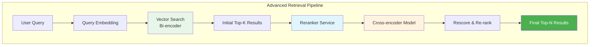
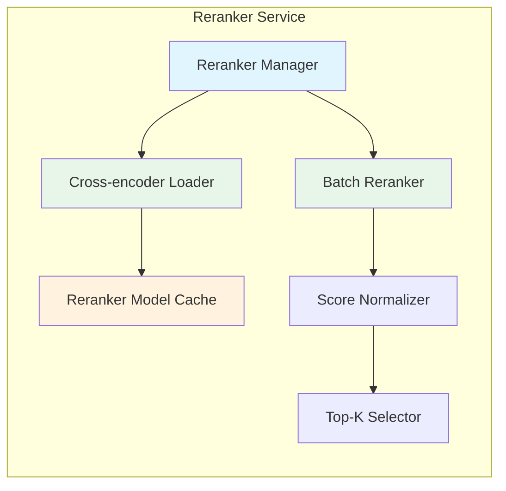
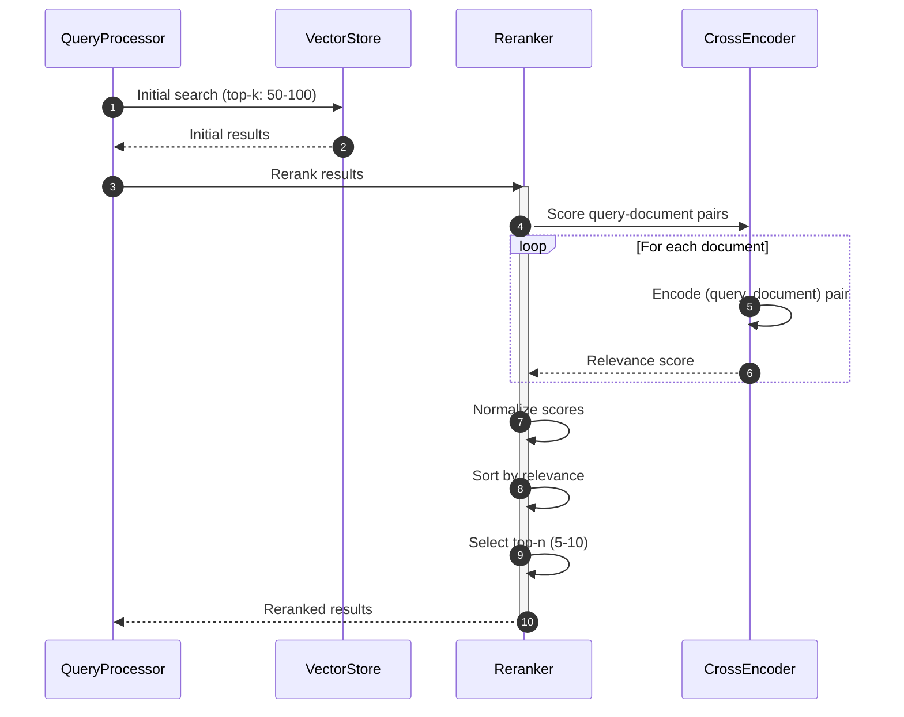
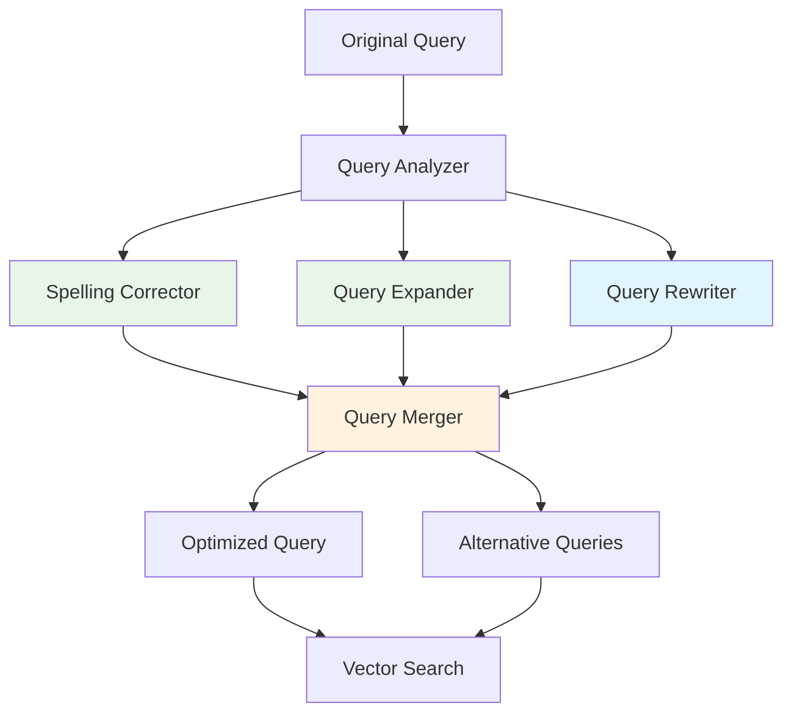
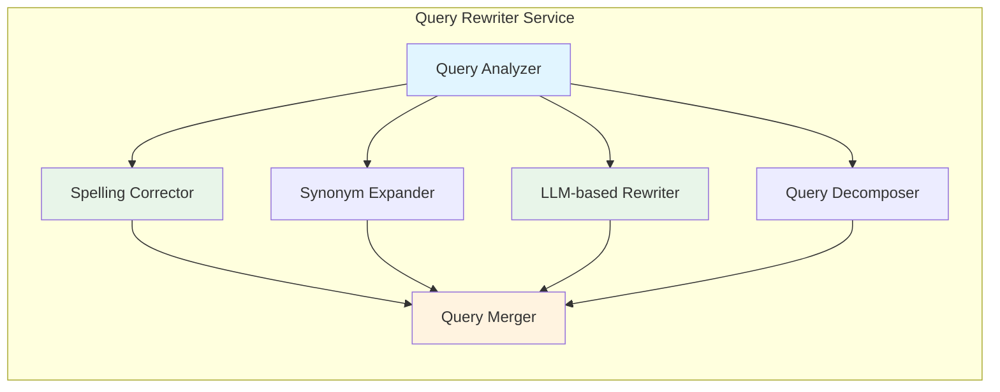
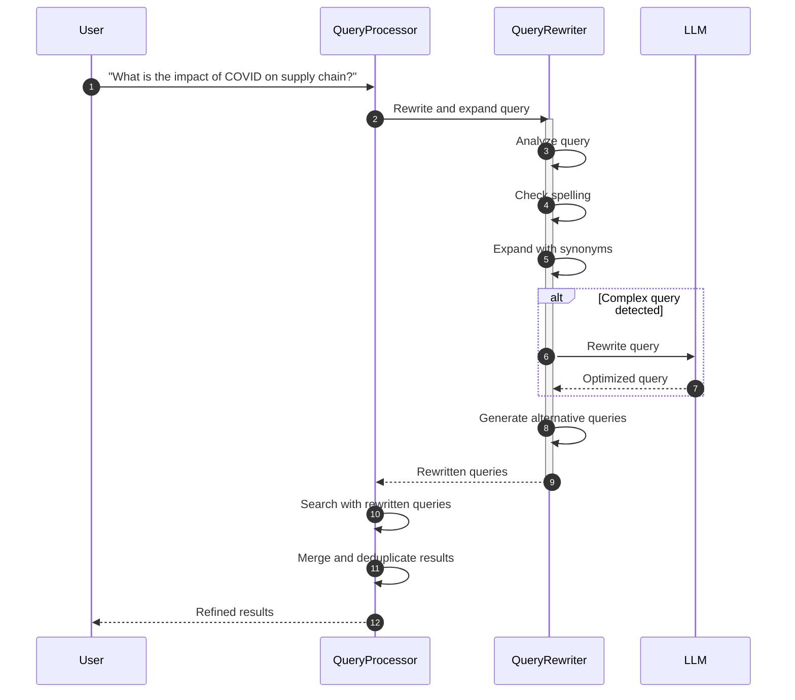
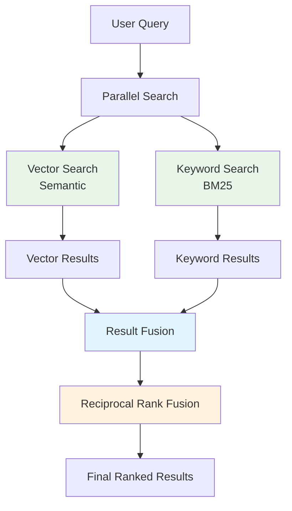
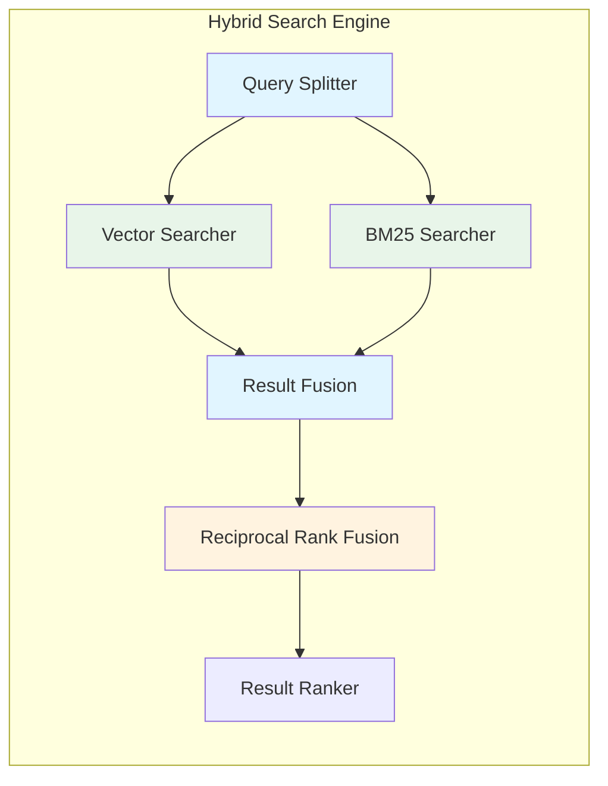
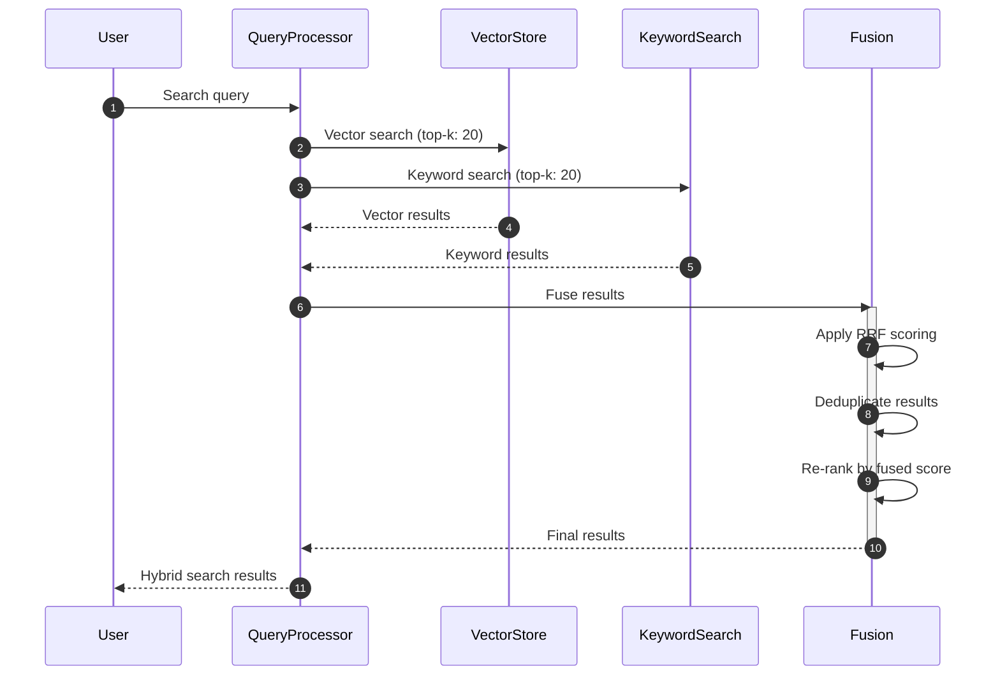
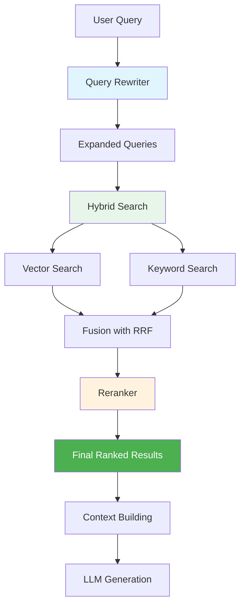

# Advanced Retrieval - RAG System Enhancement

## Overview

This document describes advanced retrieval mechanisms that enhance the RAG system's ability to find and rank relevant documents. These components significantly improve retrieval quality and query understanding beyond basic vector similarity search.

## 1. Reranker Service

### Purpose

Re-ranks initial search results using more sophisticated models (cross-encoders) to improve relevance and precision of retrieved documents.

### Architecture



### Reranker Service Components



### Reranking Flow



### Reranker Models

**Recommended Cross-encoder Models:**

1. **ms-marco-MiniLM-L-6-v2** (Fast, good for general purpose)
2. **ms-marco-MiniLM-L-12-v2** (Better quality, slightly slower)
3. **bge-reranker-large** (High quality, slower)
4. **cohere-rerank-english-v2** (Cohere API - best quality, paid)

**Trade-offs:**
- **Speed**: MiniLM-L-6-v2 (~50ms per query for 50 docs)
- **Quality**: Larger models provide better relevance
- **Latency**: Batch processing reduces latency

### API Integration

```python
# Pseudo-code for reranker integration
class QueryProcessor:
    def __init__(self, vector_store, reranker):
        self.vector_store = vector_store
        self.reranker = reranker

    async def process_query(self, query: str, k: int = 10):
        # Step 1: Initial search with larger K
        initial_k = min(k * 5, 100)
        initial_results = await self.vector_store.search(
            query, top_k=initial_k
        )

        # Step 2: Rerank results
        reranked = await self.reranker.rerank(
            query=query,
            documents=initial_results,
            top_k=k
        )

        return reranked
```

### Configuration

```python
# config/reranker_config.py
RerankerConfig = {
    "model_name": "ms-marco-MiniLM-L-6-v2",
    "max_length": 512,
    "batch_size": 32,
    "initial_k": 50,
    "final_k": 10,
    "score_threshold": 0.3,
    "device": "cuda",  # or "cpu"
    "cache_enabled": True,
    "cache_ttl": 3600  # seconds
}
```

### Performance Considerations

**Optimizations:**
- Batch reranking for multiple documents
- Cache cross-encoder results for common queries
- GPU acceleration for model inference
- Asynchronous processing for non-blocking queries

**Latency Budget:**
- Vector search: ~50-100ms
- Reranking: ~50-200ms (depends on model and doc count)
- Total: <300ms for quality reranking

---

## 2. Query Rewriter Service

### Purpose

Improves query understanding and expands queries to retrieve more relevant documents by:
- Fixing spelling errors
- Query expansion with synonyms
- Rewriting for better semantic match
- Decomposing complex queries

### Architecture



### Query Rewriting Strategies

**1. Spelling Correction:**
- Use language models (spellchecker, hunspell)
- Context-aware correction
- Domain-specific dictionaries

**2. Query Expansion:**
- Synonym expansion (WordNet, domain thesaurus)
- Related terms from embeddings
- Query augmentation with LLM

**3. Query Rewriting:**
- Convert to more searchable form
- Remove stop words appropriately
- Add relevant context terms

**4. Query Decomposition:**
- Break complex multi-part queries
- Handle multi-intent queries
- Parallel processing of sub-queries

### Query Rewriter Components



### Query Rewriting Flow



### LLM-based Query Rewriting

```python
# Query rewriting with LLM
class QueryRewriter:
    def __init__(self, llm_service):
        self.llm_service = llm_service

    async def rewrite_query(self, query: str) -> List[str]:
        prompt = f"""
        Rewrite the following query to improve search results.
        Provide 3 variations: original, expanded, and rephrased.

        Query: "{query}"

        Output format:
        - Original: [original query]
        - Expanded: [query with synonyms and related terms]
        - Rephrased: [query in different wording]
        """

        response = await self.llm_service.generate(prompt)
        return self.parse_query_variations(response)

    async def decompose_query(self, query: str) -> List[str]:
        prompt = f"""
        Decompose the following query into sub-queries if it has multiple intents.

        Query: "{query}"

        Output format:
        1. [sub-query 1]
        2. [sub-query 2]
        ...
        """

        response = await self.llm_service.generate(prompt)
        return self.parse_sub_queries(response)
```

### Query Expansion Example

**Original Query:**
"machine learning algorithms for image classification"

**Expanded Queries:**
- "deep learning models for computer vision"
- "neural networks for image recognition"
- "supervised learning for image categorization"
- "CNN for image analysis"

**Synonyms Added:**
- machine learning → deep learning, neural networks, supervised learning
- algorithms → models, networks, methods
- image classification → computer vision, image recognition, image categorization

---

## 3. Hybrid Search

### Purpose

Combines vector search (semantic) with keyword search (BM25) to leverage both semantic understanding and exact keyword matching. Improves recall for technical terms, names, and specific phrases.

### Architecture



### Hybrid Search Components



### Reciprocal Rank Fusion (RRF)

RRF combines results from multiple ranking methods:

```python
def reciprocal_rank_fusion(
    results_list: List[List[Result]],
    k: int = 60
) -> List[Result]:
    """
    Combine multiple ranked result lists using RRF.

    RRF Score = Σ 1 / (k + rank_i)

    Args:
        results_list: List of ranked result lists from different searchers
        k: RRF constant (typically 60)

    Returns:
        Fused and reranked results
    """
    score_map = defaultdict(float)

    for results in results_list:
        for rank, result in enumerate(results, start=1):
            score_map[result.id] += 1 / (k + rank)

    # Sort by RRF score
    sorted_results = sorted(
        score_map.items(),
        key=lambda x: x[1],
        reverse=True
    )

    return [Result(id=rid, score=score)
            for rid, score in sorted_results]
```

### Keyword Search Implementation

```python
# BM25-based keyword search
from rank_bm25 import BM25Okapi

class KeywordSearcher:
    def __init__(self):
        self.corpus = []
        self.tokenized_corpus = []
        self.bm25 = None

    def index_documents(self, documents: List[Document]):
        """Index documents for keyword search"""
        self.corpus = [doc.content for doc in documents]
        self.tokenized_corpus = [
            self.tokenize(doc.content) for doc in documents
        ]
        self.bm25 = BM25Okapi(self.tokenized_corpus)

    def search(self, query: str, top_k: int = 10) -> List[Result]:
        """Search using BM25"""
        tokenized_query = self.tokenize(query)
        scores = self.bm25.get_scores(tokenized_query)

        # Get top-k results
        top_indices = np.argsort(scores)[::-1][:top_k]

        return [
            Result(
                id=self.corpus[i].id,
                score=scores[i],
                source="keyword"
            )
            for i in top_indices
        ]

    @staticmethod
    def tokenize(text: str) -> List[str]:
        """Tokenize text for BM25"""
        # Use simple tokenization or NLTK/spacy
        import re
        text = text.lower()
        tokens = re.findall(r'\w+', text)
        return tokens
```

### Hybrid Search Flow



### Weight Configuration

```python
# Hybrid search configuration
HybridSearchConfig = {
    "vector_weight": 0.6,      # 60% weight for semantic search
    "keyword_weight": 0.4,     # 40% weight for keyword search
    "rrf_k": 60,               # RRF constant
    "vector_top_k": 20,         # Initial results from vector search
    "keyword_top_k": 20,        # Initial results from keyword search
    "final_k": 10,              # Final results after fusion
    "use_reranker": True,       # Optional: apply reranker after fusion
    "keyword_only_for": [        # Use keyword search for specific patterns
        r'\b\d{3}-\d{2}-\d{4}\b',  # SSN pattern
        r'\b[A-Z]{2,}\s+\d{3,}\b'  # Part numbers
    ]
}
```

### Performance Characteristics

**Vector Search:**
- Good for: Semantic understanding, paraphrases, conceptual queries
- Weakness: Fails on exact matches, technical terms, names

**Keyword Search:**
- Good for: Exact matches, technical terms, names, codes
- Weakness: Misses semantic relationships, requires exact tokens

**Hybrid Search:**
- Combines strengths of both
- Better recall and precision
- Slightly higher latency (two searches + fusion)
- Latency: ~100-200ms (vs ~50ms for vector only)

---

## Integration with RAG Pipeline

### Enhanced Query Processing



### Enhanced QueryProcessor

```python
class EnhancedQueryProcessor:
    def __init__(
        self,
        vector_store: VectorStoreService,
        keyword_searcher: KeywordSearcher,
        query_rewriter: QueryRewriter,
        reranker: RerankerService
    ):
        self.vector_store = vector_store
        self.keyword_searcher = keyword_searcher
        self.query_rewriter = query_rewriter
        self.reranker = reranker

    async def process_query(self, query: str, k: int = 10):
        # Step 1: Rewrite and expand query
        rewritten_queries = await self.query_rewriter.rewrite_query(query)

        # Step 2: Hybrid search
        vector_results = await self.vector_store.search(
            rewritten_queries[0],
            top_k=20
        )

        keyword_results = self.keyword_searcher.search(
            rewritten_queries[0],
            top_k=20
        )

        # Step 3: Fuse results with RRF
        fused = reciprocal_rank_fusion([
            vector_results,
            keyword_results
        ])

        # Step 4: Rerank top results
        final_results = await self.reranker.rerank(
            query=query,
            documents=fused[:20],
            top_k=k
        )

        return final_results
```

---

## Configuration and Tuning

### System Configuration

```yaml
# config/advanced_retrieval.yaml
advanced_retrieval:
  enabled: true

  reranker:
    enabled: true
    model: "ms-marco-MiniLM-L-6-v2"
    initial_k: 50
    final_k: 10
    batch_size: 32
    cache_enabled: true

  query_rewriter:
    enabled: true
    spelling_correction: true
    query_expansion: true
    query_decomposition: true
    max_variations: 3

  hybrid_search:
    enabled: true
    vector_weight: 0.6
    keyword_weight: 0.4
    rrf_k: 60
    vector_top_k: 20
    keyword_top_k: 20

  performance:
    parallel_search: true
    cache_results: true
    async_processing: true
```

### Tuning Guidelines

**Reranker Tuning:**
- Increase `initial_k` for better recall (100+)
- Adjust `final_k` based on context window limits (5-15)
- Use larger cross-encoder models for quality-critical applications

**Query Rewriting Tuning:**
- Enable/disable features based on query patterns
- Limit query variations to avoid noise
- Use domain-specific dictionaries for expansion

**Hybrid Search Tuning:**
- Adjust vector/keyword weights based on use case
- Higher keyword weight for technical domains
- Higher vector weight for conceptual queries

---

## Performance Benchmarks

### Expected Performance

| Component | Latency | Throughput | Accuracy |
|-----------|---------|-------------|----------|
| Vector Search Only | 50-100ms | 100-200 qps | Good |
| + Reranker | 150-250ms | 50-100 qps | Very Good |
| + Query Rewriting | 200-300ms | 30-80 qps | Excellent |
| + Hybrid Search | 250-400ms | 20-60 qps | Excellent |

### Quality Improvements

- **Precision @10**: +15-25% with reranker
- **Recall @100**: +20-30% with hybrid search
- **MRR (Mean Reciprocal Rank)**: +25-35% with full pipeline
- **User Satisfaction**: +30-40% based on feedback

---

## Use Cases

### 1. Technical Document Search
- **Challenge**: Technical terms, codes, exact matches
- **Solution**: Hybrid search with keyword emphasis
- **Result**: Better recall for technical queries

### 2. Legal Document Analysis
- **Challenge**: Complex language, precise terminology
- **Solution**: Reranker with domain-specific models
- **Result**: Higher precision for legal citations

### 3. Customer Support
- **Challenge**: Varied query quality, typos
- **Solution**: Query rewriting + spelling correction
- **Result**: Better handling of imperfect queries

### 4. Research Paper Search
- **Challenge**: Semantic understanding, paraphrases
- **Solution**: Vector search + query expansion
- **Result**: Better semantic retrieval

---

## Future Enhancements

1. **Learning to Rank (LTR)**
   - Train ranking models on user feedback
   - Personalized ranking per user

2. **Multi-vector Retrieval**
   - Dense + sparse vectors
   - ColBERT-style late interaction

3. **Neural Information Retrieval**
   - End-to-end neural models
   - T5-based retrieval

4. **Query Understanding**
   - Intent classification
   - Entity recognition
   - Query classification

5. **Adaptive Retrieval**
   - Dynamic algorithm selection
   - Context-aware retrieval
   - Performance-based adaptation

---

## Related Documents

- **[Basic Design](01-basic-design.md)** - Core RAG system components
- **[C4 Model](02-c4-model.md)** - System architecture
- **[Data Flow](04-data-flow.md)** - Query processing flow
- **[Context Management](08-context-management.md)** - Conversation and citation management
- **[Document Management](09-document-management.md)** - Document processing features
