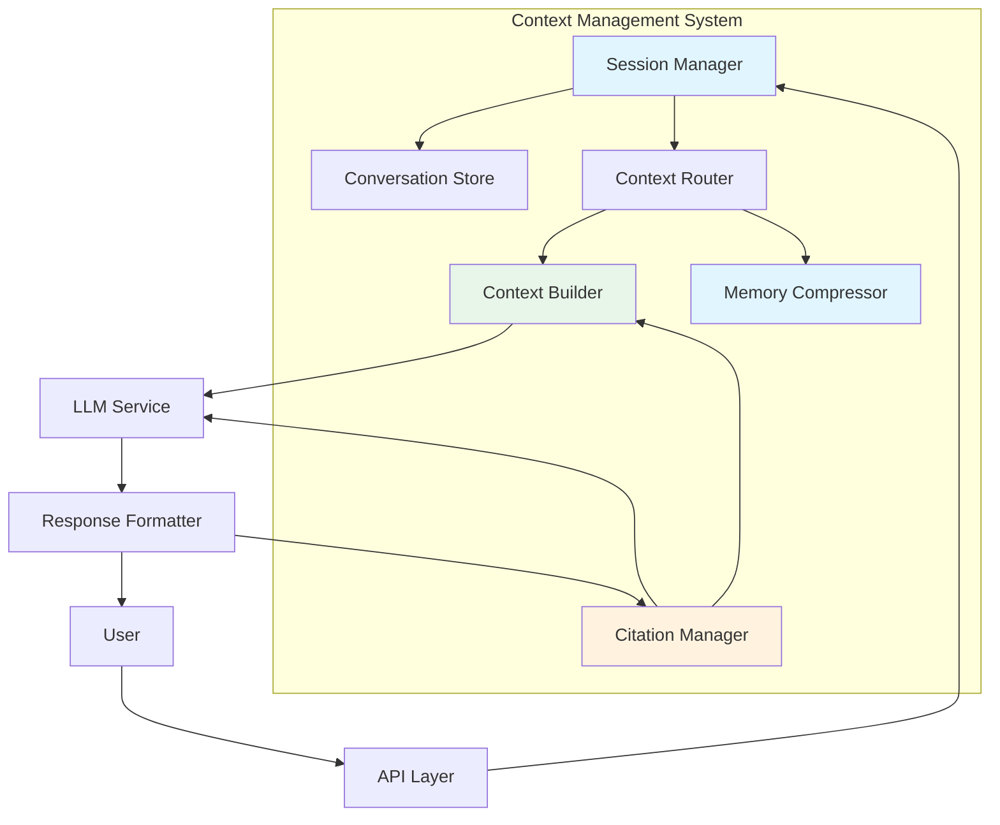
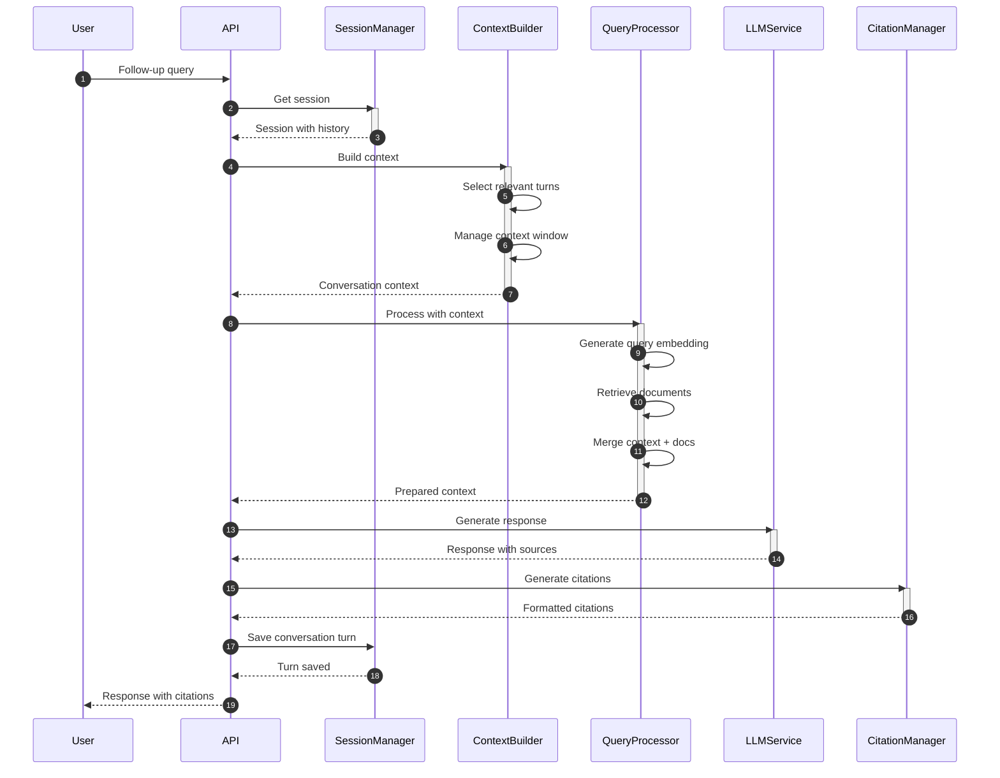

# Context Management - RAG System Enhancement

## Overview

This document describes the context management and conversation memory features for the RAG system. These capabilities enable multi-turn conversations, context awareness, citation management, and improved user experience for interactive querying.

## Motivation

### Current Limitations

In the basic RAG system, each query is processed independently without awareness of:
- Previous user queries and responses
- Conversation history
- User preferences and context
- Follow-up questions that reference earlier discussions
- Citations and source references across multiple queries

### Enhancement Goals

1. **Conversation Memory**: Maintain context across multiple turns in a conversation
2. **Citation Management**: Track and reference sources throughout a conversation
3. **Context Window Optimization**: Manage limited LLM context window efficiently
4. **Multi-turn Query Handling**: Interpret follow-up questions correctly
5. **Session Management**: Maintain user sessions with configurable retention policies

## Architecture

### System Components



### Component Responsibilities

#### 1. Session Manager

**Responsibilities:**
- Create and manage user sessions
- Track session lifecycle (creation, expiration, cleanup)
- Associate queries with sessions
- Maintain session metadata (user ID, creation time, last activity)

**API:**
```python
class SessionManager:
    async def create_session(self, user_id: str) -> Session
    async def get_session(self, session_id: str) -> Session
    async def update_session_activity(self, session_id: str) -> None
    async def delete_session(self, session_id: str) -> None
    async def get_active_sessions(self, user_id: str) -> List[Session]
    async def expire_old_sessions(self, max_age: timedelta) -> int
```

**Session Data Structure:**
```python
@dataclass
class Session:
    session_id: str
    user_id: str
    created_at: datetime
    last_activity: datetime
    conversation_history: List[ConversationTurn]
    metadata: Dict[str, Any]
    context_window: int = 4096
    max_turns: int = 50
```

#### 2. Conversation Store

**Responsibilities:**
- Store and retrieve conversation history
- Index conversations for efficient querying
- Manage conversation persistence
- Support conversation search and filtering

**Storage Options:**
1. **In-memory**: Fast, suitable for single-instance deployments
2. **Redis**: Fast persistence with TTL support
3. **Database**: PostgreSQL/MySQL for persistent storage
4. **Vector Database**: Enable semantic search over conversations

**API:**
```python
class ConversationStore:
    async def add_turn(self, session_id: str, turn: ConversationTurn) -> None
    async def get_history(self, session_id: str, limit: int) -> List[ConversationTurn]
    async def get_recent_turns(self, session_id: str, n: int) -> List[ConversationTurn]
    async def search_conversations(self, query: str, user_id: str) -> List[ConversationTurn]
    async def delete_conversation(self, session_id: str) -> None
```

**Conversation Turn Structure:**
```python
@dataclass
class ConversationTurn:
    turn_id: str
    session_id: str
    timestamp: datetime
    
    query: str
    query_embedding: Optional[List[float]] = None
    
    response: str
    response_metadata: Dict[str, Any]
    
    retrieved_documents: List[DocumentReference]
    citations: List[Citation]
    
    user_feedback: Optional[str] = None
    rating: Optional[int] = None
```

#### 3. Context Builder

**Responsibilities:**
- Construct context for LLM from conversation history
- Manage context window limits
- Prioritize relevant conversation turns
- Merge retrieved documents with conversation context

**Context Building Strategies:**

**1. Sequential Context:**
```python
def build_sequential_context(
    history: List[ConversationTurn],
    max_tokens: int
) -> str:
    """
    Build context by including recent conversation turns
    in chronological order until token limit is reached.
    """
    context_parts = []
    used_tokens = 0
    
    for turn in reversed(history):
        turn_text = format_conversation_turn(turn)
        turn_tokens = count_tokens(turn_text)
        
        if used_tokens + turn_tokens > max_tokens:
            break
            
        context_parts.insert(0, turn_text)
        used_tokens += turn_tokens
    
    return "\n".join(context_parts)
```

**2. Relevance-based Context:**
```python
def build_relevance_context(
    history: List[ConversationTurn],
    current_query: str,
    max_turns: int = 5
) -> List[ConversationTurn]:
    """
    Select most relevant conversation turns based on
    similarity to current query.
    """
    query_embedding = generate_embedding(current_query)
    
    # Score each turn by relevance
    scored_turns = []
    for turn in history:
        if turn.query_embedding:
            similarity = cosine_similarity(
                query_embedding,
                turn.query_embedding
            )
            scored_turns.append((turn, similarity))
    
    # Sort by relevance and select top-k
    scored_turns.sort(key=lambda x: x[1], reverse=True)
    return [turn for turn, _ in scored_turns[:max_turns]]
```

**3. Hybrid Context:**
```python
def build_hybrid_context(
    history: List[ConversationTurn],
    current_query: str,
    max_tokens: int
) -> str:
    """
    Combine recent and relevant turns for optimal context.
    """
    # Get recent turns (last 3)
    recent_turns = history[-3:]
    
    # Get relevant turns based on query
    relevant_turns = build_relevance_context(history, current_query)
    
    # Merge and deduplicate
    all_turns = list({t.turn_id: t for t in recent_turns + relevant_turns}.values())
    
    # Build context within token limit
    return build_sequential_context(all_turns, max_tokens)
```

#### 4. Citation Manager

**Responsibilities:**
- Extract and track citations in responses
- Generate citations from retrieved documents
- Link citations to source documents
- Format citations for display

**Citation Types:**

**1. Inline Citations:**
```
According to research, the BRCA1 gene is associated with
breast cancer risk [1]. Mutations in this gene can be
inherited or acquired somatically [2].
```

**2. Footnote Citations:**
```
The TP53 gene acts as a tumor suppressor [^1]. It regulates
cell cycle arrest and apoptosis in response to DNA damage [^2].

[^1]: Smith et al., "TP53 Mutations in Cancer", Nature, 2023
[^2]: Jones et al., "Cellular Stress Response", Cell, 2022
```

**3. Source References:**
```json
{
  "answer": "BRCA1 is a tumor suppressor gene...",
  "sources": [
    {
      "id": "doc_123",
      "title": "BRCA1 Gene Function",
      "authors": ["Smith, J.", "Doe, A."],
      "year": 2023,
      "url": "https://..."
    },
    {
      "id": "doc_456",
      "title": "Breast Cancer Genetics",
      "authors": ["Johnson, M."],
      "year": 2022,
      "url": "https://..."
    }
  ]
}
```

**Citation Generation:**
```python
class CitationManager:
    def generate_citations(
        self,
        retrieved_docs: List[Document],
        response: str,
        turn_id: str
    ) -> List[Citation]:
        """
        Generate citations from retrieved documents.
        """
        citations = []
        
        for idx, doc in enumerate(retrieved_docs, start=1):
            citation = Citation(
                citation_id=f"cit_{turn_id}_{idx}",
                turn_id=turn_id,
                document_id=doc.id,
                document_title=doc.metadata.get("title"),
                document_url=doc.metadata.get("url"),
                authors=doc.metadata.get("authors", []),
                year=doc.metadata.get("year"),
                page_number=doc.metadata.get("page_number"),
                text_snippet=self._extract_relevant_snippet(
                    doc.content,
                    response
                ),
                relevance_score=doc.score
            )
            citations.append(citation)
        
        return citations
    
    def inject_citations(
        self,
        response: str,
        citations: List[Citation],
        style: str = "inline"
    ) -> str:
        """
        Inject citation markers into the response.
        """
        if style == "inline":
            return self._inject_inline_citations(response, citations)
        elif style == "footnote":
            return self._inject_footnote_citations(response, citations)
        else:
            return response
```

#### 5. Memory Compressor

**Responsibilities:**
- Compress old conversation turns to save context window
- Summarize conversation history
- Extract key information from long conversations
- Maintain conversation semantic meaning

**Compression Strategies:**

**1. Turn-level Compression:**
```python
def compress_turn(turn: ConversationTurn) -> ConversationTurn:
    """
    Compress individual turn by summarizing query and response.
    """
    summary_prompt = f"""
    Summarize the following question and answer pair in 2-3 sentences.
    
    Question: {turn.query}
    Answer: {turn.response}
    """
    
    summary = llm_service.generate(summary_prompt)
    
    return ConversationTurn(
        turn_id=turn.turn_id,
        session_id=turn.session_id,
        timestamp=turn.timestamp,
        query=summary,
        response=summary,
        compressed=True,
        original_tokens=count_tokens(turn.query) + count_tokens(turn.response),
        compressed_tokens=count_tokens(summary)
    )
```

**2. Conversation Summarization:**
```python
def summarize_conversation(
    history: List[ConversationTurn],
    summary_length: int = 200
) -> str:
    """
    Generate a high-level summary of the conversation.
    """
    conversation_text = format_conversation_history(history)
    
    summary_prompt = f"""
    Summarize the following conversation in {summary_length} words.
    Focus on key topics discussed and main conclusions.
    
    Conversation:
    {conversation_text}
    """
    
    return llm_service.generate(summary_prompt)
```

**3. Hierarchical Compression:**
```python
def compress_hierarchically(
    history: List[ConversationTurn],
    max_tokens: int
) -> List[ConversationTurn]:
    """
    Compress conversation using hierarchical approach.
    """
    if not history:
        return []
    
    # Keep most recent 3 turns uncompressed
    recent_turns = history[-3:]
    older_turns = history[:-3]
    
    # Group older turns into segments
    segment_size = 5
    compressed_history = []
    
    for i in range(0, len(older_turns), segment_size):
        segment = older_turns[i:i+segment_size]
        segment_summary = summarize_conversation(segment)
        
        compressed_history.append(
            ConversationTurn(
                turn_id=f"compressed_{i}",
                session_id=segment[0].session_id,
                timestamp=segment[0].timestamp,
                query=f"Summary of turns {i}-{i+len(segment)}",
                response=segment_summary,
                compressed=True
            )
        )
    
    return compressed_history + recent_turns
```

#### 6. Context Router

**Responsibilities:**
- Determine optimal context building strategy
- Decide whether to include conversation history
- Manage context window allocation
- Route to appropriate context builder

**Routing Logic:**
```python
class ContextRouter:
    def __init__(self):
        self.strategies = {
            "simple": build_sequential_context,
            "relevance": build_relevance_context,
            "hybrid": build_hybrid_context
        }
    
    def select_strategy(
        self,
        query: str,
        history: List[ConversationTurn],
        session_metadata: Dict[str, Any]
    ) -> str:
        """
        Select appropriate context building strategy.
        """
        # Use simple for short conversations
        if len(history) < 3:
            return "simple"
        
        # Use relevance for follow-up questions
        if self._is_follow_up(query):
            return "relevance"
        
        # Default to hybrid
        return "hybrid"
    
    def _is_follow_up(self, query: str) -> bool:
        """
        Detect if query is a follow-up question.
        """
        follow_up_indicators = [
            "what about", "tell me more", "and", "also",
            "how does that", "why", "explain further"
        ]
        query_lower = query.lower()
        return any(indicator in query_lower for indicator in follow_up_indicators)
```

## Enhanced Query Processing Flow

### Multi-turn Query Handling



### Context Window Management

```python
class ContextWindowManager:
    def __init__(self, max_tokens: int = 4096):
        self.max_tokens = max_tokens
        self.allocations = {
            "system_prompt": 500,
            "conversation_history": 1500,
            "retrieved_docs": 1500,
            "query": 100,
            "response_buffer": 496
        }
    
    def allocate_tokens(
        self,
        requirements: Dict[str, int]
    ) -> Dict[str, int]:
        """
        Dynamically allocate tokens based on requirements.
        """
        allocations = self.allocations.copy()
        
        # Calculate required adjustments
        total_required = sum(requirements.values())
        
        if total_required <= self.max_tokens:
            return requirements
        
        # Redistribute based on priorities
        priorities = {
            "system_prompt": 1.0,
            "query": 1.0,
            "retrieved_docs": 0.8,
            "conversation_history": 0.6,
            "response_buffer": 0.5
        }
        
        # Scale allocations proportionally
        scale_factor = self.max_tokens / total_required
        scaled = {
            key: int(value * scale_factor)
            for key, value in requirements.items()
        }
        
        return scaled
    
    def estimate_tokens(self, text: str) -> int:
        """
        Estimate token count for text.
        """
        return len(text.split()) * 1.3  # Rough estimate
```

## Configuration

### Environment Variables

```env
# Session Management
SESSION_TTL=3600  # 1 hour
MAX_TURNS_PER_SESSION=100
MAX_TOKENS_PER_CONTEXT=4096

# Context Building
CONTEXT_BUILDING_STRATEGY=hybrid
MAX_HISTORY_TURNS=10
MIN_RELEVANCE_SCORE=0.7

# Memory Compression
ENABLE_COMPRESSION=true
COMPRESSION_THRESHOLD=20
SUMMARY_LENGTH=200

# Citation Management
CITATION_STYLE=inline
MAX_CITATIONS=10
CITATION_THRESHOLD=0.5
```

### YAML Configuration

```yaml
# config/context_management.yaml
context_management:
  enabled: true

  session:
    ttl: 3600  # seconds
    max_turns: 100
    storage: redis  # redis, postgres, memory
    cleanup_interval: 300  # seconds

  context_building:
    strategy: hybrid  # sequential, relevance, hybrid
    max_history_turns: 10
    min_relevance_score: 0.7
    include_metadata: true

  context_window:
    max_tokens: 4096
    allocations:
      system_prompt: 500
      conversation_history: 1500
      retrieved_docs: 1500
      query: 100
      response_buffer: 496
    dynamic_allocation: true

  compression:
    enabled: true
    compression_threshold: 20  # compress after N turns
    summary_length: 200
    compression_strategy: hierarchical  # turn-level, summarization, hierarchical

  citations:
    style: inline  # inline, footnote, reference
    max_citations: 10
    citation_threshold: 0.5
    include_snippets: true
    snippet_length: 100
```

## API Endpoints

### Session Management

```python
# POST /api/v1/sessions
{
  "user_id": "user_123",
  "metadata": {
    "initial_query": "What is BRCA1?"
  }
}

# Response
{
  "session_id": "sess_abc123",
  "user_id": "user_123",
  "created_at": "2024-01-15T10:30:00Z",
  "expires_at": "2024-01-15T11:30:00Z"
}

# GET /api/v1/sessions/{session_id}
{
  "session_id": "sess_abc123",
  "user_id": "user_123",
  "created_at": "2024-01-15T10:30:00Z",
  "last_activity": "2024-01-15T10:45:00Z",
  "turn_count": 5,
  "context_tokens": 2500
}

# DELETE /api/v1/sessions/{session_id}
# Status: 204 No Content
```

### Conversation Management

```python
# GET /api/v1/sessions/{session_id}/history
{
  "session_id": "sess_abc123",
  "turns": [
    {
      "turn_id": "turn_1",
      "timestamp": "2024-01-15T10:30:00Z",
      "query": "What is BRCA1?",
      "response": "BRCA1 is a tumor suppressor gene...",
      "sources": [
        {
          "document_id": "doc_123",
          "title": "BRCA1 Gene Function",
          "relevance": 0.95
        }
      ],
      "citations": [
        {
          "citation_id": "cit_1",
          "text": "BRCA1 mutations increase breast cancer risk",
          "sources": ["doc_123"]
        }
      ]
    }
  ],
  "total_turns": 5
}

# GET /api/v1/sessions/{session_id}/summary
{
  "session_id": "sess_abc123",
  "summary": "The conversation covered BRCA1 gene function, associated cancers, mutation types, and clinical testing recommendations...",
  "key_topics": ["BRCA1", "breast cancer", "mutations", "testing"],
  "turn_count": 5
}
```

## Performance Considerations

### Latency Impact

| Component | Added Latency | Optimization |
|-----------|---------------|--------------|
| Session lookup | 5-10ms | Use Redis, cache sessions |
| Context building | 10-50ms | Batch processing, pre-compute embeddings |
| Citation generation | 20-40ms | Cache citations, parallel processing |
| Memory compression | 100-300ms | Async processing, background jobs |

### Storage Requirements

| Data Type | Size per Turn | 1000 Turns | 10,000 Turns |
|-----------|---------------|--------------|---------------|
| Conversation turn | ~2KB | 2MB | 20MB |
| Embeddings | ~2KB | 2MB | 20MB |
| Citations | ~1KB | 1MB | 10MB |
| **Total** | **~5KB** | **5MB** | **50MB** |

### Optimization Strategies

1. **Lazy Loading**: Load conversation history only when needed
2. **Embedding Caching**: Cache query embeddings for relevance matching
3. **Background Compression**: Compress conversations asynchronously
4. **TTL-based Cleanup**: Automatically expire old sessions
5. **Batch Operations**: Batch database writes for multiple turns

## Use Cases

### 1. Multi-turn Literature Review

**Scenario:** User conducts literature review across multiple questions

```
Turn 1: "What is the role of BRCA1 in breast cancer?"
→ Response with citations to 5 papers

Turn 2: "What about in ovarian cancer?"
→ System understands continuation, provides ovarian-specific info

Turn 3: "Show me the clinical guidelines for BRCA1 testing"
→ Context includes previous discussion about cancer types

Turn 4: "What are the treatment options mentioned?"
→ System recalls discussed treatments and provides more details
```

### 2. Follow-up Question Handling

**Scenario:** User asks follow-up questions referencing previous answers

```
Turn 1: "List all genes in the PI3K pathway"
→ Response: PIK3CA, PTEN, AKT1, etc.

Turn 2: "Tell me more about PIK3CA"
→ System recognizes PIK3CA from previous turn
→ Provides detailed information without repeating context

Turn 3: "What are the drugs targeting it?"
→ System understands "it" refers to PIK3CA
→ Retrieves PIK3CA-specific drugs
```

### 3. Cross-session Context

**Scenario:** User resumes conversation after a break

```
Session A (Day 1):
User: "What are the side effects of drug X?"
System: Provides side effects with citations

Session B (Day 2):
User: "I'm concerned about the cardiac effects mentioned earlier"
System: References previous discussion about cardiac effects
→ Provides more detailed information on cardiac toxicity
```

### 4. Citation Tracking

**Scenario:** User tracks sources across conversation

```
Turn 1: "What causes Alzheimer's?"
→ Response with citations [1, 2, 3]

Turn 2: "What are the treatments?"
→ Response with citations [2, 4, 5]

Turn 3: "Show me all sources used so far"
→ System consolidates citations: [1, 2, 3, 4, 5]
→ Provides bibliography with links
```

## Security and Privacy

### Data Protection

1. **Session Isolation**: Users can only access their own sessions
2. **Data Encryption**: Encrypt sensitive session data at rest
3. **Secure Storage**: Use secure storage for conversation history
4. **Audit Logging**: Log all session access and modifications

### Retention Policies

```python
class RetentionPolicy:
    def __init__(self):
        self.policies = {
            "default": {
                "ttl": 86400,  # 24 hours
                "max_turns": 100
            },
            "enterprise": {
                "ttl": 604800,  # 7 days
                "max_turns": 1000
            },
            "research": {
                "ttl": 2592000,  # 30 days
                "max_turns": 5000
            }
        }
    
    def get_policy(self, user_tier: str) -> Dict:
        return self.policies.get(user_tier, self.policies["default"])
```

### Compliance

- **GDPR**: Right to delete conversation history
- **HIPAA**: For clinical use cases, ensure PHI protection
- **Data Minimization**: Only store necessary conversation data
- **Consent Management**: Explicit consent for storing conversations

## Future Enhancements

### Planned Features

1. **Conversation Intelligence**
   - Automatic topic detection
   - Intent classification
   - Conversation summarization
   - Sentiment analysis

2. **Advanced Memory**
   - Long-term memory across sessions
   - User preference learning
   - Personalized context building
   - Knowledge graph integration

3. **Multi-modal Context**
   - Support for images and tables in context
   - Structured data integration
   - Code and formula rendering

4. **Collaborative Features**
   - Shared sessions for teams
   - Conversation branching
   - Annotation and commenting
   - Version control

## Related Documents

- **[Basic Design](01-basic-design.md)** - Core RAG system components
- **[C4 Model](02-c4-model.md)** - System architecture diagrams
- **[Data Flow](04-data-flow.md)** - Query processing flow
- **[Advanced Retrieval](07-advanced-retrieval.md)** - Enhanced retrieval mechanisms

---

## Summary

Context management and conversation memory transform the RAG system from a single-turn Q&A system into a sophisticated conversational AI assistant. Key capabilities include:

- **Session Management**: Track and manage user conversations
- **Context Building**: Construct optimal context from conversation history
- **Citation Management**: Track and display sources throughout conversations
- **Memory Compression**: Efficiently manage limited context windows
- **Multi-turn Support**: Handle follow-up questions and references

These enhancements significantly improve user experience and enable more natural, context-aware interactions with the RAG system.
