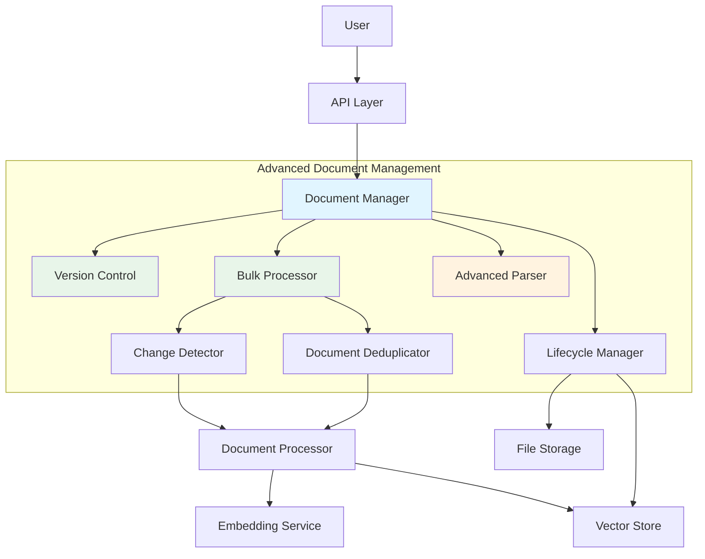
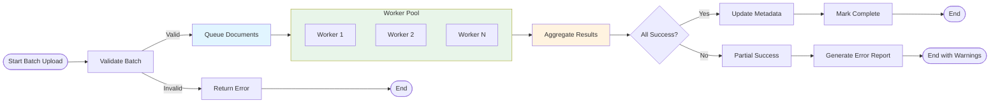
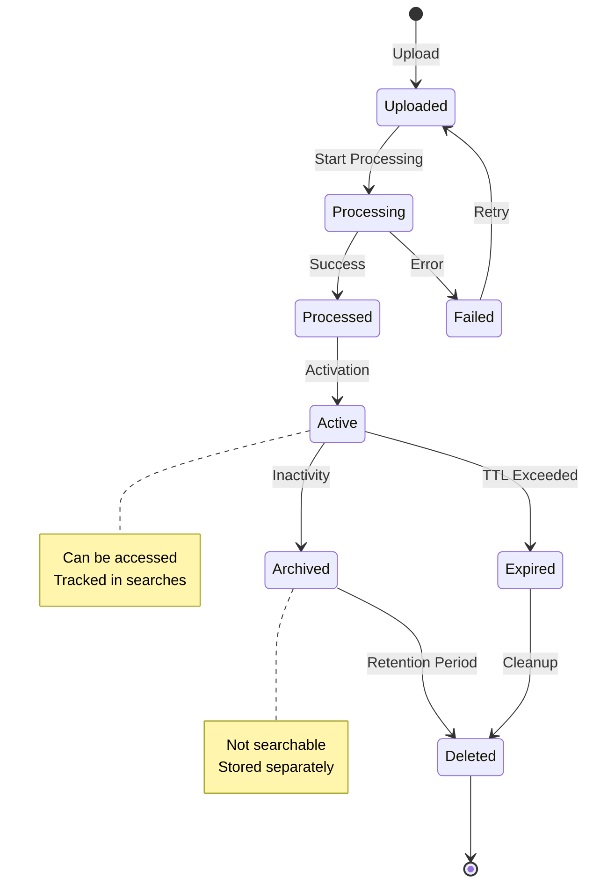

# Document Management - RAG System Enhancement

## Overview

This document describes advanced document management features for RAG system, including document versioning, incremental updates, bulk operations, advanced parsing, and lifecycle management. These capabilities enhance the document processing pipeline and improve operational efficiency.

## Motivation

### Current Limitations

Basic document processing has several limitations:

1. **No Versioning**: Documents can't be updated, only deleted and re-uploaded
2. **Batch Operations**: Limited support for bulk document processing
3. **Incremental Updates**: Full re-indexing required for document changes
4. **Limited Formats**: Support for common formats but missing specialized ones
5. **No Lifecycle Management**: Documents accumulate without cleanup policies

### Enhancement Goals

1. **Document Versioning**: Track and manage document versions
2. **Incremental Processing**: Update only changed sections of documents
3. **Advanced Parsing**: Support more file formats and better text extraction
4. **Bulk Operations**: Efficient processing of large document sets
5. **Lifecycle Management**: Automated cleanup and archival policies
6. **Document Deduplication**: Detect and handle duplicate content

## Architecture

### System Components



### Component Responsibilities

#### 1. Document Manager

**Responsibilities:**
- Coordinate all document operations
- Manage document metadata
- Handle document CRUD operations
- Coordinate versioning and lifecycle

**API:**
```python
class DocumentManager:
    async def upload_document(
        self,
        file: UploadFile,
        collection_id: str,
        metadata: Optional[Dict] = None
    ) -> Document
    
    async def update_document(
        self,
        document_id: str,
        file: Optional[UploadFile] = None,
        metadata: Optional[Dict] = None
    ) -> Document
    
    async def delete_document(
        self,
        document_id: str,
        version: Optional[str] = None
    ) -> bool
    
    async def get_document(
        self,
        document_id: str,
        version: Optional[str] = None
    ) -> Document
    
    async def list_documents(
        self,
        collection_id: str,
        filters: Optional[Dict] = None,
        pagination: Optional[Pagination] = None
    ) -> List[Document]
    
    async def get_document_versions(
        self,
        document_id: str
    ) -> List[DocumentVersion]
```

**Document Metadata:**
```python
@dataclass
class DocumentMetadata:
    document_id: str
    collection_id: str
    
    filename: str
    file_type: str
    file_size: int
    
    uploaded_at: datetime
    uploaded_by: str
    
    version: str
    current_version: bool
    
    status: ProcessingStatus
    processing_started: Optional[datetime]
    processing_completed: Optional[datetime]
    
    chunk_count: int
    vector_count: int
    
    checksum: str
    etag: str
    
    tags: List[str]
    categories: List[str]
    
    custom_metadata: Dict[str, Any]
```

#### 2. Version Control

**Responsibilities:**
- Track document versions
- Compare document changes
- Rollback to previous versions
- Calculate diff between versions

**Versioning Strategy:**

**1. Full Versioning:**
```python
class FullVersionControl:
    async def create_version(
        self,
        document: Document
    ) -> DocumentVersion:
        """
        Create a new full version of document.
        Stores complete document for each version.
        """
        version = DocumentVersion(
            version_id=generate_uuid(),
            document_id=document.id,
            version_number=document.version,
            created_at=datetime.utcnow(),
            
            file_path=document.file_path,
            file_content=await document.get_content(),
            
            checksum=document.checksum,
            metadata=document.metadata,
            
            vectors=document.vectors,
            chunks=document.chunks
        )
        
        await self.version_store.save(version)
        return version
```

**2. Delta Versioning:**
```python
class DeltaVersionControl:
    async def create_version(
        self,
        document: Document,
        previous_version: DocumentVersion
    ) -> DocumentVersion:
        """
        Create delta version storing only changes.
        """
        # Calculate diff between versions
        delta = self._calculate_delta(
            previous_version.chunks,
            document.chunks
        )
        
        version = DocumentVersion(
            version_id=generate_uuid(),
            document_id=document.id,
            version_number=document.version,
            created_at=datetime.utcnow(),
            
            base_version_id=previous_version.version_id,
            delta=delta,
            
            checksum=document.checksum,
            metadata=document.metadata
        )
        
        await self.version_store.save(version)
        return version
    
    def _calculate_delta(
        self,
        old_chunks: List[Chunk],
        new_chunks: List[Chunk]
    ) -> Delta:
        """
        Calculate changes between chunk versions.
        """
        # Identify added, modified, and deleted chunks
        added = []
        modified = []
        deleted = []
        
        old_chunk_ids = {c.id for c in old_chunks}
        new_chunk_ids = {c.id for c in new_chunks}
        
        # Find deleted chunks
        deleted = [c for c in old_chunks if c.id not in new_chunk_ids]
        
        # Find added and modified chunks
        for new_chunk in new_chunks:
            if new_chunk.id not in old_chunk_ids:
                added.append(new_chunk)
            else:
                old_chunk = next(c for c in old_chunks if c.id == new_chunk.id)
                if old_chunk.content != new_chunk.content:
                    modified.append(new_chunk)
        
        return Delta(
            added=added,
            modified=modified,
            deleted=deleted
        )
```

**3. Hybrid Versioning:**
```python
class HybridVersionControl:
    """
    Use full versioning for major versions,
    delta versioning for minor versions.
    """
    def __init__(self, major_version_interval: int = 5):
        self.major_version_interval = major_version_interval
    
    async def create_version(
        self,
        document: Document,
        previous_version: Optional[DocumentVersion] = None
    ) -> DocumentVersion:
        if not previous_version:
            return await self.full_control.create_version(document)
        
        # Check if this is a major version
        version_number = document.version
        if version_number % self.major_version_interval == 0:
            return await self.full_control.create_version(document)
        else:
            return await self.delta_control.create_version(
                document, previous_version
            )
```

**Version Rollback:**
```python
async def rollback_to_version(
    self,
    document_id: str,
    target_version: str
) -> Document:
    """
    Rollback document to specific version.
    """
    # Get target version
    target = await self.get_version(document_id, target_version)
    
    # If delta version, reconstruct full document
    if target.delta:
        document = await self._reconstruct_from_delta(target)
    else:
        document = await self._load_from_full_version(target)
    
    # Create new version with rolled-back content
    new_version = await self.create_version(document)
    
    # Update current version pointer
    await self.set_current_version(document_id, new_version.version_id)
    
    return document
```

#### 3. Bulk Processor

**Responsibilities:**
- Process multiple documents efficiently
- Manage batch processing queues
- Track batch processing progress
- Handle errors and retries

**Batch Processing Pipeline:**



**Bulk Processor API:**
```python
class BulkProcessor:
    async def process_batch(
        self,
        files: List[UploadFile],
        collection_id: str,
        config: BatchConfig
    ) -> BatchResult:
        """
        Process multiple documents as a batch.
        """
        # Create batch job
        batch = BatchJob(
            batch_id=generate_uuid(),
            collection_id=collection_id,
            files=[f.filename for f in files],
            total=len(files),
            created_at=datetime.utcnow(),
            status=BatchStatus.PENDING
        )
        
        await self.batch_store.save(batch)
        
        # Queue documents for processing
        for file in files:
            await self.queue_document(
                batch_id=batch.batch_id,
                file=file,
                collection_id=collection_id,
                config=config
            )
        
        # Start processing workers
        await self._start_workers(batch.batch_id, config.max_workers)
        
        return batch
    
    async def get_batch_status(
        self,
        batch_id: str
    ) -> BatchStatus:
        """
        Get current status of batch processing.
        """
        batch = await self.batch_store.get(batch_id)
        
        # Get document statuses
        document_statuses = await self._get_document_statuses(batch_id)
        
        return BatchStatus(
            batch_id=batch.batch_id,
            total=batch.total,
            completed=len([s for s in document_statuses if s == "completed"]),
            failed=len([s for s in document_statuses if s == "failed"]),
            processing=len([s for s in document_statuses if s == "processing"]),
            progress=self._calculate_progress(document_statuses),
            document_statuses=document_statuses
        )
```

**Batch Configuration:**
```python
@dataclass
class BatchConfig:
    max_workers: int = 4
    chunk_size: int = 1000
    chunk_overlap: int = 200
    batch_size: int = 32
    
    retry_attempts: int = 3
    retry_delay: float = 1.0
    
    continue_on_error: bool = True
    max_errors: int = 10
    
    priority: ProcessingPriority = ProcessingPriority.NORMAL
    estimated_duration: Optional[timedelta] = None
```

#### 4. Advanced Parser

**Responsibilities:**
- Parse complex document formats
- Extract structured data
- Handle tables, images, and figures
- Preserve document structure

**Supported Formats:**

| Format | Parser | Features |
|--------|---------|-----------|
| PDF | pdfplumber + PyPDF2 | Tables, headers, footers |
| DOCX | python-docx | Styles, tables, images |
| XLSX | openpyxl | Multiple sheets, formulas |
| PPTX | python-pptx | Slides, notes, images |
| HTML | BeautifulSoup | Links, tables, metadata |
| EPUB | ebooklib | Chapters, TOC, metadata |
| CSV | pandas | Delimiter detection, types |
| JSON/JSONL | Built-in | Schema validation |
| XML | lxml | XSLT, namespaces |
| Markdown | python-markdown | Tables, code blocks |
| TXT/MD | Built-in | Encoding detection |

**Table Extraction:**
```python
class TableExtractor:
    def extract_tables(
        self,
        document_path: str
    ) -> List[Table]:
        """
        Extract tables from document.
        """
        file_type = get_file_type(document_path)
        
        if file_type == "pdf":
            return self._extract_from_pdf(document_path)
        elif file_type == "docx":
            return self._extract_from_docx(document_path)
        elif file_type == "xlsx":
            return self._extract_from_xlsx(document_path)
        elif file_type == "html":
            return self._extract_from_html(document_path)
    
    def _extract_from_pdf(
        self,
        path: str
    ) -> List[Table]:
        tables = []
        
        with pdfplumber.open(path) as pdf:
            for page_num, page in enumerate(pdf.pages, start=1):
                page_tables = page.extract_tables()
                
                for table_num, table_data in enumerate(page_tables):
                    # Convert to DataFrame
                    df = pd.DataFrame(table_data[1:], columns=table_data[0])
                    
                    # Clean table
                    df = self._clean_table(df)
                    
                    table = Table(
                        table_id=generate_uuid(),
                        page_number=page_num,
                        table_number=table_num + 1,
                        data=df.to_dict(),
                        headers=df.columns.tolist(),
                        row_count=len(df),
                        column_count=len(df.columns)
                    )
                    
                    tables.append(table)
        
        return tables
```

**Image and Figure Extraction:**
```python
class ImageExtractor:
    def extract_images(
        self,
        document_path: str
    ) -> List[Image]:
        """
        Extract images and figures from document.
        """
        file_type = get_file_type(document_path)
        
        if file_type == "pdf":
            return self._extract_from_pdf(document_path)
        elif file_type == "docx":
            return self._extract_from_docx(document_path)
        elif file_type == "pptx":
            return self._extract_from_pptx(document_path)
    
    def _extract_from_pdf(
        self,
        path: str
    ) -> List[Image]:
        images = []
        
        with pdfplumber.open(path) as pdf:
            for page_num, page in enumerate(pdf.pages, start=1):
                if page.images:
                    for img_num, image_info in enumerate(page.images):
                        # Extract image
                        image = self._extract_image_data(page, image_info)
                        
                        # OCR if text extraction needed
                        ocr_text = self._ocr_image(image)
                        
                        img = Image(
                            image_id=generate_uuid(),
                            page_number=page_num,
                            image_number=img_num + 1,
                            format=image_info.get("image_format"),
                            width=image_info.get("width"),
                            height=image_info.get("height"),
                            data=image,
                            ocr_text=ocr_text,
                            caption=image_info.get("caption")
                        )
                        
                        images.append(img)
        
        return images
```

**Document Structure Preservation:**
```python
class StructureExtractor:
    def extract_structure(
        self,
        document_path: str
    ) -> DocumentStructure:
        """
        Extract document structure (headers, sections, etc.).
        """
        file_type = get_file_type(document_path)
        
        if file_type in ["txt", "md"]:
            return self._extract_text_structure(document_path)
        elif file_type == "docx":
            return self._extract_docx_structure(document_path)
        elif file_type == "html":
            return self._extract_html_structure(document_path)
    
    def _extract_text_structure(
        self,
        path: str
    ) -> DocumentStructure:
        """
        Extract structure from Markdown/text using headers.
        """
        with open(path, 'r', encoding='utf-8') as f:
            content = f.read()
        
        sections = []
        lines = content.split('\n')
        current_section = None
        
        for line in lines:
            # Check for headers
            if line.startswith('#'):
                level = len(line) - len(line.lstrip('#'))
                title = line.lstrip('#').strip()
                
                if current_section:
                    sections.append(current_section)
                
                current_section = Section(
                    level=level,
                    title=title,
                    content=[],
                    subsections=[]
                )
            elif current_section:
                current_section.content.append(line)
        
        if current_section:
            sections.append(current_section)
        
        return DocumentStructure(sections=sections)
```

#### 5. Lifecycle Manager

**Responsibilities:**
- Implement document lifecycle policies
- Manage document archival and deletion
- Track document usage and access
- Enforce retention policies

**Lifecycle States:**



**Lifecycle Policies:**
```python
class LifecyclePolicies:
    def __init__(self):
        self.policies = {
            "default": {
                "ttl": None,  # No expiration
                "max_inactive_days": 365,  # Archive after 1 year inactive
                "max_versions": 10,  # Keep max 10 versions
                "archive_after_versions": 5,  # Archive after 5 versions
                "delete_after_archive_days": 90  # Delete archived after 90 days
            },
            "temporary": {
                "ttl": 86400,  # 24 hours
                "max_inactive_days": 1,
                "max_versions": 3,
                "archive_after_versions": 2,
                "delete_after_archive_days": 1
            },
            "permanent": {
                "ttl": None,
                "max_inactive_days": None,
                "max_versions": 50,
                "archive_after_versions": 10,
                "delete_after_archive_days": None
            }
        }
    
    def get_policy(
        self,
        policy_type: str
    ) -> Dict[str, Any]:
        return self.policies.get(policy_type, self.policies["default"])
```

**Lifecycle Management:**
```python
class LifecycleManager:
    async def check_and_update_lifecycle(
        self,
        document: Document
    ) -> LifecycleAction:
        """
        Check if document lifecycle action is needed.
        """
        policy = self.policies.get_policy(document.lifecycle_policy)
        
        # Check TTL
        if policy["ttl"]:
            age = datetime.utcnow() - document.uploaded_at
            if age.total_seconds() > policy["ttl"]:
                return LifecycleAction(action="delete", reason="TTL expired")
        
        # Check inactivity
        if policy["max_inactive_days"]:
            last_access = document.last_accessed_at or document.uploaded_at
            inactive_days = (datetime.utcnow() - last_access).days
            
            if inactive_days > policy["max_inactive_days"]:
                if document.state == DocumentState.ACTIVE:
                    return LifecycleAction(
                        action="archive",
                        reason=f"Inactive for {inactive_days} days"
                    )
                elif document.state == DocumentState.ARCHIVED:
                    if inactive_days > policy["delete_after_archive_days"]:
                        return LifecycleAction(
                            action="delete",
                            reason=f"Archived for {inactive_days} days"
                        )
        
        # Check version count
        if document.version_count > policy["max_versions"]:
            return LifecycleAction(
                action="cleanup_old_versions",
                reason=f"Exceeds max versions: {document.version_count}"
            )
        
        return LifecycleAction(action="none", reason="No action needed")
    
    async def archive_document(
        self,
        document_id: str
    ) -> bool:
        """
        Archive document.
        """
        # Get document
        document = await self.document_store.get(document_id)
        
        # Move vectors to archive collection
        await self.vector_store.archive_vectors(
            document.collection_id,
            document_id
        )
        
        # Move files to archive storage
        await self.storage.archive_file(document.file_path)
        
        # Update document state
        document.state = DocumentState.ARCHIVED
        document.archived_at = datetime.utcnow()
        await self.document_store.update(document)
        
        return True
    
    async def cleanup_old_versions(
        self,
        document_id: str,
        keep_versions: int = 5
    ) -> int:
        """
        Clean up old document versions.
        """
        versions = await self.version_store.get_versions(document_id)
        
        # Sort by creation date, keep most recent N
        versions.sort(key=lambda v: v.created_at, reverse=True)
        to_delete = versions[keep_versions:]
        
        deleted_count = 0
        for version in to_delete:
            await self.version_store.delete(version.version_id)
            deleted_count += 1
        
        return deleted_count
```

#### 6. Document Deduplicator

**Responsibilities:**
- Detect duplicate documents
- Handle duplicate content intelligently
- Merge similar documents
- Track document relationships

**Deduplication Strategies:**

**1. Hash-based Deduplication:**
```python
class HashDeduplicator:
    async def check_duplicate(
        self,
        file: UploadFile,
        collection_id: str
    ) -> Optional[Document]:
        """
        Check for exact duplicate using file hash.
        """
        # Calculate file hash
        file_hash = await self._calculate_hash(file)
        
        # Search for existing document with same hash
        existing = await self.document_store.find_by_hash(
            collection_id,
            file_hash
        )
        
        return existing
    
    async def _calculate_hash(
        self,
        file: UploadFile
    ) -> str:
        """
        Calculate SHA-256 hash of file content.
        """
        import hashlib
        
        sha256_hash = hashlib.sha256()
        
        # Read file in chunks
        for chunk in file.file.chunks():
            sha256_hash.update(chunk)
        
        return sha256_hash.hexdigest()
```

**2. Semantic Deduplication:**
```python
class SemanticDeduplicator:
    def __init__(self, vector_store, similarity_threshold=0.95):
        self.vector_store = vector_store
        self.similarity_threshold = similarity_threshold
    
    async def find_similar_documents(
        self,
        document: Document,
        collection_id: str,
        top_k: int = 5
    ) -> List[Tuple[Document, float]]:
        """
        Find semantically similar documents.
        """
        # Generate document embedding
        embedding = await self.embedding_service.generate_embedding(
            document.content_summary
        )
        
        # Search for similar documents
        results = await self.vector_store.search(
            collection_id=collection_id,
            query_vector=embedding,
            limit=top_k
        )
        
        # Filter by similarity threshold
        similar = [
            (await self.get_document(r.document_id), r.score)
            for r in results
            if r.score >= self.similarity_threshold
        ]
        
        return similar
    
    async def suggest_action(
        self,
        document: Document,
        similar_docs: List[Tuple[Document, float]]
    ) -> DeduplicationAction:
        """
        Suggest action based on similarity.
        """
        if not similar_docs:
            return DeduplicationAction(
                action="proceed",
                reason="No similar documents found"
            )
        
        most_similar, similarity = similar_docs[0]
        
        if similarity > 0.99:
            # Very similar, likely duplicate
            return DeduplicationAction(
                action="skip",
                reason=f"Duplicate of document {most_similar.id}",
                duplicate_id=most_similar.id
            )
        elif similarity > 0.95:
            # Highly similar, suggest merge
            return DeduplicationAction(
                action="merge",
                reason=f"Highly similar to document {most_similar.id}",
                duplicate_id=most_similar.id,
                merge_suggestion=True
            )
        else:
            # Similar but not duplicate
            return DeduplicationAction(
                action="proceed",
                reason=f"Similar documents exist but not duplicates",
                similar_documents=[doc for doc, _ in similar_docs]
            )
```

#### 7. Change Detector

**Responsibilities:**
- Detect changes in documents
- Identify modified sections
- Trigger incremental processing
- Track change history

**Change Detection:**
```python
class ChangeDetector:
    async def detect_changes(
        self,
        old_document: Document,
        new_document: Document
    ) -> ChangeSummary:
        """
        Detect changes between document versions.
        """
        # Compare content
        content_changes = self._compare_content(
            old_document.content,
            new_document.content
        )
        
        # Compare metadata
        metadata_changes = self._compare_metadata(
            old_document.metadata,
            new_document.metadata
        )
        
        # Compare structure
        structure_changes = self._compare_structure(
            old_document.structure,
            new_document.structure
        )
        
        # Calculate overall change percentage
        change_percentage = self._calculate_change_percentage(
            content_changes,
            old_document.content
        )
        
        return ChangeSummary(
            document_id=new_document.id,
            old_version=old_document.version,
            new_version=new_document.version,
            
            content_changes=content_changes,
            metadata_changes=metadata_changes,
            structure_changes=structure_changes,
            
            change_percentage=change_percentage,
            
            processing_strategy=self._determine_processing_strategy(
                change_percentage
            )
        )
    
    def _compare_content(
        self,
        old_content: str,
        new_content: str
    ) -> ContentChanges:
        """
        Compare document content using diff algorithm.
        """
        import difflib
        
        # Generate diff
        diff = list(difflib.unified_diff(
            old_content.splitlines(keepends=True),
            new_content.splitlines(keepends=True),
            lineterm=''
        ))
        
        # Parse diff to identify changes
        additions = []
        deletions = []
        modifications = []
        
        for line in diff:
            if line.startswith('+') and not line.startswith('+++'):
                additions.append(line[1:])
            elif line.startswith('-') and not line.startswith('---'):
                deletions.append(line[1:])
        
        # Identify modifications (addition + deletion at same position)
        modifications = self._find_modifications(additions, deletions)
        
        return ContentChanges(
            additions=additions,
            deletions=deletions,
            modifications=modifications,
            total_lines_changed=len(additions) + len(deletions)
        )
    
    def _determine_processing_strategy(
        self,
        change_percentage: float
    ) -> ProcessingStrategy:
        """
        Determine whether to do full or incremental processing.
        """
        if change_percentage > 0.5:
            # More than 50% changed, do full processing
            return ProcessingStrategy.FULL_REPROCESSING
        elif change_percentage > 0.1:
            # 10-50% changed, selective reprocessing
            return ProcessingStrategy.SELECTIVE_REPROCESSING
        else:
            # Less than 10% changed, incremental update
            return ProcessingStrategy.INCREMENTAL_UPDATE
```

## API Endpoints

### Document Versioning

```python
# POST /api/v1/documents/{id}/versions
{
  "description": "Updated with new research",
  "metadata": {
    "updated_sections": ["introduction", "methods"]
  }
}

# Response
{
  "version_id": "ver_456",
  "document_id": "doc_123",
  "version_number": "2.0",
  "created_at": "2024-01-15T10:30:00Z"
}

# GET /api/v1/documents/{id}/versions
{
  "document_id": "doc_123",
  "versions": [
    {
      "version_id": "ver_456",
      "version_number": "2.0",
      "created_at": "2024-01-15T10:30:00Z",
      "current": true,
      "description": "Updated with new research"
    },
    {
      "version_id": "ver_123",
      "version_number": "1.0",
      "created_at": "2024-01-10T08:00:00Z",
      "current": false
    }
  ]
}

# POST /api/v1/documents/{id}/versions/rollback
{
  "target_version": "1.0",
  "reason": "Previous version was more accurate"
}

# Response
{
  "new_version_id": "ver_789",
  "restored_from": "1.0",
  "created_at": "2024-01-15T11:00:00Z"
}
```

### Bulk Operations

```python
# POST /api/v1/documents/batch
{
  "collection_id": "coll_123",
  "files": [
    {"file": <binary>, "filename": "doc1.pdf"},
    {"file": <binary>, "filename": "doc2.pdf"},
    {"file": <binary>, "filename": "doc3.pdf"}
  ],
  "config": {
    "max_workers": 4,
    "continue_on_error": true,
    "max_errors": 5
  }
}

# Response
{
  "batch_id": "batch_abc123",
  "status": "processing",
  "total_documents": 3,
  "created_at": "2024-01-15T10:30:00Z",
  "estimated_completion": "2024-01-15T10:35:00Z"
}

# GET /api/v1/batches/{id}
{
  "batch_id": "batch_abc123",
  "status": "completed",
  "total": 3,
  "completed": 3,
  "failed": 0,
  "progress": 100,
  "started_at": "2024-01-15T10:30:00Z",
  "completed_at": "2024-01-15T10:35:00Z",
  "documents": [
    {
      "document_id": "doc_456",
      "filename": "doc1.pdf",
      "status": "completed",
      "processing_time": 45
    }
  ]
}
```

### Document Lifecycle

```python
# POST /api/v1/documents/{id}/lifecycle
{
  "action": "archive",
  "reason": "Document no longer in use"
}

# Response
{
  "document_id": "doc_123",
  "previous_state": "active",
  "current_state": "archived",
  "archived_at": "2024-01-15T10:30:00Z"
}

# GET /api/v1/documents/{id}/lifecycle
{
  "document_id": "doc_123",
  "state": "archived",
  "uploaded_at": "2024-01-10T08:00:00Z",
  "archived_at": "2024-01-15T10:30:00Z",
  "last_accessed_at": "2024-01-12T15:00:00Z",
  "access_count": 25,
  "version_count": 3
}
```

### Document Analysis

```python
# GET /api/v1/documents/{id}/analysis
{
  "document_id": "doc_123",
  "structure": {
    "sections": [
      {
        "title": "Introduction",
        "level": 1,
        "page_range": [1, 3]
      },
      {
        "title": "Methods",
        "level": 1,
        "page_range": [4, 10]
      }
    ]
  },
  "tables": [
    {
      "table_id": "tbl_1",
      "page_number": 5,
      "row_count": 10,
      "column_count": 4
    }
  ],
  "images": [
    {
      "image_id": "img_1",
      "page_number": 3,
      "format": "png",
      "caption": "Figure 1: Experimental setup"
    }
  ],
  "statistics": {
    "total_pages": 25,
    "word_count": 5000,
    "character_count": 30000,
    "average_word_length": 6
  }
}
```

## Configuration

### YAML Configuration

```yaml
# config/document_management.yaml
document_management:
  versioning:
    enabled: true
    strategy: hybrid  # full, delta, hybrid
    max_versions: 10
    major_version_interval: 5
    auto_cleanup: true
    keep_versions: 5

  bulk_processing:
    enabled: true
    max_workers: 4
    queue_size: 100
    batch_size: 32
    retry_attempts: 3
    retry_delay: 1.0
    continue_on_error: true
    max_errors: 10

  parsing:
    extract_tables: true
    extract_images: true
    preserve_structure: true
    ocr_enabled: true
    ocr_language: "en"

  deduplication:
    enabled: true
    hash_check: true
    semantic_check: true
    similarity_threshold: 0.95
    auto_merge: false

  lifecycle:
    enabled: true
    default_policy: "default"
    policies:
      default:
        ttl: null
        max_inactive_days: 365
        max_versions: 10
      temporary:
        ttl: 86400
        max_inactive_days: 1
      permanent:
        ttl: null
        max_inactive_days: null

  change_detection:
    enabled: true
    full_reprocessing_threshold: 0.5
    selective_reprocessing_threshold: 0.1
    track_changes: true
```

## Performance Considerations

### Storage Overhead

| Feature | Storage per Document | 1000 Documents | 10,000 Documents |
|---------|---------------------|-----------------|-------------------|
| Versioning (full) | +100% | 2GB | 20GB |
| Versioning (delta) | +20% | 1.2GB | 12GB |
| Versioning (hybrid) | +40% | 1.4GB | 14GB |
| Lifecycle Metadata | +1KB | 1MB | 10MB |

### Processing Performance

| Operation | Time per Document | 10 Documents | 100 Documents |
|-----------|------------------|---------------|----------------|
| Standard Processing | 30s | 5m | 50m |
| Bulk Processing (parallel) | 30s | 2m | 15m |
| Incremental Update | 10s | 1.5m | 10m |
| Change Detection | 5s | 30s | 5m |

### Optimization Strategies

1. **Parallel Processing**: Use multiple workers for bulk operations
2. **Lazy Loading**: Load document content only when needed
3. **Caching**: Cache parsed document structures
4. **Delta Updates**: Only process changed sections
5. **Batch Database Operations**: Reduce database round trips

## Use Cases

### 1. Document Collaboration

**Scenario:** Multiple users collaborate on document updates

```
User A uploads document v1.0
→ Document processed and indexed

User B updates document
→ New version v1.1 created
→ Changes detected (20% changed)
→ Incremental update applied

User C reviews changes
→ Can view diff between v1.0 and v1.1
→ Rollback to v1.0 if needed
```

### 2. Regulatory Compliance

**Scenario:** Documents need version tracking and audit trails

```
Upload regulatory document
→ Version 1.0 created
→ Audit trail: created by User A, 2024-01-15

Update document
→ Version 1.1 created
→ Audit trail: updated by User B, 2024-01-20
→ Change log: modified section 3.2

Audit review
→ View all versions with timestamps
→ Compare changes between versions
→ Export audit report
```

### 3. Knowledge Base Management

**Scenario:** Large-scale document ingestion and maintenance

```
Bulk upload 1000 documents
→ Parallel processing with 8 workers
→ Deduplication detects 50 duplicates
→ Processing completes in 15 minutes

Periodic maintenance
→ Lifecycle manager identifies inactive documents
→ Documents inactive > 1 year archived
→ Archived documents deleted after 90 days

Update existing documents
→ Change detector identifies 50 changed docs
→ Only changed sections reprocessed
→ Updates complete in 5 minutes
```

## Security and Privacy

### Access Control

- Document-level permissions
- Version access restrictions
- Audit logging for all operations

### Data Protection

- Encryption at rest for archived documents
- Secure deletion with overwrite
- Backup and recovery for version history

## Future Enhancements

### Planned Features

1. **Advanced Diffing**
   - Word-level diffing
   - Visual diff display
   - 3-way merge support

2. **Collaboration Features**
   - Real-time collaboration
   - Conflict resolution
   - Merge requests

3. **Analytics**
   - Document usage analytics
   - Search pattern analysis
   - Performance metrics

4. **Integration**
   - Webhook notifications
   - External storage integration
   - OCR improvements

## Related Documents

- **[Basic Design](01-basic-design.md)** - Core RAG system components
- **[C4 Model](02-c4-model.md)** - System architecture diagrams
- **[Context Management](08-context-management.md)** - Conversation and context features

---

## Summary

Advanced document management significantly enhances RAG system's capabilities:

- **Version Control**: Track and manage document versions with rollback support
- **Bulk Processing**: Efficiently process large document sets
- **Advanced Parsing**: Extract tables, images, and structure from documents
- **Lifecycle Management**: Automated archival and cleanup policies
- **Deduplication**: Detect and handle duplicate content
- **Change Detection**: Incremental updates for modified documents

These features improve operational efficiency, reduce processing costs, and provide better document governance.
