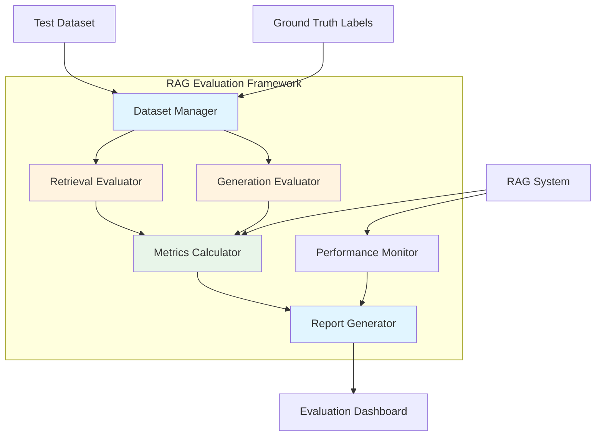
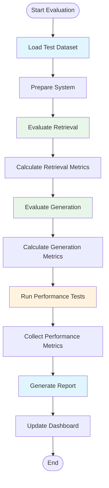

# Evaluation and Testing - RAG System Enhancement

## Overview

This document describes comprehensive evaluation and testing framework for RAG system. It covers retrieval quality metrics, generation quality assessment, performance benchmarking, and automated testing strategies to ensure system reliability and continuous improvement.

## Motivation

### Why Evaluation is Critical

1. **Quality Assurance**: Ensure RAG system provides accurate, relevant answers
2. **Performance Monitoring**: Track system performance over time
3. **Continuous Improvement**: Identify areas for enhancement
4. **Regression Detection**: Catch performance degradations early
5. **Model Comparison**: Compare different embedding/LLM models
6. **User Trust**: Demonstrate system reliability to stakeholders

### Current Challenges

- No standard metrics for RAG systems
- Evaluation depends on both retrieval and generation quality
- Need domain-specific evaluation criteria
- Balancing automation with human evaluation
- Scaling evaluation to large document sets

## Evaluation Framework Architecture



## 1. Retrieval Evaluation Metrics

### 1.1 Standard Metrics

#### Precision@K

**Definition**: Fraction of relevant documents in top-K retrieved results

```python
def precision_at_k(
    retrieved_docs: List[str],
    relevant_docs: Set[str],
    k: int
) -> float:
    """
    Calculate Precision@K.
    
    Args:
        retrieved_docs: List of retrieved document IDs (top-K)
        relevant_docs: Set of relevant document IDs
        k: Number of top results to consider
    
    Returns:
        Precision@K score (0.0 to 1.0)
    """
    top_k = retrieved_docs[:k]
    relevant_in_top_k = [
        doc_id for doc_id in top_k 
        if doc_id in relevant_docs
    ]
    
    return len(relevant_in_top_k) / k
```

#### Recall@K

**Definition**: Fraction of relevant documents retrieved in top-K results

```python
def recall_at_k(
    retrieved_docs: List[str],
    relevant_docs: Set[str],
    k: int
) -> float:
    """
    Calculate Recall@K.
    """
    if len(relevant_docs) == 0:
        return 0.0
    
    top_k = retrieved_docs[:k]
    relevant_in_top_k = [
        doc_id for doc_id in top_k 
        if doc_id in relevant_docs
    ]
    
    return len(relevant_in_top_k) / len(relevant_docs)
```

#### Mean Reciprocal Rank (MRR)

**Definition**: Average of reciprocal ranks of first relevant document

```python
def mean_reciprocal_rank(
    queries: List[QueryResult],
    relevant_sets: List[Set[str]]
) -> float:
    """
    Calculate Mean Reciprocal Rank.
    
    Args:
        queries: List of query results with ranked document IDs
        relevant_sets: List of relevant document ID sets for each query
    
    Returns:
        MRR score (0.0 to 1.0)
    """
    reciprocal_ranks = []
    
    for query_results, relevant_docs in zip(queries, relevant_sets):
        if not relevant_docs:
            continue
        
        # Find rank of first relevant document
        for rank, doc_id in enumerate(query_results.documents, start=1):
            if doc_id in relevant_docs:
                reciprocal_ranks.append(1.0 / rank)
                break
        else:
            # No relevant document found
            reciprocal_ranks.append(0.0)
    
    return sum(reciprocal_ranks) / len(reciprocal_ranks) if reciprocal_ranks else 0.0
```

#### Normalized Discounted Cumulative Gain (NDCG)

**Definition**: Measures ranking quality with position-based discounting

```python
def ndcg_at_k(
    retrieved_docs: List[str],
    relevance_scores: Dict[str, int],
    k: int
) -> float:
    """
    Calculate NDCG@K.
    
    Args:
        retrieved_docs: Ranked list of retrieved document IDs
        relevance_scores: Document ID to relevance score mapping (0-3)
        k: Number of top results to consider
    
    Returns:
        NDCG@K score (0.0 to 1.0)
    """
    # Calculate DCG
    dcg = 0.0
    for rank, doc_id in enumerate(retrieved_docs[:k], start=1):
        rel = relevance_scores.get(doc_id, 0)
        dcg += (2**rel - 1) / np.log2(rank + 1)
    
    # Calculate ideal DCG (best possible ranking)
    ideal_relevances = sorted(
        relevance_scores.values(),
        reverse=True
    )
    idcg = 0.0
    for rank, rel in enumerate(ideal_relevances[:k], start=1):
        idcg += (2**rel - 1) / np.log2(rank + 1)
    
    return dcg / idcg if idcg > 0 else 0.0
```

### 1.2 Domain-Specific Metrics

#### Relevance Scoring

```python
class RelevanceScorer:
    """
    Score document relevance to query.
    Supports multiple scoring methods.
    """
    def __init__(self, method: str = "combined"):
        self.method = method
    
    def score_relevance(
        self,
        query: str,
        document: Document
    ) -> float:
        """
        Calculate relevance score using specified method.
        """
        if self.method == "keyword":
            return self._keyword_relevance(query, document)
        elif self.method == "semantic":
            return self._semantic_relevance(query, document)
        elif self.method == "combined":
            return self._combined_relevance(query, document)
    
    def _keyword_relevance(
        self,
        query: str,
        document: Document
    ) -> float:
        """
        Calculate keyword-based relevance (BM25-like).
        """
        from sklearn.feature_extraction.text import TfidfVectorizer
        
        # Tokenize query
        query_tokens = self._tokenize(query)
        
        # Calculate TF-IDF
        vectorizer = TfidfVectorizer()
        tfidf_matrix = vectorizer.fit_transform(
            [document.content]
        )
        
        # Score based on query term presence
        score = 0.0
        feature_names = vectorizer.get_feature_names_out()
        
        for token in query_tokens:
            if token in feature_names:
                token_idx = list(feature_names).index(token)
                score += tfidf_matrix[0, token_idx]
        
        return score
    
    def _semantic_relevance(
        self,
        query: str,
        document: Document
    ) -> float:
        """
        Calculate semantic relevance using embeddings.
        """
        query_embedding = self.embedding_service.generate_embedding(query)
        doc_embedding = document.embedding
        
        return cosine_similarity(query_embedding, doc_embedding)
    
    def _combined_relevance(
        self,
        query: str,
        document: Document
    ) -> float:
        """
        Combine keyword and semantic relevance.
        """
        keyword_score = self._keyword_relevance(query, document)
        semantic_score = self._semantic_relevance(query, document)
        
        # Weighted combination
        return 0.4 * keyword_score + 0.6 * semantic_score
```

#### Coverage Metrics

```python
def calculate_coverage(
    retrieved_docs: List[Document],
    query_topics: Set[str]
) -> float:
    """
    Calculate topic coverage of retrieved documents.
    
    Args:
        retrieved_docs: List of retrieved documents
        query_topics: Set of topics that should be covered
    
    Returns:
        Coverage score (0.0 to 1.0)
    """
    covered_topics = set()
    
    for doc in retrieved_docs:
        # Extract topics from document
        doc_topics = extract_topics(doc.content)
        covered_topics.update(doc_topics)
    
    # Calculate coverage
    intersection = covered_topics.intersection(query_topics)
    return len(intersection) / len(query_topics) if query_topics else 0.0
```

### 1.3 Retrieval Evaluator

```python
class RetrievalEvaluator:
    def __init__(self, rag_system: RAGSystem):
        self.rag_system = rag_system
        self.metrics_calculator = MetricsCalculator()
    
    async def evaluate_retrieval(
        self,
        test_dataset: TestDataset
    ) -> RetrievalEvaluationResults:
        """
        Evaluate retrieval performance on test dataset.
        """
        results = []
        
        for test_case in test_dataset.cases:
            # Retrieve documents
            retrieved_docs = await self.rag_system.retrieve_documents(
                query=test_case.query,
                collection_id=test_case.collection_id,
                top_k=10
            )
            
            # Extract retrieved document IDs
            retrieved_ids = [doc.id for doc in retrieved_docs]
            
            # Calculate metrics
            metrics = {
                "precision@1": precision_at_k(
                    retrieved_ids, test_case.relevant_docs, 1
                ),
                "precision@5": precision_at_k(
                    retrieved_ids, test_case.relevant_docs, 5
                ),
                "precision@10": precision_at_k(
                    retrieved_ids, test_case.relevant_docs, 10
                ),
                "recall@5": recall_at_k(
                    retrieved_ids, test_case.relevant_docs, 5
                ),
                "recall@10": recall_at_k(
                    retrieved_ids, test_case.relevant_docs, 10
                ),
                "mrr": 1.0 / (next(
                    (i for i, doc_id in enumerate(retrieved_ids)
                    if doc_id in test_case.relevant_docs
                ) + 1)
                ) if any(doc_id in test_case.relevant_docs 
                       for doc_id in retrieved_ids) else 0.0
            }
            
            results.append({
                "query_id": test_case.id,
                "query": test_case.query,
                "metrics": metrics,
                "retrieved_count": len(retrieved_docs),
                "relevant_count": len(test_case.relevant_docs)
            })
        
        # Aggregate metrics
        return self._aggregate_results(results)
    
    def _aggregate_results(
        self,
        results: List[Dict]
    ) -> RetrievalEvaluationResults:
        """
        Aggregate evaluation results across all test cases.
        """
        metrics_keys = results[0]["metrics"].keys()
        
        aggregated = {}
        for key in metrics_keys:
            values = [r["metrics"][key] for r in results]
            aggregated[key] = {
                "mean": np.mean(values),
                "std": np.std(values),
                "min": np.min(values),
                "max": np.max(values),
                "median": np.median(values)
            }
        
        return RetrievalEvaluationResults(
            test_cases_count=len(results),
            aggregated_metrics=aggregated,
            per_case_results=results
        )
```

## 2. Generation Evaluation Metrics

### 2.1 Faithfulness Metrics

#### Answer Relevance

```python
def calculate_answer_relevance(
    answer: str,
    query: str,
    retrieved_docs: List[Document]
) -> float:
    """
    Calculate how relevant the answer is to the query.
    
    Uses cross-encoder model for scoring.
    """
    from sentence_transformers import CrossEncoder
    
    # Load cross-encoder
    model = CrossEncoder('cross-encoder/ms-marco-MiniLM-L-6-v2')
    
    # Score answer relevance
    scores = model.predict(
        [[query, answer]]
    )
    
    # Convert to probability (sigmoid)
    relevance = 1 / (1 + np.exp(-scores[0]))
    
    return relevance
```

#### Citation Accuracy

```python
def calculate_citation_accuracy(
    answer: str,
    retrieved_docs: List[Document],
    citations: List[Citation]
) -> float:
    """
    Calculate how well citations support the answer.
    
    Checks if cited information appears in source documents.
    """
    if not citations:
        return 0.0
    
    accurate_citations = 0
    
    for citation in citations:
        # Get cited document
        cited_doc = next(
            (doc for doc in retrieved_docs 
             if doc.id == citation.document_id),
            None
        )
        
        if not cited_doc:
            continue
        
        # Extract cited information from answer
        cited_text = self._extract_citation_text(
            answer, citation
        )
        
        # Check if cited text is in document
        if cited_text.lower() in cited_doc.content.lower():
            accurate_citations += 1
    
    return accurate_citations / len(citations)
```

#### Faithfulness Score

```python
async def calculate_faithfulness(
    answer: str,
    retrieved_docs: List[Document],
    llm_service: LLMService
) -> float:
    """
    Calculate faithfulness of answer using LLM verification.
    
    Prompts LLM to check if each claim in answer is
    supported by retrieved documents.
    """
    # Extract claims from answer
    claims = await self._extract_claims(answer)
    
    if not claims:
        return 1.0  # No claims, trivially faithful
    
    # Verify each claim
    verified_claims = 0
    for claim in claims:
        # Build context from retrieved docs
        context = "\n".join([
            f"Doc {i}: {doc.content}"
            for i, doc in enumerate(retrieved_docs)
        ])
        
        # Ask LLM to verify claim
        prompt = f"""
        Based on the following context, is this claim supported?
        
        Context:
        {context}
        
        Claim: {claim}
        
        Respond with "supported" or "not_supported" and a brief explanation.
        """
        
        response = await llm_service.generate(prompt)
        
        if "supported" in response.lower():
            verified_claims += 1
    
    return verified_claims / len(claims)
```

### 2.2 Quality Metrics

#### Answer Completeness

```python
def calculate_completeness(
    answer: str,
    expected_aspects: List[str]
) -> float:
    """
    Calculate how complete the answer is based on
    expected aspects/topics.
    """
    covered_aspects = 0
    
    for aspect in expected_aspects:
        if aspect.lower() in answer.lower():
            covered_aspects += 1
    
    return covered_aspects / len(expected_aspects) if expected_aspects else 0.0
```

#### Answer Fluency

```python
def calculate_fluency(
    answer: str
) -> float:
    """
    Calculate fluency score using language model.
    
    Measures how natural and grammatical the answer is.
    """
    from transformers import pipeline
    
    # Load fluency checker
    fluency_checker = pipeline(
        "text-classification",
        model="textattack/roberta-base-CoLA"
    )
    
    # Score fluency
    result = fluency_checker(answer)
    
    # Extract probability of being grammatical
    grammatical_score = next(
        (item["score"] for item in result 
         if item["label"] == "LABEL_1"),
        0.0
    )
    
    return grammatical_score
```

#### Answer Length

```python
def calculate_answer_length_score(
    answer: str,
    min_length: int = 50,
    ideal_length: int = 200,
    max_length: int = 500
) -> float:
    """
    Calculate score based on answer length.
    
    Penalizes answers that are too short or too long.
    """
    actual_length = len(answer.split())
    
    if actual_length < min_length:
        return actual_length / min_length
    elif actual_length > max_length:
        return max_length / actual_length
    else:
        # Within ideal range
        return 1.0
```

### 2.3 Generation Evaluator

```python
class GenerationEvaluator:
    def __init__(self, rag_system: RAGSystem, llm_service: LLMService):
        self.rag_system = rag_system
        self.llm_service = llm_service
    
    async def evaluate_generation(
        self,
        test_dataset: TestDataset
    ) -> GenerationEvaluationResults:
        """
        Evaluate generation performance on test dataset.
        """
        results = []
        
        for test_case in test_dataset.cases:
            # Generate answer
            answer = await self.rag_system.query(
                query=test_case.query,
                collection_id=test_case.collection_id
            )
            
            # Calculate metrics
            metrics = {
                "relevance": await calculate_answer_relevance(
                    answer.text, test_case.query, answer.retrieved_docs
                ),
                "citation_accuracy": calculate_citation_accuracy(
                    answer.text, answer.retrieved_docs, answer.citations
                ),
                "faithfulness": await calculate_faithfulness(
                    answer.text, answer.retrieved_docs, self.llm_service
                ),
                "completeness": calculate_completeness(
                    answer.text, test_case.expected_aspects
                ),
                "fluency": calculate_fluency(answer.text),
                "length_score": calculate_answer_length_score(answer.text)
            }
            
            results.append({
                "query_id": test_case.id,
                "query": test_case.query,
                "answer": answer.text,
                "metrics": metrics
            })
        
        return self._aggregate_results(results)
```

## 3. Performance Benchmarking

### 3.1 System Performance Metrics

```python
class PerformanceMonitor:
    def __init__(self):
        self.metrics = {
            "query_latency": [],
            "document_ingestion_time": [],
            "embedding_generation_time": [],
            "vector_search_time": [],
            "llm_generation_time": [],
            "total_query_time": []
        }
    
    async def track_query(
        self,
        query_func: Callable,
        query: str,
        **kwargs
    ) -> QueryPerformance:
        """
        Track performance of a query.
        """
        start_time = time.time()
        
        # Execute query
        result = await query_func(query, **kwargs)
        
        end_time = time.time()
        total_time = end_time - start_time
        
        # Record metrics
        self.metrics["query_latency"].append(total_time)
        self.metrics["total_query_time"].append(total_time)
        
        if result.embedding_time:
            self.metrics["embedding_generation_time"].append(
                result.embedding_time
            )
        
        if result.search_time:
            self.metrics["vector_search_time"].append(
                result.search_time
            )
        
        if result.llm_time:
            self.metrics["llm_generation_time"].append(
                result.llm_time
            )
        
        return QueryPerformance(
            query=query,
            total_time=total_time,
            embedding_time=result.embedding_time,
            search_time=result.search_time,
            llm_time=result.llm_time
        )
    
    async def track_ingestion(
        self,
        document: Document
    ) -> IngestionPerformance:
        """
        Track performance of document ingestion.
        """
        start_time = time.time()
        
        # Process document
        await self.rag_system.ingest_document(document)
        
        end_time = time.time()
        ingestion_time = end_time - start_time
        
        self.metrics["document_ingestion_time"].append(
            ingestion_time
        )
        
        return IngestionPerformance(
            document_id=document.id,
            file_size=document.file_size,
            ingestion_time=ingestion_time,
            throughput=document.file_size / ingestion_time
        )
    
    def get_performance_summary(self) -> PerformanceSummary:
        """
        Get summary of performance metrics.
        """
        summary = {}
        
        for metric_name, values in self.metrics.items():
            if values:
                summary[metric_name] = {
                    "mean": np.mean(values),
                    "std": np.std(values),
                    "min": np.min(values),
                    "max": np.max(values),
                    "p50": np.percentile(values, 50),
                    "p95": np.percentile(values, 95),
                    "p99": np.percentile(values, 99)
                }
        
        return summary
```

### 3.2 Stress Testing

```python
class StressTester:
    def __init__(self, rag_system: RAGSystem):
        self.rag_system = rag_system
    
    async def run_load_test(
        self,
        queries: List[str],
        concurrent_users: int = 10,
        test_duration: int = 60
    ) -> LoadTestResults:
        """
        Run load test on RAG system.
        
        Args:
            queries: List of queries to execute
            concurrent_users: Number of concurrent users
            test_duration: Test duration in seconds
        
        Returns:
            Load test results with performance metrics
        """
        start_time = time.time()
        results = []
        
        async def execute_query(query: str) -> QueryResult:
            query_start = time.time()
            result = await self.rag_system.query(query)
            query_end = time.time()
            
            return QueryResult(
                query=query,
                latency=query_end - query_start,
                success=result is not None
            )
        
        # Execute queries concurrently
        tasks = []
        for _ in range(test_duration):
            query = random.choice(queries)
            tasks.append(execute_query(query))
            
            if len(tasks) >= concurrent_users:
                completed = await asyncio.gather(*tasks)
                results.extend(completed)
                tasks = []
        
        # Wait for remaining tasks
        if tasks:
            completed = await asyncio.gather(*tasks)
            results.extend(completed)
        
        end_time = time.time()
        
        # Calculate metrics
        total_queries = len(results)
        successful_queries = len([r for r in results if r.success])
        
        return LoadTestResults(
            total_queries=total_queries,
            successful_queries=successful_queries,
            failed_queries=total_queries - successful_queries,
            success_rate=successful_queries / total_queries,
            
            total_time=end_time - start_time,
            
            avg_latency=np.mean([r.latency for r in results]),
            p50_latency=np.percentile([r.latency for r in results], 50),
            p95_latency=np.percentile([r.latency for r in results], 95),
            p99_latency=np.percentile([r.latency for r in results], 99),
            
            throughput=total_queries / (end_time - start_time)
        )
```

## 4. Test Dataset Management

### 4.1 Dataset Structure

```python
@dataclass
class TestDataset:
    """
    Structure for test dataset.
    """
    dataset_id: str
    name: str
    description: str
    domain: str
    language: str
    
    cases: List[TestCase]
    metadata: Dict[str, Any]
    
    created_at: datetime
    updated_at: datetime

@dataclass
class TestCase:
    """
    Individual test case.
    """
    test_id: str
    dataset_id: str
    
    query: str
    query_type: str  # factoid, list, explanation, etc.
    
    collection_id: str
    
    # Retrieval ground truth
    relevant_docs: Set[str]  # Document IDs
    relevance_scores: Optional[Dict[str, int]]  # Graded relevance
    
    # Generation ground truth
    expected_aspects: List[str]  # Topics/aspects to cover
    reference_answer: Optional[str]  # Ideal answer
    
    # Metadata
    difficulty: str  # easy, medium, hard
    source: Optional[str]
    created_at: datetime
```

### 4.2 Dataset Generation

```python
class DatasetGenerator:
    """
    Generate test datasets from existing documents.
    """
    def __init__(self, rag_system: RAGSystem):
        self.rag_system = rag_system
        self.llm_service = rag_system.llm_service
    
    async def generate_synthetic_dataset(
        self,
        collection_id: str,
        num_queries: int = 100
    ) -> TestDataset:
        """
        Generate synthetic test dataset using LLM.
        """
        # Get sample documents
        documents = await self.rag_system.get_documents(
            collection_id=collection_id,
            limit=100
        )
        
        test_cases = []
        
        for doc in random.sample(documents, num_queries):
            # Generate query from document
            query = await self._generate_query(doc)
            
            # Identify relevant documents (query-based search)
            relevant_docs = await self._find_relevant_docs(
                query, collection_id
            )
            
            # Extract expected aspects
            expected_aspects = self._extract_aspects(doc.content)
            
            test_case = TestCase(
                test_id=generate_uuid(),
                dataset_id="synthetic",
                query=query,
                query_type="explanation",
                collection_id=collection_id,
                relevant_docs={doc.id for doc in relevant_docs},
                expected_aspects=expected_aspects,
                reference_answer=None,
                difficulty="medium",
                source="synthetic",
                created_at=datetime.utcnow()
            )
            
            test_cases.append(test_case)
        
        return TestDataset(
            dataset_id="synthetic_dataset",
            name="Synthetic Test Dataset",
            description="Auto-generated test dataset",
            domain="general",
            language="en",
            cases=test_cases,
            metadata={"generation_method": "llm_based"},
            created_at=datetime.utcnow(),
            updated_at=datetime.utcnow()
        )
    
    async def _generate_query(
        self,
        document: Document
    ) -> str:
        """
        Generate query from document content.
        """
        prompt = f"""
        Generate a natural language question based on the following text.
        The question should be answerable using only the provided text.
        
        Text:
        {document.content[:1000]}
        
        Question:
        """
        
        response = await self.llm_service.generate(prompt)
        return response.strip()
```

### 4.3 Human Evaluation Framework

```python
class HumanEvaluator:
    """
    Framework for human evaluation of RAG outputs.
    """
    def __init__(self, storage: EvaluationStorage):
        self.storage = storage
    
    async def create_evaluation_task(
        self,
        test_case: TestCase,
        rag_output: RAGOutput
    ) -> EvaluationTask:
        """
        Create evaluation task for human reviewer.
        """
        task = EvaluationTask(
            task_id=generate_uuid(),
            test_case_id=test_case.test_id,
            
            query=test_case.query,
            rag_output=rag_output,
            
            evaluation_criteria={
                "answer_quality": {
                    "description": "Is the answer high quality?",
                    "scale": "1-5"
                },
                "answer_relevance": {
                    "description": "Is the answer relevant to the query?",
                    "scale": "1-5"
                },
                "source_relevance": {
                    "description": "Are the retrieved sources relevant?",
                    "scale": "1-5"
                },
                "citation_accuracy": {
                    "description": "Are the citations accurate?",
                    "scale": "1-5"
                }
            },
            
            created_at=datetime.utcnow()
        )
        
        await self.storage.save_task(task)
        return task
    
    async def submit_evaluation(
        self,
        task_id: str,
        evaluator_id: str,
        scores: Dict[str, int],
        comments: Optional[str] = None
    ) -> None:
        """
        Submit human evaluation.
        """
        evaluation = HumanEvaluation(
            evaluation_id=generate_uuid(),
            task_id=task_id,
            evaluator_id=evaluator_id,
            scores=scores,
            comments=comments,
            submitted_at=datetime.utcnow()
        )
        
        await self.storage.save_evaluation(evaluation)
    
    async def get_consensus_scores(
        self,
        task_id: str
    ) -> Dict[str, float]:
        """
        Calculate consensus scores from multiple evaluators.
        """
        evaluations = await self.storage.get_evaluations(task_id)
        
        consensus = {}
        for criterion in evaluations[0].scores.keys():
            scores = [
                eval.scores[criterion] 
                for eval in evaluations
            ]
            consensus[criterion] = {
                "mean": np.mean(scores),
                "std": np.std(scores),
                "min": np.min(scores),
                "max": np.max(scores),
                "count": len(scores)
            }
        
        return consensus
```

## 5. Evaluation Pipeline

### 5.1 Automated Evaluation Pipeline



```python
class EvaluationPipeline:
    def __init__(
        self,
        rag_system: RAGSystem,
        retrieval_evaluator: RetrievalEvaluator,
        generation_evaluator: GenerationEvaluator,
        performance_monitor: PerformanceMonitor
    ):
        self.rag_system = rag_system
        self.retrieval_evaluator = retrieval_evaluator
        self.generation_evaluator = generation_evaluator
        self.performance_monitor = performance_monitor
    
    async def run_evaluation(
        self,
        dataset: TestDataset,
        config: EvaluationConfig
    ) -> EvaluationReport:
        """
        Run complete evaluation pipeline.
        """
        report = EvaluationReport(
            report_id=generate_uuid(),
            dataset_id=dataset.dataset_id,
            started_at=datetime.utcnow(),
            config=config
        )
        
        # Evaluate retrieval
        if config.evaluate_retrieval:
            report.retrieval_results = await self.retrieval_evaluator.evaluate_retrieval(dataset)
        
        # Evaluate generation
        if config.evaluate_generation:
            report.generation_results = await self.generation_evaluator.evaluate_generation(dataset)
        
        # Run performance tests
        if config.run_performance_tests:
            report.performance_results = await self._run_performance_tests(dataset)
        
        # Generate summary
        report.summary = self._generate_summary(report)
        report.completed_at = datetime.utcnow()
        
        # Save report
        await self.report_storage.save(report)
        
        return report
```

### 5.2 Evaluation Dashboard

```python
class EvaluationDashboard:
    """
    Web dashboard for visualizing evaluation results.
    """
    def __init__(self, report_storage: ReportStorage):
        self.storage = report_storage
    
    async def get_dashboard_data(
        self,
        time_range: Optional[timedelta] = None
    ) -> DashboardData:
        """
        Get data for evaluation dashboard.
        """
        # Get recent reports
        reports = await self.storage.get_recent_reports(time_range)
        
        # Aggregate metrics
        dashboard_data = DashboardData(
            # Retrieval metrics trends
            retrieval_trends=self._calculate_retrieval_trends(reports),
            
            # Generation metrics trends
            generation_trends=self._calculate_generation_trends(reports),
            
            # Performance metrics
            performance_metrics=self._calculate_performance_metrics(reports),
            
            # Recent evaluations
            recent_evaluations=reports[:10],
            
            # System health
            system_health=self._assess_system_health(reports)
        )
        
        return dashboard_data
```

## Configuration

### YAML Configuration

```yaml
# config/evaluation.yaml
evaluation:
  enabled: true
  
  datasets:
    path: /data/evaluations/datasets
    auto_generate: true
    synthetic_queries: 100
    human_annotated_ratio: 0.2
  
  retrieval_metrics:
    - precision_at_k
    - recall_at_k
    - mrr
    - ndcg
    k_values: [1, 5, 10, 20]
  
  generation_metrics:
    - relevance
    - faithfulness
    - citation_accuracy
    - completeness
    - fluency
  
  performance_tests:
    enabled: true
    load_test:
      concurrent_users: 10
      duration_seconds: 60
      queries_per_second_target: 10
    
    stress_test:
      max_concurrent_users: 100
      duration_seconds: 300
  
  evaluation_frequency:
    automated:
      enabled: true
      schedule: "0 2 * * *"  # Daily at 2 AM
    
    on_model_change: true
    on_document_update: true
  
  reporting:
    save_reports: true
    path: /data/evaluations/reports
    dashboard_enabled: true
    alert_thresholds:
      precision_at_5: 0.7
      faithfulness: 0.8
      query_latency_p95: 2000  # ms
  
  human_evaluation:
    enabled: true
    sample_rate: 0.1  # Evaluate 10% of outputs
    min_evaluators_per_task: 2
    evaluator_pool: []
```

## Use Cases

### 1. Model Comparison

**Scenario:** Compare different embedding models

```
Evaluate Model A (MiniLM-L6):
- Precision@10: 0.75
- MRR: 0.65
- Query latency: 150ms

Evaluate Model B (MPNet):
- Precision@10: 0.82
- MRR: 0.72
- Query latency: 180ms

Decision: Use MPNet for better quality despite slightly higher latency
```

### 2. Regression Testing

**Scenario:** Detect performance degradation after deployment

```
Baseline (v1.0):
- Precision@10: 0.80 ± 0.05
- Query latency p95: 150ms

After deployment (v1.1):
- Precision@10: 0.72 ± 0.06
- Query latency p95: 200ms

Alert: Performance degradation detected!
- Investigate changes in v1.1
- Rollback if necessary
```

### 3. Continuous Monitoring

**Scenario:** Monitor system performance over time

```
Daily evaluation runs:
- Track metrics trends
- Identify gradual degradation
- Alert on significant changes

Dashboard shows:
- Retrieval quality trends
- Generation quality trends
- Performance metrics
- Error rates

Proactive actions:
- Optimize vector database indexes
- Rebalance LLM load
- Update embedding models
```

## Future Enhancements

### Planned Features

1. **Advanced Metrics**
   - Novelty detection
   - Diversity metrics
   - User satisfaction prediction

2. **Auto-Tuning**
   - Hyperparameter optimization
   - Model selection
   - Threshold tuning

3. **Evaluation Pipelines**
   - CI/CD integration
   - Automated regression testing
   - A/B testing support

4. **Enhanced Human Evaluation**
   - Crowdsourcing integration
   - Expert review workflows
   - Quality assurance automation

## Related Documents

- **[Basic Design](01-basic-design.md)** - Core RAG system components
- **[C4 Model](02-c4-model.md)** - System architecture diagrams
- **[Advanced Retrieval](07-advanced-retrieval.md)** - Enhanced retrieval mechanisms
- **[Context Management](08-context-management.md)** - Conversation and context features

---

## Summary

Comprehensive evaluation and testing framework ensures:

- **Quality Assurance**: Regular evaluation of retrieval and generation quality
- **Performance Monitoring**: Track system performance and resource usage
- **Continuous Improvement**: Identify areas for enhancement
- **Regression Detection**: Catch performance degradations early
- **Automated Testing**: Run tests automatically on schedule
- **Human-in-the-Loop**: Combine automated and human evaluation

This framework enables data-driven decisions for optimizing RAG system performance and ensuring high-quality outputs.
