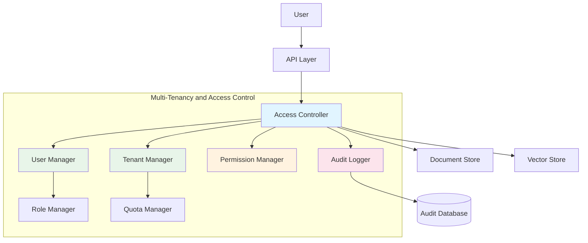
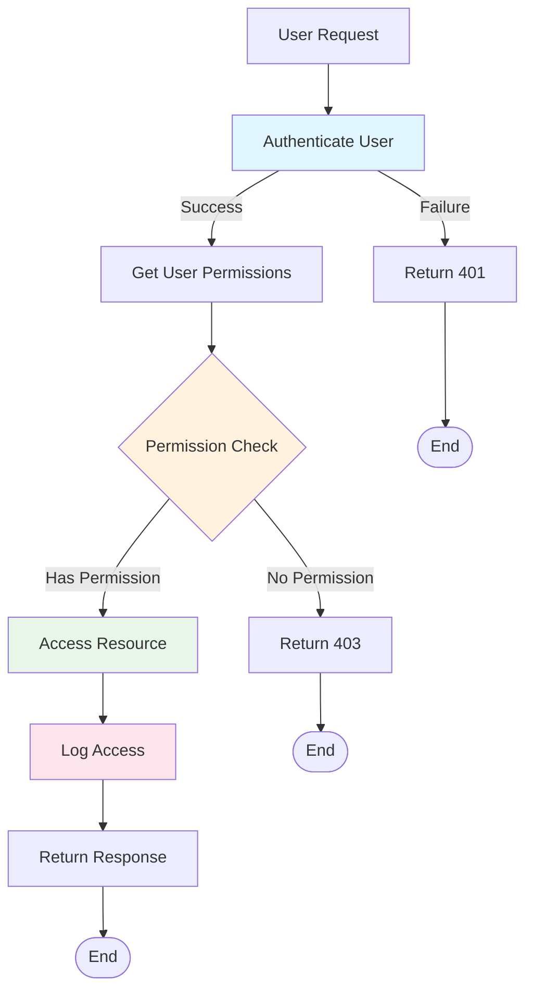
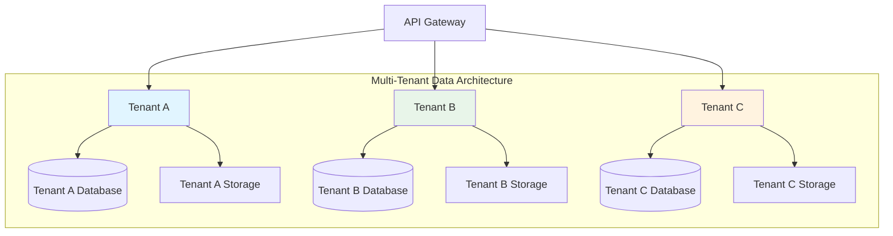

# Multi-tenancy and Access Control - RAG System Enhancement

## Overview

This document describes multi-tenancy and access control features for RAG system, enabling support for multiple organizations, users, and secure access control to documents and collections. These capabilities are essential for enterprise deployments and SaaS implementations.

## Motivation

### Current Limitations

Basic RAG system lacks:

1. **Single Tenant Design**: No support for multiple organizations or teams
2. **No User Management**: Basic authentication without role-based access
3. **No Document Isolation**: All documents accessible to all users
4. **No Audit Trail**: Limited tracking of user actions
5. **No Resource Quotas**: Unlimited resource consumption per user

### Enhancement Goals

1. **Multi-Tenancy**: Support multiple organizations/tenants
2. **Role-Based Access Control (RBAC)**: Granular permissions for users
3. **Document-Level Security**: Secure access to individual documents
4. **Audit Logging**: Comprehensive tracking of all actions
5. **Resource Quotas**: Manage resource allocation per tenant
6. **Data Isolation**: Ensure tenant data separation

## Architecture

### System Components



### Component Responsibilities

#### 1. Tenant Manager

**Responsibilities:**
- Create and manage tenant organizations
- Track tenant metadata and configuration
- Manage tenant lifecycle
- Handle tenant data isolation

**API:**
```python
class TenantManager:
    async def create_tenant(
        self,
        name: str,
        admin_user_id: str,
        config: Optional[TenantConfig] = None
    ) -> Tenant
    
    async def get_tenant(
        self,
        tenant_id: str
    ) -> Tenant
    
    async def update_tenant(
        self,
        tenant_id: str,
        updates: Dict[str, Any]
    ) -> Tenant
    
    async def delete_tenant(
        self,
        tenant_id: str
    ) -> bool
    
    async def list_tenants(
        self,
        filters: Optional[Dict] = None
    ) -> List[Tenant]
    
    async def get_tenant_usage(
        self,
        tenant_id: str
    ) -> TenantUsage
```

**Tenant Data Structure:**
```python
@dataclass
class Tenant:
    tenant_id: str
    name: str
    slug: str  # URL-friendly identifier
    
    plan: str  # free, basic, pro, enterprise
    status: TenantStatus  # active, suspended, deleted
    
    created_at: datetime
    updated_at: datetime
    
    # Configuration
    config: TenantConfig
    
    # Metadata
    metadata: Dict[str, Any]

@dataclass
class TenantConfig:
    max_users: int
    max_documents: int
    max_storage_gb: float
    max_queries_per_day: int
    
    allowed_features: List[str]
    custom_models: List[str]
    
    # Data retention
    document_retention_days: int
    query_retention_days: int
    audit_retention_days: int

@dataclass
class TenantUsage:
    tenant_id: str
    
    user_count: int
    document_count: int
    storage_used_gb: float
    queries_today: int
    
    # Quota status
    user_quota_used: float  # percentage
    document_quota_used: float
    storage_quota_used: float
    query_quota_used: float
```

#### 2. User Manager

**Responsibilities:**
- Create and manage user accounts
- Authenticate users
- Manage user sessions
- Handle user lifecycle

**API:**
```python
class UserManager:
    async def create_user(
        self,
        tenant_id: str,
        email: str,
        password: str,
        name: str,
        roles: List[str]
    ) -> User
    
    async def authenticate_user(
        self,
        email: str,
        password: str
    ) -> Optional[User]
    
    async def get_user(
        self,
        user_id: str
    ) -> User
    
    async def update_user(
        self,
        user_id: str,
        updates: Dict[str, Any]
    ) -> User
    
    async def delete_user(
        self,
        user_id: str
    ) -> bool
    
    async def list_users(
        self,
        tenant_id: str,
        filters: Optional[Dict] = None
    ) -> List[User]
```

**User Data Structure:**
```python
@dataclass
class User:
    user_id: str
    tenant_id: str
    
    email: str
    name: str
    
    password_hash: str
    salt: str
    
    roles: List[str]
    permissions: List[str]
    
    status: UserStatus  # active, inactive, suspended
    email_verified: bool
    
    created_at: datetime
    updated_at: datetime
    last_login_at: Optional[datetime]
    
    # Metadata
    metadata: Dict[str, Any]
```

#### 3. Role Manager

**Responsibilities:**
- Define roles and their permissions
- Assign roles to users
- Manage role hierarchy

**Predefined Roles:**

| Role | Permissions | Description |
|-------|-------------|-------------|
| `tenant_admin` | Full access to tenant resources | Tenant administrator |
| `collection_admin` | Manage collections and documents | Collection manager |
| `document_editor` | Create, edit, delete documents | Document editor |
| `document_viewer` | Read-only access to documents | Document viewer |
| `query_user` | Submit queries only | Regular user |
| `auditor` | Read-only access to audit logs | Compliance auditor |

**API:**
```python
class RoleManager:
    async def define_role(
        self,
        tenant_id: str,
        role_name: str,
        permissions: List[str],
        description: str = ""
    ) -> Role
    
    async def assign_role(
        self,
        user_id: str,
        role_name: str
    ) -> bool
    
    async def remove_role(
        self,
        user_id: str,
        role_name: str
    ) -> bool
    
    async def get_user_roles(
        self,
        user_id: str
    ) -> List[Role]
    
    async def get_user_permissions(
        self,
        user_id: str
    ) -> List[str]
```

**Role Definition:**
```python
@dataclass
class Role:
    tenant_id: str
    role_name: str
    
    permissions: List[str]
    
    # Role hierarchy
    inherits_from: Optional[List[str]]
    
    description: str
    
    created_at: datetime
    updated_at: datetime
```

#### 4. Permission Manager

**Responsibilities:**
- Define system permissions
- Check permissions for operations
- Manage permission inheritance

**Permission Hierarchy:**

```
Permissions are organized by resource and action:

Document Permissions:
- document:read      # Read document content
- document:create    # Create new documents
- document:update    # Update document metadata
- document:delete    # Delete documents
- document:share     # Share documents with others

Collection Permissions:
- collection:read    # Read collection
- collection:create   # Create collection
- collection:update   # Update collection settings
- collection:delete   # Delete collection

Query Permissions:
- query:submit       # Submit queries
- query:history      # View query history

Admin Permissions:
- tenant:configure   # Configure tenant settings
- tenant:manage_users # Manage users
- tenant:manage_roles # Manage roles
- tenant:audit_log   # View audit logs
```

**API:**
```python
class PermissionManager:
    def has_permission(
        self,
        user: User,
        permission: str
    ) -> bool:
        """
        Check if user has a specific permission.
        """
        # Check if user has any role with this permission
        for role_name in user.roles:
            role = self._get_role(role_name)
            
            if permission in role.permissions:
                return True
            
            # Check inherited permissions
            if role.inherits_from:
                for inherited_role_name in role.inherits_from:
                    inherited_role = self._get_role(inherited_role_name)
                    if permission in inherited_role.permissions:
                        return True
        
        return False
    
    def has_any_permission(
        self,
        user: User,
        permissions: List[str]
    ) -> bool:
        """
        Check if user has any of the specified permissions.
        """
        return any(
            self.has_permission(user, perm)
            for perm in permissions
        )
    
    def has_all_permissions(
        self,
        user: User,
        permissions: List[str]
    ) -> bool:
        """
        Check if user has all of the specified permissions.
        """
        return all(
            self.has_permission(user, perm)
            for perm in permissions
        )
```

#### 5. Access Controller

**Responsibilities:**
- Enforce access control rules
- Check permissions before operations
- Implement document-level access control
- Log all access attempts

**Access Control Flow:**



**API:**
```python
class AccessController:
    def __init__(
        self,
        tenant_manager: TenantManager,
        user_manager: UserManager,
        permission_manager: PermissionManager,
        audit_logger: AuditLogger
    ):
        self.tenant_manager = tenant_manager
        self.user_manager = user_manager
        self.permission_manager = permission_manager
        self.audit_logger = audit_logger
    
    async def check_document_access(
        self,
        user_id: str,
        document_id: str,
        required_permission: str = "document:read"
    ) -> bool:
        """
        Check if user has access to document.
        """
        user = await self.user_manager.get_user(user_id)
        
        # Check permission
        if not self.permission_manager.has_permission(
            user, required_permission
        ):
            await self.audit_logger.log_access_denied(
                user_id, document_id, required_permission
            )
            return False
        
        # Check document ownership/sharing
        document = await self.document_store.get(document_id)
        
        if not self._has_document_access(user, document):
            await self.audit_logger.log_access_denied(
                user_id, document_id, "document access"
            )
            return False
        
        # Log access granted
        await self.audit_logger.log_access_granted(
            user_id, document_id, required_permission
        )
        
        return True
    
    def _has_document_access(
        self,
        user: User,
        document: Document
    ) -> bool:
        """
        Check if user has access to specific document.
        """
        # Admin has access to all documents in tenant
        if "tenant_admin" in user.roles:
            return True
        
        # Document owner has access
        if document.owner_id == user.user_id:
            return True
        
        # Check document sharing
        if document.shared_with:
            if user.user_id in document.shared_with.users:
                return True
            
            for group_id in document.shared_with.groups:
                if user.group_id == group_id:
                    return True
        
        # Check collection-level access
        collection = self.collection_store.get(document.collection_id)
        if self._has_collection_access(user, collection):
            return True
        
        return False
    
    async def check_collection_access(
        self,
        user_id: str,
        collection_id: str,
        required_permission: str = "collection:read"
    ) -> bool:
        """
        Check if user has access to collection.
        """
        user = await self.user_manager.get_user(user_id)
        
        # Check permission
        if not self.permission_manager.has_permission(
            user, required_permission
        ):
            return False
        
        # Check collection access
        collection = await self.collection_store.get(collection_id)
        
        return self._has_collection_access(user, collection)
    
    def _has_collection_access(
        self,
        user: User,
        collection: Collection
    ) -> bool:
        """
        Check if user has access to collection.
        """
        # Admin has access to all collections in tenant
        if "tenant_admin" in user.roles:
            return True
        
        # Collection is public in tenant
        if collection.is_public:
            return True
        
        # User has explicit access
        if user.user_id in collection.allowed_users:
            return True
        
        # User's group has access
        if user.group_id in collection.allowed_groups:
            return True
        
        return False
```

#### 6. Audit Logger

**Responsibilities:**
- Log all user actions
- Track access attempts
- Store audit trail
- Provide audit reports

**API:**
```python
class AuditLogger:
    async def log_access_granted(
        self,
        user_id: str,
        resource_id: str,
        resource_type: str,
        action: str
    ) -> None:
        """
        Log successful access.
        """
        audit_event = AuditEvent(
            event_id=generate_uuid(),
            
            user_id=user_id,
            tenant_id=await self._get_tenant_id(user_id),
            
            resource_id=resource_id,
            resource_type=resource_type,
            action=action,
            
            result="granted",
            
            timestamp=datetime.utcnow(),
            ip_address=self._get_ip_address(),
            user_agent=self._get_user_agent()
        )
        
        await self.audit_store.save(audit_event)
    
    async def log_access_denied(
        self,
        user_id: str,
        resource_id: str,
        reason: str
    ) -> None:
        """
        Log denied access.
        """
        audit_event = AuditEvent(
            event_id=generate_uuid(),
            
            user_id=user_id,
            tenant_id=await self._get_tenant_id(user_id),
            
            resource_id=resource_id,
            resource_type=self._infer_resource_type(resource_id),
            action="access",
            
            result="denied",
            reason=reason,
            
            timestamp=datetime.utcnow(),
            ip_address=self._get_ip_address(),
            user_agent=self._get_user_agent()
        )
        
        await self.audit_store.save(audit_event)
    
    async def log_action(
        self,
        user_id: str,
        action: str,
        resource_type: str,
        resource_id: Optional[str] = None,
        details: Optional[Dict] = None
    ) -> None:
        """
        Log user action.
        """
        audit_event = AuditEvent(
            event_id=generate_uuid(),
            
            user_id=user_id,
            tenant_id=await self._get_tenant_id(user_id),
            
            resource_id=resource_id,
            resource_type=resource_type,
            action=action,
            
            result="success",
            details=details,
            
            timestamp=datetime.utcnow(),
            ip_address=self._get_ip_address(),
            user_agent=self._get_user_agent()
        )
        
        await self.audit_store.save(audit_event)
    
    async def get_audit_log(
        self,
        tenant_id: str,
        filters: AuditFilters,
        pagination: Pagination
    ) -> List[AuditEvent]:
        """
        Retrieve audit log with filters.
        """
        return await self.audit_store.query(
            tenant_id=tenant_id,
            filters=filters,
            pagination=pagination
        )
```

**Audit Event Structure:**
```python
@dataclass
class AuditEvent:
    event_id: str
    
    user_id: str
    tenant_id: str
    
    resource_id: Optional[str]
    resource_type: str  # document, collection, user, tenant
    action: str
    
    result: str  # granted, denied, success, failure
    reason: Optional[str]
    
    details: Optional[Dict[str, Any]]
    
    timestamp: datetime
    ip_address: Optional[str]
    user_agent: Optional[str]
```

#### 7. Quota Manager

**Responsibilities:**
- Track resource usage per tenant
- Enforce quota limits
- Alert on quota violations
- Handle quota upgrades

**API:**
```python
class QuotaManager:
    async def check_quota(
        self,
        tenant_id: str,
        resource: str,
        amount: int = 1
    ) -> QuotaCheckResult:
        """
        Check if tenant has sufficient quota for resource.
        """
        tenant = await self.tenant_manager.get_tenant(tenant_id)
        usage = await self.get_tenant_usage(tenant_id)
        
        if resource == "documents":
            available = tenant.config.max_documents - usage.document_count
            return QuotaCheckResult(
                allowed=amount <= available,
                resource=resource,
                requested=amount,
                available=available,
                quota=tenant.config.max_documents
            )
        
        elif resource == "storage":
            available = tenant.config.max_storage_gb - usage.storage_used_gb
            return QuotaCheckResult(
                allowed=amount <= available,
                resource=resource,
                requested=amount,
                available=available,
                quota=tenant.config.max_storage_gb
            )
        
        elif resource == "queries":
            available = tenant.config.max_queries_per_day - usage.queries_today
            return QuotaCheckResult(
                allowed=amount <= available,
                resource=resource,
                requested=amount,
                available=available,
                quota=tenant.config.max_queries_per_day
            )
        
        elif resource == "users":
            available = tenant.config.max_users - usage.user_count
            return QuotaCheckResult(
                allowed=amount <= available,
                resource=resource,
                requested=amount,
                available=available,
                quota=tenant.config.max_users
            )
    
    async def record_usage(
        self,
        tenant_id: str,
        resource: str,
        amount: int = 1
    ) -> None:
        """
        Record resource usage for tenant.
        """
        usage_record = UsageRecord(
            record_id=generate_uuid(),
            tenant_id=tenant_id,
            resource=resource,
            amount=amount,
            timestamp=datetime.utcnow()
        )
        
        await self.usage_store.save(usage_record)
    
    async def get_tenant_usage(
        self,
        tenant_id: str
    ) -> TenantUsage:
        """
        Get current usage for tenant.
        """
        user_count = await self._count_users(tenant_id)
        document_count = await self._count_documents(tenant_id)
        storage_used = await self._calculate_storage(tenant_id)
        queries_today = await self._count_queries_today(tenant_id)
        
        tenant = await self.tenant_manager.get_tenant(tenant_id)
        
        return TenantUsage(
            tenant_id=tenant_id,
            
            user_count=user_count,
            document_count=document_count,
            storage_used_gb=storage_used / (1024**3),
            queries_today=queries_today,
            
            user_quota_used=user_count / tenant.config.max_users,
            document_quota_used=document_count / tenant.config.max_documents,
            storage_quota_used=storage_used / (tenant.config.max_storage_gb * 1024**3),
            query_quota_used=queries_today / tenant.config.max_queries_per_day
        )
```

## Data Isolation Strategy

### Tenant Data Isolation



### Isolation Levels

**1. Schema-level Isolation:**
```sql
-- Separate schema per tenant
CREATE SCHEMA tenant_a;
CREATE SCHEMA tenant_b;

-- Tables in each schema
CREATE TABLE tenant_a.documents (...);
CREATE TABLE tenant_b.documents (...);

-- Query with schema prefix
SELECT * FROM tenant_a.documents WHERE ...;
```

**2. Row-level Isolation:**
```sql
-- Single schema with tenant_id column
CREATE TABLE documents (
    id UUID PRIMARY KEY,
    tenant_id UUID NOT NULL,
    content TEXT,
    ...
);

-- Always filter by tenant_id
SELECT * FROM documents 
WHERE tenant_id = :current_tenant_id;

-- Add row-level security policy
CREATE POLICY tenant_isolation ON documents
    USING (tenant_id = current_tenant_id());
```

**3. Database-level Isolation:**
```python
# Separate database per tenant
tenant_databases = {
    "tenant_a": "rag_tenant_a",
    "tenant_b": "rag_tenant_b",
    "tenant_c": "rag_tenant_c"
}

# Get tenant-specific connection
def get_db_connection(tenant_id: str):
    db_name = tenant_databases[tenant_id]
    return psycopg2.connect(database=db_name)
```

### Vector Store Isolation

**Using Separate Collections:**
```python
class VectorStoreService:
    def get_collection_name(
        self,
        tenant_id: str,
        collection_id: str
    ) -> str:
        """
        Generate tenant-isolated collection name.
        """
        return f"{tenant_id}_{collection_id}"
    
    async def search(
        self,
        tenant_id: str,
        collection_id: str,
        query_vector: List[float]
    ) -> List[Document]:
        """
        Search with tenant isolation.
        """
        collection_name = self.get_collection_name(
            tenant_id, collection_id
        )
        
        return await self.qdrant_client.search(
            collection_name=collection_name,
            query_vector=query_vector
        )
```

**Using Payload Filtering:**
```python
class VectorStoreService:
    async def search(
        self,
        collection_id: str,
        tenant_id: str,
        query_vector: List[float]
    ) -> List[Document]:
        """
        Search with tenant filtering.
        """
        return await self.qdrant_client.search(
            collection_name=collection_id,
            query_vector=query_vector,
            query_filter={
                "must": [
                    {
                        "key": "tenant_id",
                        "match": {"value": tenant_id}
                    }
                ]
            }
        )
```

## API Integration

### Authentication Middleware

```python
class AuthenticationMiddleware:
    def __init__(
        self,
        user_manager: UserManager,
        jwt_secret: str
    ):
        self.user_manager = user_manager
        self.jwt_secret = jwt_secret
    
    async def __call__(
        self,
        request: Request,
        call_next: Callable
    ) -> Response:
        # Extract JWT token
        token = self._extract_token(request)
        
        if not token:
            return JSONResponse(
                {"error": "Missing authentication token"},
                status_code=401
            )
        
        # Verify token
        try:
            payload = jwt.decode(
                token,
                self.jwt_secret,
                algorithms=["HS256"]
            )
            
            user_id = payload["user_id"]
            tenant_id = payload["tenant_id"]
            
            # Get user
            user = await self.user_manager.get_user(user_id)
            
            if not user:
                return JSONResponse(
                    {"error": "User not found"},
                    status_code=401
                )
            
            # Add to request state
            request.state.user = user
            request.state.tenant_id = tenant_id
            
        except jwt.ExpiredSignatureError:
            return JSONResponse(
                {"error": "Token expired"},
                status_code=401
            )
        except jwt.InvalidTokenError:
            return JSONResponse(
                {"error": "Invalid token"},
                status_code=401
            )
        
        # Continue to next middleware/route
        return await call_next(request)
```

### Authorization Decorator

```python
def require_permission(permission: str):
    """
    Decorator to require specific permission.
    """
    def decorator(func: Callable) -> Callable:
        async def wrapper(
            request: Request,
            *args,
            **kwargs
        ) -> Response:
            user = request.state.user
            
            # Check permission
            permission_manager = request.app.state.permission_manager
            
            if not permission_manager.has_permission(user, permission):
                return JSONResponse(
                    {"error": "Insufficient permissions"},
                    status_code=403
                )
            
            # Call original function
            return await func(request, *args, **kwargs)
        
        return wrapper
    return decorator

# Usage
@router.post("/documents")
@require_permission("document:create")
async def create_document(
    request: Request,
    document_data: DocumentCreate
):
    # User has document:create permission
    pass
```

### API Endpoints

#### Tenant Management

```python
# POST /api/v1/tenants
{
  "name": "Acme Corp",
  "slug": "acme-corp",
  "plan": "enterprise",
  "admin_email": "admin@acme.com"
}

# Response
{
  "tenant_id": "tenant_abc123",
  "name": "Acme Corp",
  "slug": "acme-corp",
  "plan": "enterprise",
  "status": "active",
  "created_at": "2024-01-15T10:30:00Z"
}

# GET /api/v1/tenants/{id}
{
  "tenant_id": "tenant_abc123",
  "name": "Acme Corp",
  "plan": "enterprise",
  "status": "active",
  "config": {
    "max_users": 100,
    "max_documents": 10000,
    "max_storage_gb": 100,
    "max_queries_per_day": 100000
  },
  "usage": {
    "user_count": 25,
    "document_count": 5000,
    "storage_used_gb": 45.2,
    "queries_today": 1523
  }
}
```

#### User Management

```python
# POST /api/v1/users
{
  "email": "john.doe@acme.com",
  "name": "John Doe",
  "password": "secure_password",
  "roles": ["document_editor"]
}

# Response
{
  "user_id": "user_456",
  "tenant_id": "tenant_abc123",
  "email": "john.doe@acme.com",
  "name": "John Doe",
  "roles": ["document_editor"],
  "created_at": "2024-01-15T10:30:00Z"
}

# GET /api/v1/users/{id}
{
  "user_id": "user_456",
  "email": "john.doe@acme.com",
  "name": "John Doe",
  "roles": ["document_editor"],
  "permissions": [
    "document:read",
    "document:create",
    "document:update"
  ],
  "status": "active",
  "last_login_at": "2024-01-20T15:30:00Z"
}
```

#### Audit Log

```python
# GET /api/v1/audit/logs
{
  "tenant_id": "tenant_abc123",
  "logs": [
    {
      "event_id": "evt_789",
      "user_id": "user_456",
      "action": "document:read",
      "resource_type": "document",
      "resource_id": "doc_123",
      "result": "granted",
      "timestamp": "2024-01-20T10:15:30Z",
      "ip_address": "192.168.1.100"
    }
  ],
  "total": 1523,
  "page": 1,
  "page_size": 50
}

# POST /api/v1/audit/export
{
  "tenant_id": "tenant_abc123",
  "start_date": "2024-01-01T00:00:00Z",
  "end_date": "2024-01-31T23:59:59Z",
  "format": "csv"
}

# Response
{
  "export_id": "export_123",
  "status": "processing",
  "download_url": "https://..."
}
```

## Configuration

### YAML Configuration

```yaml
# config/multi_tenancy.yaml
multi_tenancy:
  enabled: true
  
  isolation:
    level: schema  # schema, row, database
    vector_store: collection  # collection, payload
  
  authentication:
    method: jwt
    jwt_secret: ${JWT_SECRET}
    jwt_expiry_hours: 24
    
    password_policy:
      min_length: 12
      require_uppercase: true
      require_lowercase: true
      require_numbers: true
      require_special_chars: true
  
  authorization:
    rbac_enabled: true
    
    default_roles:
      - tenant_admin
      - collection_admin
      - document_editor
      - document_viewer
      - query_user
  
  plans:
    free:
      max_users: 5
      max_documents: 100
      max_storage_gb: 1
      max_queries_per_day: 100
      allowed_features:
        - basic_search
        - document_upload
    
    basic:
      max_users: 20
      max_documents: 1000
      max_storage_gb: 10
      max_queries_per_day: 1000
      allowed_features:
        - basic_search
        - document_upload
        - versioning
    
    enterprise:
      max_users: 1000
      max_documents: 100000
      max_storage_gb: 1000
      max_queries_per_day: 100000
      allowed_features:
        - basic_search
        - document_upload
        - versioning
        - advanced_retrieval
        - custom_models
  
  audit:
    enabled: true
    retention_days: 90
    log_level: all  # all, access, admin
  
  quotas:
    enabled: true
    enforcement_mode: soft  # soft, hard
    
    alerts:
      enabled: true
      thresholds:
        warning: 0.8
        critical: 0.95
```

## Security Considerations

### Data Protection

1. **Encryption at Rest**: Encrypt sensitive tenant data
2. **Encryption in Transit**: Use TLS for all communications
3. **Data Isolation**: Ensure tenant data separation
4. **Secure Authentication**: Use JWT with strong secrets
5. **Password Hashing**: Use bcrypt or similar for passwords

### Access Control

1. **Principle of Least Privilege**: Grant minimal required permissions
2. **Regular Audits**: Review access logs regularly
3. **Role Reviews**: Periodically review user roles
4. **Session Management**: Implement session timeouts
5. **Multi-Factor Auth**: Optional MFA for sensitive operations

### Compliance

- **GDPR**: Right to data deletion, consent management
- **SOC 2**: Access control, audit logging, data security
- **HIPAA**: For healthcare tenants, additional safeguards

## Performance Considerations

### Scalability

**Multi-tenant Architecture Benefits:**
- Resource sharing across tenants
- Efficient resource utilization
- Lower operational costs

**Challenges:**
- Resource contention
- Tenant isolation overhead
- Quota management complexity

### Optimization Strategies

1. **Connection Pooling**: Share database connections
2. **Query Caching**: Cache tenant-specific queries
3. **Horizontal Scaling**: Scale across multiple instances
4. **Tenant Sharding**: Distribute tenants across shards

## Use Cases

### 1. SaaS Deployment

**Scenario:** Multiple organizations using same RAG system

```
Tenant A (Company A):
- 25 users
- 5,000 documents
- Enterprise plan
- Custom embedding model

Tenant B (Company B):
- 10 users
- 500 documents
- Basic plan
- Standard model

System:
- Single RAG deployment
- Complete data isolation
- Per-tenant billing
- Individual feature sets
```

### 2. Departmental Access Control

**Scenario:** Organization with multiple departments

```
Organization: Acme Corp

Departments:
- R&D: Full access to all documents
- Sales: Access to product docs only
- HR: Access to HR documents only
- Legal: Read-only access to all docs

Users:
- User A (R&D): Can create, edit, delete
- User B (Sales): Can only read product docs
- User C (Legal): Can read all, but not edit
```

### 3. Document Sharing

**Scenario:** Secure document sharing across teams

```
User A creates document:
- Initially private to User A
- Shares with Team B (read-only)
- Shares with User C (full access)
- Collection: Public to organization

Access:
- User A: Full access (owner)
- Team B: Read-only
- User C: Full access
- Org members: Can see in collection
```

## Future Enhancements

### Planned Features

1. **Advanced Access Control**
   - Time-based access restrictions
   - Location-based access control
   - Conditional access policies

2. **External Identity Providers**
   - SAML 2.0 integration
   - LDAP/Active Directory
   - OAuth 2.0 (Google, Microsoft)

3. **Advanced Auditing**
   - Real-time monitoring
   - Anomaly detection
   - Automated compliance reporting

4. **Resource Optimization**
   - Dynamic quota adjustment
   - Priority-based resource allocation
   - Auto-scaling based on tenant load

## Related Documents

- **[Basic Design](01-basic-design.md)** - Core RAG system components
- **[C4 Model](02-c4-model.md)** - System architecture diagrams
- **[Security](12-security.md)** - Security best practices

---

## Summary

Multi-tenancy and access control features enable:

- **Multiple Organizations**: Support multiple tenants in single deployment
- **User Management**: Comprehensive user account management
- **Role-Based Access**: Granular permissions via roles
- **Data Isolation**: Complete tenant data separation
- **Audit Logging**: Comprehensive tracking of all actions
- **Resource Quotas**: Manage resource allocation per tenant
- **Security**: Enterprise-grade access control and security

These features transform RAG system from single-user application to enterprise-ready multi-tenant platform suitable for SaaS deployments.
