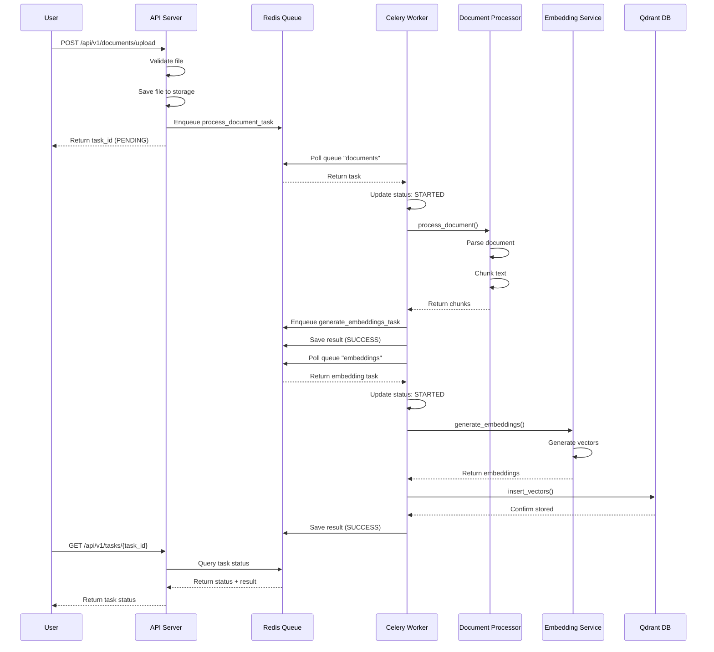

# Task Queue Architecture - RAG System

## Tổng quan

Hệ thống sử dụng **Celery** với **Redis** làm message broker để xử lý các tác vụ nặng (document processing, embedding generation) một cách bất đồng bộ. Điều này cho phép API server trả về response ngay lập tức mà không phải chờ đợi các tác vụ tốn thời gian hoàn thành.

## Kiến trúc tổng thể

```
┌─────────────────────────────────────────────────────────────────┐
│                         RAG System Architecture                  │
└─────────────────────────────────────────────────────────────────┘

┌──────────────┐         ┌──────────────┐         ┌──────────────┐
│   Client     │         │  API Server  │         │    Redis     │
│  (Browser)   │◀───────▶│  (FastAPI)   │────────▶│  (Broker &   │
│              │  HTTP   │              │  Enqueue │   Backend)   │
└──────────────┘         └──────────────┘         └──────────────┘
                                                          ▲
                                                          │
                                                          │ Poll Tasks
                                                          │
                                                          │
                                                  ┌───────┴───────┐
                                                  │ Celery Worker │
                                                  │  (Consumer)   │
                                                  └───────┬───────┘
                                                          │
                                                          │ Execute
                                                          │
                    ┌─────────────────────────────────────┴─────────────────────┐
                    │                                                           │
            ┌───────▼────────┐                                        ┌────────▼────────┐
            │  Document      │                                        │   Embedding     │
            │  Processor     │                                        │    Service      │
            │  Service       │                                        │                 │
            └───────┬────────┘                                        └────────┬────────┘
                    │                                                          │
                    │                                                          │
            ┌───────▼────────┐                                        ┌────────▼────────┐
            │  Storage       │                                        │   Vector Store  │
            │  Manager       │                                        │   (Qdrant)       │
            └────────────────┘                                        └──────────────────┘
```

## Các thành phần chính

### 1. API Server (Producer)

**Vai trò:** Nhận requests từ client và enqueue tasks vào queue

**Location:** `src/api/routes/documents.py`

**Chức năng:**
- Nhận file upload từ user
- Validate file (size, format)
- Lưu file vào storage
- Enqueue task vào Redis queue
- Trả về task ID ngay lập tức (non-blocking)

**Code Example:**
```python
@router.post("/upload", response_model=DocumentUploadTaskResponse)
async def upload_document(
    file: UploadFile,
    collection: str,
    ...
) -> DocumentUploadTaskResponse:
    # 1. Validate file
    validator.validate_document(file.filename, file_size)
    
    # 2. Save file to storage
    storage_path = storage_manager.save_file(content, file.filename, collection)
    
    # 3. Enqueue task (không xử lý trực tiếp)
    task = process_document_task.delay(
        storage_path=str(storage_path),
        collection=collection,
        filename=file.filename,
        ...
    )
    
    # 4. Return immediately với task ID
    return DocumentUploadTaskResponse(
        task_id=task.id,
        status="PENDING",
        message="Document upload queued for processing"
    )
```

### 2. Redis (Message Broker & Result Backend)

**Vai trò:** 
- **Message Broker**: Lưu trữ task queue
- **Result Backend**: Lưu trữ task results và status

**Location:** Docker container `redis:7-alpine`

**Cấu hình:**
```python
# src/core/config.py
class CeleryConfig(BaseSettings):
    broker_url: str = "redis://localhost:6379/0"      # Queue storage
    result_backend: str = "redis://localhost:6379/0"  # Result storage
```

**Queue Structure:**
```
Redis Keys:
├── celery (default queue)
├── documents (document processing queue)
│   ├── task_1: process_document_task(...)
│   ├── task_2: process_document_task(...)
│   └── task_3: process_document_task(...)
│
└── embeddings (embedding generation queue)
    ├── task_4: generate_embeddings_task(...)
    ├── task_5: generate_embeddings_task(...)
    └── task_6: generate_embeddings_task(...)

Result Storage:
├── celery-task-meta-{task_id_1}: {status: "SUCCESS", result: {...}}
├── celery-task-meta-{task_id_2}: {status: "PENDING", ...}
└── celery-task-meta-{task_id_3}: {status: "FAILURE", error: "..."}
```

### 3. Celery Worker (Consumer)

**Vai trò:** Lắng nghe queue và xử lý tasks

**Location:** `src/tasks/celery_app.py` + Docker container `celery-worker`

**Cách khởi động:**
```bash
# Docker Compose (tự động)
docker-compose up celery-worker

# Hoặc manual
celery -A src.tasks.celery_app worker \
    --loglevel=info \
    --queues=documents,embeddings \
    --concurrency=4 \
    --max-tasks-per-child=1000
```

**Thông số:**
- `--queues=documents,embeddings`: Lắng nghe 2 queues
- `--concurrency=4`: 4 worker processes chạy song song
- `--max-tasks-per-child=1000`: Restart worker sau 1000 tasks (tránh memory leak)

**Worker Process Flow:**
```
1. Worker khởi động → Kết nối Redis
2. Worker polling Redis queues (documents, embeddings)
3. Khi có task mới:
   a. Worker idle picks up task
   b. Task status: PENDING → STARTED
   c. Execute task function
   d. Task status: STARTED → SUCCESS/FAILURE
   e. Save result vào Redis backend
4. Worker tiếp tục polling cho task tiếp theo
```

### 4. Task Definitions

#### Document Processing Task

**Location:** `src/tasks/document_tasks.py`

**Queue:** `documents`

**Chức năng:**
- Parse document (PDF, DOCX, TXT, MD)
- Chunk text thành các đoạn nhỏ
- Enqueue embedding generation task

**Code:**
```python
@celery_app.task(
    name="src.tasks.document_tasks.process_document_task",
    bind=True,
    max_retries=3,
    default_retry_delay=60
)
def process_document_task(
    self,
    storage_path: str,
    collection: str,
    filename: str,
    chunk_size: Optional[int] = None,
    chunk_overlap: Optional[int] = None,
    chunker_type: str = "sentence",
    metadata: Optional[Dict[str, Any]] = None
) -> Dict[str, Any]:
    # 1. Initialize processor
    processor = DocumentProcessor(
        chunk_size=chunk_size,
        chunk_overlap=chunk_overlap,
        chunker_type=chunker_type
    )
    
    # 2. Process document (parse + chunk)
    result = processor.process_document(
        filepath=Path(storage_path),
        metadata=metadata
    )
    
    # 3. Prepare chunks for embedding
    chunks_data = [...]
    
    # 4. Enqueue embedding task (chuyển sang queue khác)
    embedding_task = embedding_tasks.generate_embeddings_task.delay(
        chunks_data=chunks_data,
        collection=collection,
        ...
    )
    
    return {
        "success": True,
        "task_id": self.request.id,
        "chunk_count": len(chunks_data),
        "embedding_task_id": embedding_task.id
    }
```

#### Embedding Generation Task

**Location:** `src/tasks/embedding_tasks.py`

**Queue:** `embeddings`

**Chức năng:**
- Generate vector embeddings cho text chunks
- Store embeddings vào Qdrant vector database

**Code:**
```python
@celery_app.task(
    name="src.tasks.embedding_tasks.generate_embeddings_task",
    bind=True,
    max_retries=3,
    default_retry_delay=60
)
def generate_embeddings_task(
    self,
    chunks_data: List[Dict[str, Any]],
    collection: str,
    ...
) -> Dict[str, Any]:
    # 1. Initialize services
    embedding_service = EmbeddingService()
    vector_store = VectorStore()
    
    # 2. Extract chunk texts
    chunk_texts = [chunk["text"] for chunk in chunks_data]
    
    # 3. Generate embeddings (CPU/GPU intensive)
    embeddings = embedding_service.generate_embeddings(
        texts=chunk_texts,
        batch_size=32
    )
    
    # 4. Ensure collection exists
    if not vector_store.collection_exists(collection):
        vector_store.create_collection(
            collection_name=collection,
            dimension=embedding_service.get_dimension()
        )
    
    # 5. Store vectors in Qdrant
    vector_store.insert_vectors(
        collection_name=collection,
        vectors=embeddings,
        payloads=payloads
    )
    
    return {
        "success": True,
        "task_id": self.request.id,
        "vectors_inserted": len(embeddings)
    }
```

## Flow chi tiết: Document Upload

### Sequence Diagram



### Step-by-step Flow

#### Step 1: User Upload Document
```
User → POST /api/v1/documents/upload
Body: {file: document.pdf, collection: "my_collection"}
```

#### Step 2: API Server Processing
```
1. Validate file (size, format)
2. Save file: storage_manager.save_file() → ./data/documents/my_collection/document.pdf
3. Generate document_id: "doc-abc-123"
4. Enqueue task: process_document_task.delay(...)
   → Redis queue "documents"
5. Return response:
   {
     "task_id": "task-xyz-789",
     "document_id": "doc-abc-123",
     "status": "PENDING",
     "message": "Document upload queued for processing"
   }
```

#### Step 3: Celery Worker Picks Up Task
```
Worker polling Redis queue "documents"
→ Found task: task-xyz-789
→ Worker picks up task
→ Update task status: PENDING → STARTED
→ Execute: process_document_task()
```

#### Step 4: Document Processing
```
Worker calls DocumentProcessor.process_document():
1. Parse document (PDF → text)
2. Clean text
3. Chunk text (1000 chars/chunk, 200 overlap)
4. Add metadata to chunks
5. Return: {
     "chunks": [chunk1, chunk2, ...],
     "chunk_count": 150
   }
```

#### Step 5: Enqueue Embedding Task
```
Worker enqueues: generate_embeddings_task.delay(
    chunks_data=[...],
    collection="my_collection",
    ...
)
→ Redis queue "embeddings"
→ embedding_task_id: "task-emb-456"
```

#### Step 6: Worker Processes Embedding Task
```
Worker (hoặc worker khác) polling queue "embeddings"
→ Found task: task-emb-456
→ Execute: generate_embeddings_task()
```

#### Step 7: Embedding Generation
```
1. Load embedding model (sentence-transformers)
2. Generate embeddings cho 150 chunks
   → Batch processing (32 chunks/batch)
   → Result: 150 vectors (384 dimensions each)
3. Ensure Qdrant collection exists
4. Insert vectors vào Qdrant:
   - Vectors: [vector1, vector2, ..., vector150]
   - Payloads: [{metadata1}, {metadata2}, ...]
```

#### Step 8: Task Completion
```
Worker saves result vào Redis:
{
  "success": True,
  "task_id": "task-emb-456",
  "vectors_inserted": 150
}
Task status: STARTED → SUCCESS
```

#### Step 9: User Checks Status
```
User → GET /api/v1/tasks/task-xyz-789
API → Query Redis backend
Redis → Return task status + result
API → Return:
{
  "task_id": "task-xyz-789",
  "status": "SUCCESS",
  "result": {
    "chunk_count": 150,
    "embedding_task_id": "task-emb-456"
  }
}
```

## Task Status Lifecycle

```
PENDING
  │
  ├─ Worker picks up task
  │
  ▼
STARTED
  │
  ├─ Task executing...
  │
  ├─ Success ──────────────► SUCCESS
  │                              │
  │                              └─ Result saved to Redis
  │
  ├─ Failure ──────────────► FAILURE
  │                              │
  │                              └─ Error saved to Redis
  │
  └─ Retry ─────────────────► RETRY
                                  │
                                  └─ Retry after delay
```

**Status Definitions:**
- **PENDING**: Task đã được enqueue, chờ worker xử lý
- **STARTED**: Worker đã bắt đầu xử lý task
- **SUCCESS**: Task hoàn thành thành công
- **FAILURE**: Task thất bại (có thể retry)
- **RETRY**: Task đang được retry sau khi fail
- **REVOKED**: Task bị hủy bởi user

## Queue Routing

**Location:** `src/tasks/celery_app.py`

```python
celery_app.conf.update(
    task_routes={
        "src.tasks.document_tasks.*": {"queue": "documents"},
        "src.tasks.embedding_tasks.*": {"queue": "embeddings"},
    },
    ...
)
```

**Tại sao cần 2 queues riêng biệt?**

1. **documents queue** (I/O intensive):
   - File reading
   - Text parsing
   - Text chunking
   - Có thể scale với nhiều workers (2-4 workers)

2. **embeddings queue** (CPU/GPU intensive):
   - Model inference
   - Vector generation
   - Cần nhiều CPU/GPU hơn
   - Có thể scale độc lập (4-8 workers)

**Lợi ích:**
- Scale độc lập theo resource requirements
- Tránh blocking: embedding tasks không block document tasks
- Priority: Có thể set priority khác nhau cho mỗi queue

## Task Status Tracking API

### Get Task Status

**Endpoint:** `GET /api/v1/tasks/{task_id}`

**Response:**
```json
{
  "task_id": "task-xyz-789",
  "status": "SUCCESS",
  "task_name": "src.tasks.document_tasks.process_document_task",
  "result": {
    "success": true,
    "chunk_count": 150,
    "embedding_task_id": "task-emb-456"
  },
  "error": null,
  "created_at": "2024-01-30T10:00:00Z",
  "started_at": "2024-01-30T10:00:01Z",
  "completed_at": "2024-01-30T10:02:30Z",
  "progress": null,
  "metadata": {}
}
```

### Revoke Task

**Endpoint:** `POST /api/v1/tasks/{task_id}/revoke`

**Response:**
```json
{
  "success": true,
  "task_id": "task-xyz-789",
  "message": "Task revoked successfully"
}
```

### List Active Tasks

**Endpoint:** `GET /api/v1/tasks/?status=STARTED&limit=100`

**Response:**
```json
{
  "tasks": [
    {
      "task_id": "task-1",
      "status": "STARTED",
      "task_name": "src.tasks.document_tasks.process_document_task",
      ...
    },
    ...
  ],
  "total": 5
}
```

## Configuration

### Environment Variables

```bash
# Celery Configuration
CELERY_BROKER_URL=redis://localhost:6379/0
CELERY_RESULT_BACKEND=redis://localhost:6379/0

# Task Settings
CELERY_TASK_TIME_LIMIT=3600        # 1 hour max
CELERY_TASK_SOFT_TIME_LIMIT=3000    # 30 min soft limit
CELERY_WORKER_PREFETCH_MULTIPLIER=4
CELERY_WORKER_MAX_TASKS_PER_CHILD=1000
```

### Docker Compose Configuration

```yaml
# Redis Service
redis:
  image: redis:7-alpine
  ports:
    - "6379:6379"
  volumes:
    - redis_data:/data
  command: redis-server --appendonly yes

# Celery Worker Service
celery-worker:
  build:
    context: ../..
    dockerfile: deployments/docker/Dockerfile
  command: celery -A src.tasks.celery_app worker \
    --loglevel=info \
    --queues=documents,embeddings \
    --concurrency=4
  environment:
    - CELERY_BROKER_URL=redis://redis:6379/0
    - CELERY_RESULT_BACKEND=redis://redis:6379/0
  depends_on:
    - redis
```

## Monitoring & Debugging

### Check Worker Status

```bash
# List active workers
celery -A src.tasks.celery_app inspect active

# List registered tasks
celery -A src.tasks.celery_app inspect registered

# Check worker stats
celery -A src.tasks.celery_app inspect stats
```

### Check Queue Status

```bash
# Connect to Redis
redis-cli

# List all queues
KEYS celery*

# Check queue length
LLEN celery (default queue)
LLEN documents
LLEN embeddings

# View task in queue
LRANGE documents 0 -1
```

### View Task Result

```python
from celery.result import AsyncResult
from src.tasks.celery_app import celery_app

task = AsyncResult('task-id-here', app=celery_app)
print(task.state)      # PENDING, STARTED, SUCCESS, FAILURE
print(task.info)       # Task result
print(task.traceback)  # Error traceback (if failed)
```

## Error Handling & Retry

### Automatic Retry

Tasks tự động retry khi gặp lỗi:

```python
@celery_app.task(
    bind=True,
    max_retries=3,           # Retry tối đa 3 lần
    default_retry_delay=60    # Đợi 60 giây trước khi retry
)
def process_document_task(self, ...):
    try:
        # Process document
        ...
    except Exception as e:
        # Retry on unexpected errors
        raise self.retry(exc=e)
```

### Retry Strategy

1. **First retry**: Sau 60 giây
2. **Second retry**: Sau 120 giây (exponential backoff)
3. **Third retry**: Sau 240 giây
4. **Final failure**: Task status = FAILURE, error saved to Redis

### Error Types

- **DocumentProcessingError**: Không retry (validation errors)
- **EmbeddingError**: Không retry (model errors)
- **VectorStoreError**: Không retry (database errors)
- **Unexpected errors**: Retry 3 lần

## Performance Optimization

### Worker Concurrency

```bash
# CPU-bound tasks (embeddings)
--concurrency=4  # 4 processes

# I/O-bound tasks (documents)
--concurrency=8  # 8 processes (có thể nhiều hơn)
```

### Batch Processing

Embedding generation sử dụng batch processing:

```python
# Process 32 chunks at once
embeddings = embedding_service.generate_embeddings(
    texts=chunk_texts,
    batch_size=32  # Optimize based on GPU memory
)
```

### Prefetch Limit

```python
worker_prefetch_multiplier=4  # Worker prefetch 4 tasks
```

**Lợi ích:**
- Giảm network round-trips
- Tăng throughput

**Nhược điểm:**
- Tasks có thể bị "stuck" nếu worker crash
- Giải pháp: Set `--max-tasks-per-child` để restart workers

## Best Practices

### 1. Task Idempotency

Tasks nên idempotent (chạy nhiều lần cho cùng kết quả):

```python
# Good: Check if already processed
if vector_store.vector_exists(chunk_id):
    return {"skipped": True}

# Process chunk
...
```

### 2. Task Size

- **Small tasks**: Nhanh hơn, dễ retry
- **Large tasks**: Ít overhead, nhưng khó retry

**Recommendation:** Chunk documents thành tasks nhỏ (1 document = 1 task)

### 3. Result Expiration

```python
result_expires=3600  # Results expire after 1 hour
```

**Lý do:** Tránh Redis memory overflow

### 4. Monitoring

- Monitor queue length (nếu queue dài → cần thêm workers)
- Monitor task failure rate
- Monitor worker CPU/memory usage

## Troubleshooting

### Task Stuck in PENDING

**Nguyên nhân:**
- Không có worker đang chạy
- Worker không lắng nghe đúng queue

**Giải pháp:**
```bash
# Check workers
celery -A src.tasks.celery_app inspect active

# Restart worker
docker-compose restart celery-worker
```

### Task Failed

**Check error:**
```python
task = AsyncResult('task-id', app=celery_app)
print(task.traceback)
```

**Common errors:**
- File not found → Check storage path
- Qdrant connection error → Check Qdrant service
- Memory error → Reduce batch_size

### High Memory Usage

**Giải pháp:**
```python
# Restart worker sau 1000 tasks
worker_max_tasks_per_child=1000
```

### Slow Processing

**Nguyên nhân:**
- Không đủ workers
- CPU/GPU bottleneck
- Network latency

**Giải pháp:**
- Tăng `--concurrency`
- Scale workers horizontally
- Optimize batch_size

## Related Documents

- **[C4 Model](02-c4-model.md)** - System architecture overview
- **[Data Flow](04-data-flow.md)** - Data flow diagrams
- **[Sequence Diagrams](05-sequence-diagrams.md)** - Interaction sequences
- **[High-Level Design](03-high-level-design.md)** - Architectural patterns
