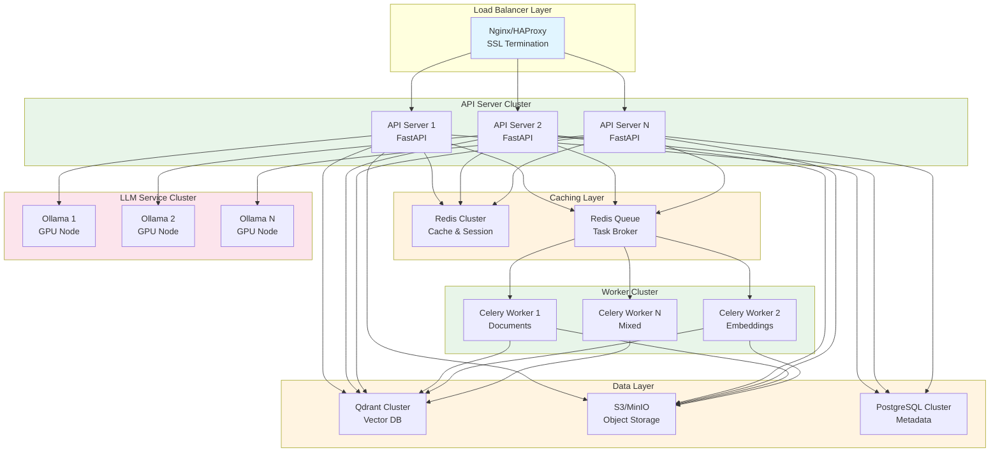
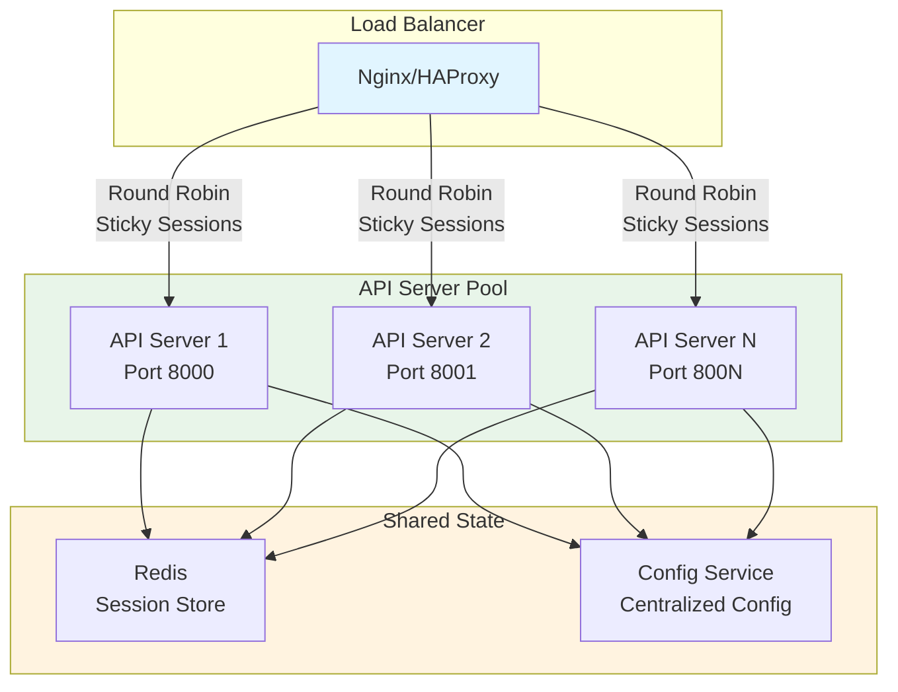
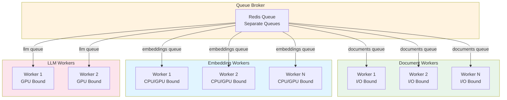
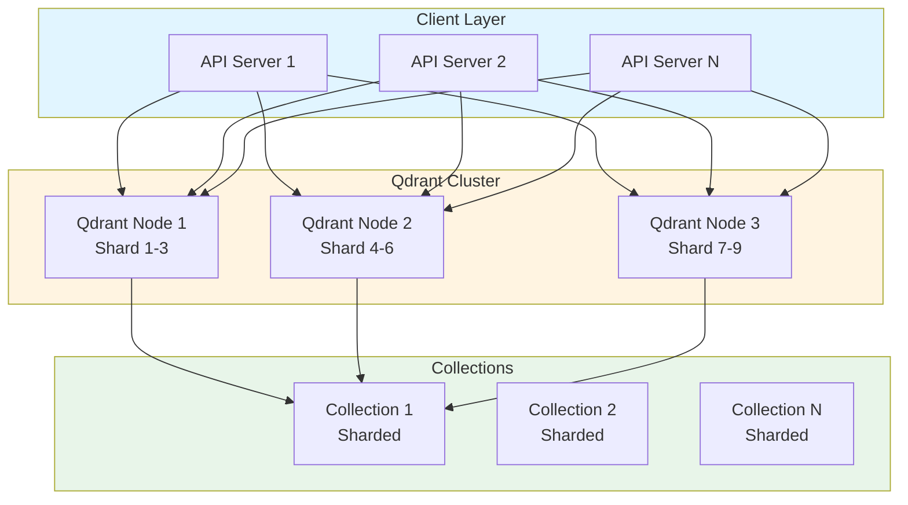
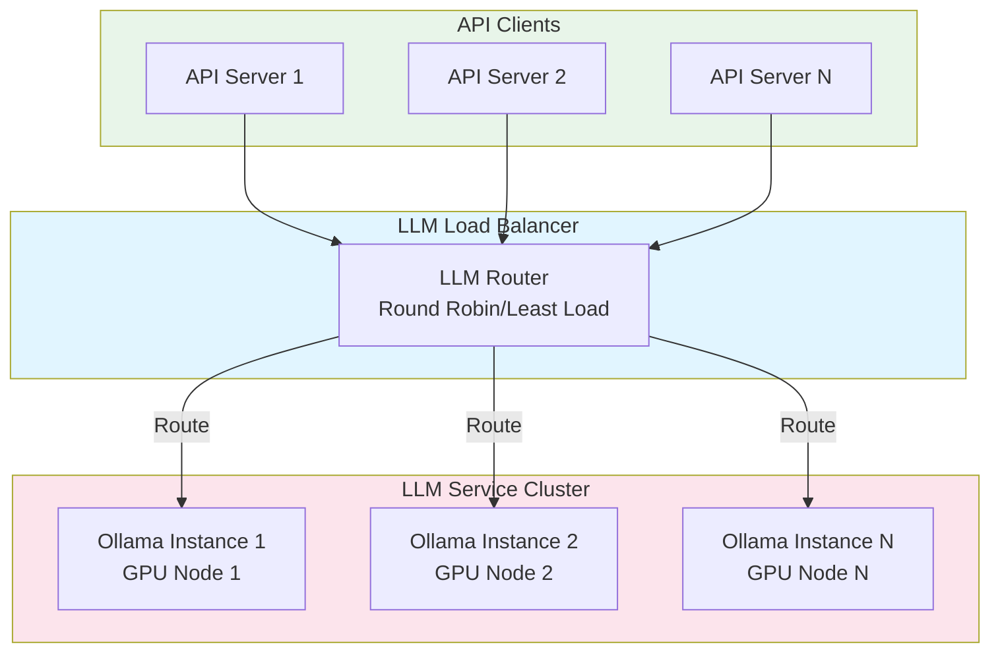
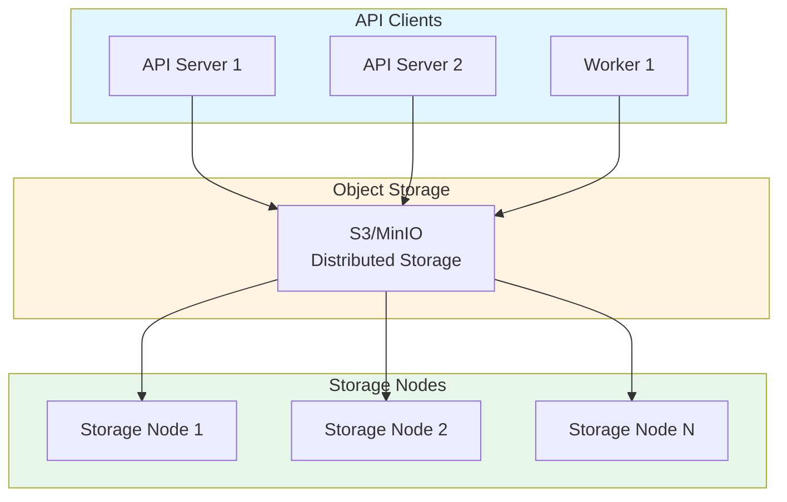
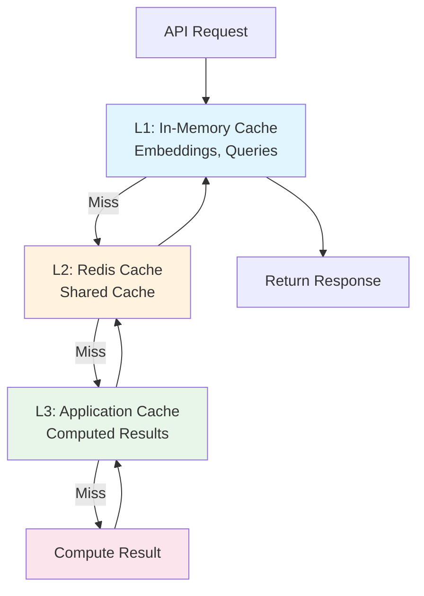
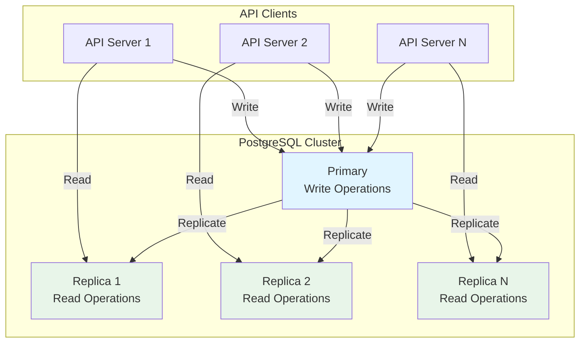
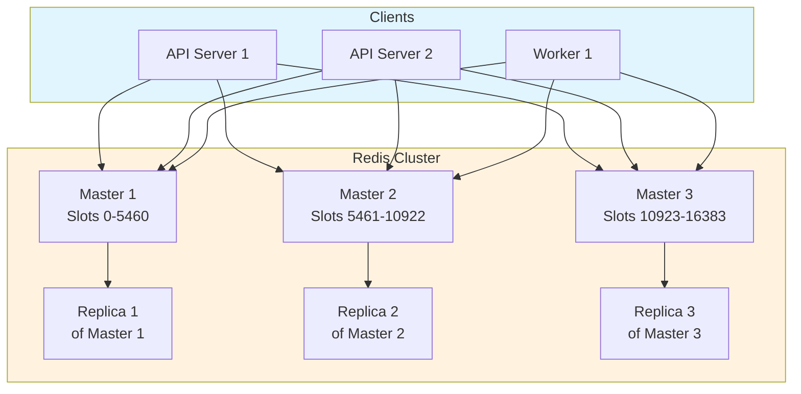
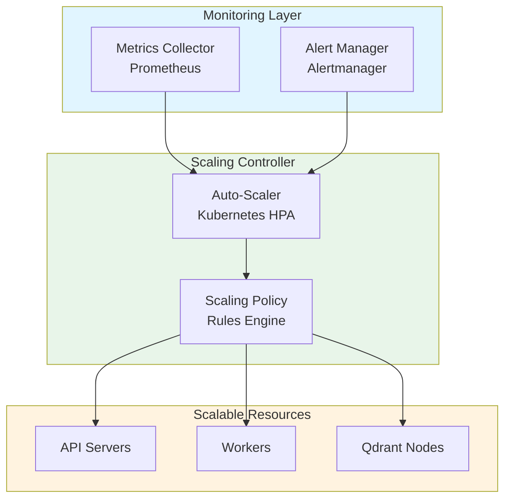

# Scaling Enhancement - RAG System

## Overview

This document describes comprehensive scaling enhancements for the RAG system to support high-throughput, high-availability deployments. The enhancements cover horizontal scaling, performance optimization, resource management, and infrastructure improvements to handle enterprise-scale workloads.

## Table of Contents

1. [Scaling Challenges](#scaling-challenges)
2. [Horizontal Scaling Architecture](#horizontal-scaling-architecture)
3. [Component-Specific Scaling](#component-specific-scaling)
4. [Caching Strategies](#caching-strategies)
5. [Database and Storage Scaling](#database-and-storage-scaling)
6. [Load Balancing and Routing](#load-balancing-and-routing)
7. [Auto-Scaling and Resource Management](#auto-scaling-and-resource-management)
8. [Performance Optimization](#performance-optimization)
9. [Monitoring and Observability](#monitoring-and-observability)
10. [Migration and Rollout Strategy](#migration-and-rollout-strategy)

---

## Scaling Challenges

### Current System Limitations

The current RAG system architecture has several scaling bottlenecks:

1. **Single-Instance API Server**: Limited to single FastAPI instance
2. **Single Qdrant Instance**: No clustering or sharding support
3. **Single Ollama Instance**: LLM inference bottleneck
4. **Limited Worker Scaling**: Celery workers scale manually
5. **No Caching Layer**: Repeated computations for embeddings and queries
6. **Storage Bottlenecks**: Local file system limitations
7. **No Load Balancing**: Single point of failure
8. **Resource Contention**: Shared resources across tenants

### Scaling Goals

- **Throughput**: Support 10,000+ queries per minute
- **Concurrency**: Handle 1,000+ concurrent users
- **Document Volume**: Process 100,000+ documents
- **Availability**: 99.9% uptime (8.76 hours downtime/year)
- **Latency**: P95 query response < 2 seconds
- **Scalability**: Linear scaling with added resources

---

## Horizontal Scaling Architecture

### High-Level Architecture



### Scaling Dimensions

1. **API Servers**: Stateless, horizontally scalable
2. **Workers**: Independent scaling per queue type
3. **Vector Database**: Clustering and sharding
4. **LLM Services**: GPU-based horizontal scaling
5. **Storage**: Distributed object storage
6. **Caching**: Distributed cache cluster

---

## Component-Specific Scaling

### 1. API Server Scaling

#### Architecture



#### Scaling Strategy

**Stateless Design:**
- No local state storage
- Session data in Redis
- Configuration from centralized service
- Shared connection pools

**Load Balancing:**
- Round-robin with health checks
- Sticky sessions for WebSocket connections
- Weighted routing for different instance sizes
- Geographic routing for multi-region

**Configuration:**

```yaml
# docker-compose.scale.yml
services:
  api-server:
    build: .
    deploy:
      replicas: 5
      update_config:
        parallelism: 2
        delay: 10s
      restart_policy:
        condition: on-failure
        max_attempts: 3
    environment:
      - WORKER_PROCESSES=4
      - WORKER_CONNECTIONS=1000
      - MAX_REQUESTS=10000
      - MAX_REQUESTS_JITTER=1000
    healthcheck:
      test: ["CMD", "curl", "-f", "http://localhost:8000/health"]
      interval: 10s
      timeout: 5s
      retries: 3
```

**Performance Tuning:**

```python
# src/core/config.py
class APIScalingConfig:
    # Uvicorn workers
    WORKER_PROCESSES: int = 4  # CPU cores
    
    # Connection pool sizes
    QDRANT_POOL_SIZE: int = 20
    POSTGRES_POOL_SIZE: int = 20
    REDIS_POOL_SIZE: int = 50
    
    # Request limits
    MAX_CONCURRENT_REQUESTS: int = 1000
    REQUEST_TIMEOUT: int = 30
    
    # Keep-alive
    KEEP_ALIVE_TIMEOUT: int = 5
    KEEP_ALIVE_CONNECTIONS: int = 100
```

**Scaling Metrics:**
- Target: 500 requests/second per instance
- CPU utilization: < 70%
- Memory: < 2GB per instance
- Response time: P95 < 200ms

### 2. Task Queue Worker Scaling

#### Architecture



#### Queue-Specific Scaling

**Document Processing Workers:**
- **Type**: I/O-bound (file reading, parsing)
- **Concurrency**: 8-16 processes per worker
- **Scaling**: Scale based on queue length
- **Resources**: 2-4 CPU cores, 4GB RAM

```yaml
celery-worker-documents:
  image: rag-system:latest
  command: celery -A src.tasks.celery_app worker
    --queues=documents
    --concurrency=8
    --max-tasks-per-child=1000
  deploy:
    replicas: 3
  resources:
    limits:
      cpus: '4'
      memory: 4G
```

**Embedding Generation Workers:**
- **Type**: CPU/GPU-bound (model inference)
- **Concurrency**: 2-4 processes per worker (GPU) or 4-8 (CPU)
- **Scaling**: Scale based on queue length and GPU availability
- **Resources**: GPU nodes: 1 GPU, 8GB VRAM, 16GB RAM

```yaml
celery-worker-embeddings:
  image: rag-system:latest
  command: celery -A src.tasks.celery_app worker
    --queues=embeddings
    --concurrency=4
    --max-tasks-per-child=500
  deploy:
    replicas: 5
  resources:
    reservations:
      devices:
        - driver: nvidia
          count: 1
          capabilities: [gpu]
    limits:
      cpus: '8'
      memory: 16G
```

**LLM Workers (Optional):**
- **Type**: GPU-bound (LLM inference)
- **Concurrency**: 1-2 processes per worker
- **Scaling**: Scale based on query queue
- **Resources**: GPU nodes: 1-2 GPUs, 24GB+ VRAM, 32GB RAM

#### Auto-Scaling Workers

```python
# src/core/worker_scaling.py
class WorkerAutoScaler:
    def __init__(self, redis_client, min_workers=2, max_workers=20):
        self.redis = redis_client
        self.min_workers = min_workers
        self.max_workers = max_workers
    
    async def scale_workers(self, queue_name: str):
        """Scale workers based on queue length."""
        queue_length = await self.redis.llen(f"celery:{queue_name}")
        active_workers = await self._count_active_workers(queue_name)
        
        # Calculate desired workers
        if queue_length > active_workers * 10:
            desired = min(
                active_workers + 2,
                self.max_workers
            )
        elif queue_length < active_workers * 2:
            desired = max(
                active_workers - 1,
                self.min_workers
            )
        else:
            desired = active_workers
        
        if desired != active_workers:
            await self._scale_to(queue_name, desired)
```

### 3. Qdrant Vector Database Scaling

#### Clustering Architecture



#### Scaling Strategies

**1. Horizontal Sharding:**
- Distribute collections across multiple nodes
- Shard large collections (>10M vectors)
- Replicate shards for high availability

```python
# src/services/vector_store.py
class VectorStoreService:
    def __init__(self, qdrant_cluster: List[QdrantClient]):
        self.cluster = qdrant_cluster
        self.shard_count = len(qdrant_cluster)
    
    def get_shard(self, collection_name: str, vector_id: str) -> QdrantClient:
        """Route to appropriate shard."""
        shard_index = hash(f"{collection_name}:{vector_id}") % self.shard_count
        return self.cluster[shard_index]
    
    async def search(
        self,
        collection_name: str,
        query_vector: List[float],
        limit: int = 10
    ) -> List[SearchResult]:
        """Search across all shards and merge results."""
        # Parallel search across all shards
        tasks = [
            shard.search(collection_name, query_vector, limit * 2)
            for shard in self.cluster
        ]
        results = await asyncio.gather(*tasks)
        
        # Merge and re-rank
        merged = self._merge_results(results)
        return merged[:limit]
```

**2. Collection-Level Sharding:**
- Separate collections per tenant
- Distribute tenants across nodes
- Isolate high-traffic tenants

**3. Replication:**
- Replicate collections for read scaling
- Primary-replica setup for writes
- Read from replicas, write to primary

```yaml
# Qdrant cluster configuration
qdrant:
  cluster:
    nodes:
      - name: qdrant-1
        host: qdrant-1.internal
        port: 6333
        shards: [0, 1, 2]
        replicas: [3, 4, 5]
      - name: qdrant-2
        host: qdrant-2.internal
        port: 6333
        shards: [3, 4, 5]
        replicas: [0, 1, 2]
      - name: qdrant-3
        host: qdrant-3.internal
        port: 6333
        shards: [6, 7, 8]
        replicas: [0, 1, 2]
```

**4. Performance Tuning:**

```python
# Qdrant collection configuration for scale
collection_config = {
    "vectors": {
        "size": 384,
        "distance": "Cosine"
    },
    "optimizers_config": {
        "default_segment_number": 2,
        "max_optimization_threads": 4,
        "indexing_threshold": 20000
    },
    "hnsw_config": {
        "m": 16,
        "ef_construct": 200,
        "full_scan_threshold": 10000
    },
    "replication_factor": 2,
    "write_consistency_factor": 1
}
```

### 4. LLM Service Scaling

#### Multi-Instance Architecture



#### Scaling Strategy

**1. Model Replication:**
- Deploy same model on multiple GPU nodes
- Load balance requests across instances
- Health check and failover

```python
# src/services/llm_service.py
class LLMService:
    def __init__(self, ollama_endpoints: List[str]):
        self.endpoints = ollama_endpoints
        self.current_index = 0
        self.health_status = {ep: True for ep in ollama_endpoints}
    
    async def generate_response(
        self,
        prompt: str,
        model: str = "llama2"
    ) -> str:
        """Generate response with load balancing."""
        endpoint = self._get_healthy_endpoint()
        
        try:
            response = await self._call_ollama(endpoint, prompt, model)
            return response
        except Exception as e:
            self.health_status[endpoint] = False
            # Retry with next endpoint
            return await self.generate_response(prompt, model)
    
    def _get_healthy_endpoint(self) -> str:
        """Get next healthy endpoint (round-robin)."""
        healthy = [ep for ep, status in self.health_status.items() if status]
        if not healthy:
            # Reset all if all unhealthy
            self.health_status = {ep: True for ep in self.endpoints}
            healthy = self.endpoints
        
        endpoint = healthy[self.current_index % len(healthy)]
        self.current_index += 1
        return endpoint
```

**2. Model Sharding (Large Models):**
- Split model across multiple GPUs
- Use model parallelism
- Coordinate inference across GPUs

**3. Batch Processing:**
- Batch multiple queries together
- Process batch on single GPU
- Reduce per-query overhead

```python
class BatchLLMService:
    async def generate_batch(
        self,
        prompts: List[str],
        model: str = "llama2"
    ) -> List[str]:
        """Process batch of prompts."""
        # Group prompts by endpoint
        batches = self._distribute_prompts(prompts)
        
        # Process in parallel
        tasks = [
            self._process_batch(endpoint, batch, model)
            for endpoint, batch in batches.items()
        ]
        
        results = await asyncio.gather(*tasks)
        return self._flatten_results(results)
```

**4. Resource Allocation:**

```yaml
# Ollama GPU node configuration
ollama-node:
  image: ollama/ollama:latest
  deploy:
    replicas: 3
    placement:
      constraints:
        - node.role == worker
        - node.labels.gpu == "true"
  resources:
    reservations:
      devices:
        - driver: nvidia
          count: 1
          capabilities: [gpu]
    limits:
      cpus: '16'
      memory: 32G
  environment:
    - OLLAMA_NUM_PARALLEL=2
    - OLLAMA_MAX_LOADED_MODELS=2
```

### 5. Storage Scaling

#### Object Storage Architecture



#### Storage Strategy

**1. Object Storage (S3/MinIO):**
- Replace local file system
- Distributed and scalable
- High availability
- Cost-effective

```python
# src/services/storage_manager.py
class StorageManager:
    def __init__(self, s3_client: boto3.client):
        self.s3 = s3_client
        self.bucket = os.getenv("S3_BUCKET")
    
    async def store_document(
        self,
        file_content: bytes,
        tenant_id: str,
        collection: str,
        filename: str
    ) -> str:
        """Store document in S3."""
        key = f"{tenant_id}/{collection}/{filename}"
        
        await self.s3.put_object(
            Bucket=self.bucket,
            Key=key,
            Body=file_content,
            Metadata={
                "tenant_id": tenant_id,
                "collection": collection,
                "uploaded_at": datetime.utcnow().isoformat()
            }
        )
        
        return key
    
    async def get_document(
        self,
        tenant_id: str,
        collection: str,
        filename: str
    ) -> bytes:
        """Retrieve document from S3."""
        key = f"{tenant_id}/{collection}/{filename}"
        
        response = await self.s3.get_object(
            Bucket=self.bucket,
            Key=key
        )
        
        return await response['Body'].read()
```

**2. CDN Integration:**
- Cache frequently accessed documents
- Reduce S3 load
- Lower latency for reads

**3. Lifecycle Policies:**
- Automatic archival to cold storage
- Deletion of old documents
- Cost optimization

```yaml
# S3 lifecycle policy
lifecycle_rules:
  - id: archive-old-documents
    status: Enabled
    transitions:
      - days: 90
        storage_class: GLACIER
      - days: 365
        storage_class: DEEP_ARCHIVE
  - id: delete-very-old
    status: Enabled
    expiration:
      days: 2555  # 7 years
```

---

## Caching Strategies

### Multi-Level Caching Architecture



### Caching Layers

#### 1. Embedding Cache

**Purpose**: Cache computed embeddings to avoid recomputation

```python
# src/services/embedding_service.py
class EmbeddingService:
    def __init__(self, redis_client: Redis):
        self.redis = redis_client
        self.cache_ttl = 86400 * 7  # 7 days
    
    async def generate_embedding(
        self,
        text: str,
        model_name: str = "all-MiniLM-L6-v2"
    ) -> List[float]:
        """Generate embedding with caching."""
        # Generate cache key
        cache_key = f"embedding:{model_name}:{hashlib.sha256(text.encode()).hexdigest()}"
        
        # Check cache
        cached = await self.redis.get(cache_key)
        if cached:
            return json.loads(cached)
        
        # Generate embedding
        embedding = await self._compute_embedding(text, model_name)
        
        # Store in cache
        await self.redis.setex(
            cache_key,
            self.cache_ttl,
            json.dumps(embedding)
        )
        
        return embedding
```

**Cache Strategy:**
- Key: `embedding:{model}:{text_hash}`
- TTL: 7 days (embeddings don't change)
- Size: ~1.5KB per embedding (384 dims)
- Capacity: Millions of embeddings

#### 2. Query Result Cache

**Purpose**: Cache query results for identical queries

```python
# src/services/query_processor.py
class QueryProcessor:
    def __init__(self, redis_client: Redis):
        self.redis = redis_client
        self.cache_ttl = 3600  # 1 hour
    
    async def process_query(
        self,
        query: str,
        collection: str,
        tenant_id: str
    ) -> QueryResult:
        """Process query with caching."""
        # Generate cache key
        cache_key = f"query:{tenant_id}:{collection}:{hashlib.sha256(query.encode()).hexdigest()}"
        
        # Check cache
        cached = await self.redis.get(cache_key)
        if cached:
            return QueryResult.parse_raw(cached)
        
        # Process query
        result = await self._process_query_internal(query, collection, tenant_id)
        
        # Store in cache
        await self.redis.setex(
            cache_key,
            self.cache_ttl,
            result.json()
        )
        
        return result
```

**Cache Strategy:**
- Key: `query:{tenant_id}:{collection}:{query_hash}`
- TTL: 1 hour (configurable)
- Invalidation: On document updates in collection
- Capacity: Thousands of cached queries

#### 3. Vector Search Cache

**Purpose**: Cache vector search results

```python
class VectorStoreService:
    async def search(
        self,
        collection: str,
        query_vector: List[float],
        limit: int = 10
    ) -> List[SearchResult]:
        """Search with result caching."""
        # Generate cache key from query vector
        vector_hash = hashlib.sha256(
            json.dumps(query_vector).encode()
        ).hexdigest()
        cache_key = f"search:{collection}:{limit}:{vector_hash}"
        
        # Check cache
        cached = await self.redis.get(cache_key)
        if cached:
            return [SearchResult.parse_raw(r) for r in json.loads(cached)]
        
        # Perform search
        results = await self._search_internal(collection, query_vector, limit)
        
        # Store in cache
        await self.redis.setex(
            cache_key,
            1800,  # 30 minutes
            json.dumps([r.json() for r in results])
        )
        
        return results
```

#### 4. Model Cache

**Purpose**: Keep loaded models in memory

```python
class ModelCache:
    def __init__(self, max_models: int = 5):
        self.cache: Dict[str, Any] = {}
        self.max_models = max_models
        self.access_times: Dict[str, datetime] = {}
    
    async def get_model(self, model_name: str):
        """Get model from cache or load."""
        if model_name in self.cache:
            self.access_times[model_name] = datetime.utcnow()
            return self.cache[model_name]
        
        # Load model
        model = await self._load_model(model_name)
        
        # Evict if cache full
        if len(self.cache) >= self.max_models:
            await self._evict_lru()
        
        self.cache[model_name] = model
        self.access_times[model_name] = datetime.utcnow()
        
        return model
    
    async def _evict_lru(self):
        """Evict least recently used model."""
        lru_model = min(
            self.access_times.items(),
            key=lambda x: x[1]
        )[0]
        
        del self.cache[lru_model]
        del self.access_times[lru_model]
        # Unload model from memory
        await self._unload_model(lru_model)
```

### Cache Invalidation Strategy

```python
class CacheInvalidator:
    async def invalidate_collection(
        self,
        tenant_id: str,
        collection: str
    ):
        """Invalidate all caches for a collection."""
        # Invalidate query cache
        pattern = f"query:{tenant_id}:{collection}:*"
        keys = await self.redis.keys(pattern)
        if keys:
            await self.redis.delete(*keys)
        
        # Invalidate search cache
        pattern = f"search:{collection}:*"
        keys = await self.redis.keys(pattern)
        if keys:
            await self.redis.delete(*keys)
    
    async def invalidate_document(
        self,
        tenant_id: str,
        collection: str,
        document_id: str
    ):
        """Invalidate caches for a document."""
        await self.invalidate_collection(tenant_id, collection)
```

---

## Database and Storage Scaling

### PostgreSQL Scaling

#### Read Replicas



#### Connection Pooling

```python
# src/core/database.py
from sqlalchemy import create_engine
from sqlalchemy.pool import QueuePool

# Primary (write) connection
write_engine = create_engine(
    DATABASE_URL,
    poolclass=QueuePool,
    pool_size=20,
    max_overflow=10,
    pool_pre_ping=True
)

# Read replica connections
read_engines = [
    create_engine(
        replica_url,
        poolclass=QueuePool,
        pool_size=10,
        max_overflow=5,
        pool_pre_ping=True
    )
    for replica_url in READ_REPLICA_URLS
]

class DatabaseRouter:
    def get_connection(self, read_only: bool = False):
        """Route to appropriate database."""
        if read_only:
            # Round-robin read replicas
            return read_engines[self._get_replica_index()]
        else:
            return write_engine
```

#### Sharding Strategy

```python
class TenantSharding:
    def __init__(self, shard_configs: List[Dict]):
        self.shards = shard_configs
        self.shard_count = len(shard_configs)
    
    def get_shard(self, tenant_id: str) -> str:
        """Route tenant to shard."""
        shard_index = hash(tenant_id) % self.shard_count
        return self.shards[shard_index]['url']
    
    async def query_tenant(
        self,
        tenant_id: str,
        query: str
    ):
        """Query tenant-specific shard."""
        shard_url = self.get_shard(tenant_id)
        engine = create_engine(shard_url)
        return await engine.execute(query)
```

### Redis Cluster Scaling

#### Redis Cluster Architecture



#### Redis Configuration

```yaml
# Redis cluster configuration
redis-cluster:
  nodes:
    - host: redis-1
      port: 6379
      role: master
      slots: [0-5460]
    - host: redis-2
      port: 6379
      role: master
      slots: [5461-10922]
    - host: redis-3
      port: 6379
      role: master
      slots: [10923-16383]
    - host: redis-4
      port: 6379
      role: replica
      master: redis-1
    - host: redis-5
      port: 6379
      role: replica
      master: redis-2
    - host: redis-6
      port: 6379
      role: replica
      master: redis-3
```

---

## Load Balancing and Routing

### Load Balancer Configuration

#### Nginx Configuration

```nginx
# nginx.conf
upstream api_servers {
    least_conn;  # Use least connections algorithm
    server api-1:8000 max_fails=3 fail_timeout=30s;
    server api-2:8000 max_fails=3 fail_timeout=30s;
    server api-3:8000 max_fails=3 fail_timeout=30s;
    server api-4:8000 max_fails=3 fail_timeout=30s;
    server api-5:8000 max_fails=3 fail_timeout=30s;
    
    keepalive 32;
}

server {
    listen 80;
    server_name api.rag-system.com;
    
    # Rate limiting
    limit_req_zone $binary_remote_addr zone=api_limit:10m rate=100r/s;
    limit_req zone=api_limit burst=20 nodelay;
    
    # Health check endpoint
    location /health {
        access_log off;
        proxy_pass http://api_servers;
    }
    
    # API endpoints
    location /api/ {
        proxy_pass http://api_servers;
        proxy_set_header Host $host;
        proxy_set_header X-Real-IP $remote_addr;
        proxy_set_header X-Forwarded-For $proxy_add_x_forwarded_for;
        proxy_set_header X-Forwarded-Proto $scheme;
        
        # Timeouts
        proxy_connect_timeout 5s;
        proxy_send_timeout 30s;
        proxy_read_timeout 30s;
        
        # Keep-alive
        proxy_http_version 1.1;
        proxy_set_header Connection "";
    }
    
    # WebSocket support
    location /ws/ {
        proxy_pass http://api_servers;
        proxy_http_version 1.1;
        proxy_set_header Upgrade $http_upgrade;
        proxy_set_header Connection "upgrade";
        proxy_read_timeout 3600s;
    }
}
```

#### HAProxy Configuration

```haproxy
# haproxy.cfg
global
    maxconn 10000
    log stdout format raw local0

defaults
    mode http
    timeout connect 5s
    timeout client 30s
    timeout server 30s
    option httplog

frontend api_frontend
    bind *:80
    default_backend api_backend
    
    # Rate limiting
    stick-table type ip size 100k expire 1h store http_req_rate(10s)
    http-request track-sc0 src
    http-request deny if { sc_http_req_rate(0) gt 100 }

backend api_backend
    balance leastconn
    option httpchk GET /health
    
    server api-1 api-1:8000 check inter 5s fall 3 rise 2
    server api-2 api-2:8000 check inter 5s fall 3 rise 2
    server api-3 api-3:8000 check inter 5s fall 3 rise 2
    server api-4 api-4:8000 check inter 5s fall 3 rise 2
    server api-5 api-5:8000 check inter 5s fall 3 rise 2
```

### Routing Strategies

#### 1. Round-Robin
- Distribute requests evenly
- Simple and fair
- No state required

#### 2. Least Connections
- Route to server with fewest active connections
- Better for long-lived connections
- Handles varying request durations

#### 3. Weighted Routing
- Assign weights based on server capacity
- Route more traffic to powerful servers
- Useful for heterogeneous clusters

#### 4. Geographic Routing
- Route based on client location
- Reduce latency
- Multi-region deployments

#### 5. Sticky Sessions
- Route same client to same server
- Required for WebSocket connections
- Session affinity

---

## Auto-Scaling and Resource Management

### Auto-Scaling Architecture



### Kubernetes Horizontal Pod Autoscaler (HPA)

```yaml
# api-server-hpa.yaml
apiVersion: autoscaling/v2
kind: HorizontalPodAutoscaler
metadata:
  name: api-server-hpa
spec:
  scaleTargetRef:
    apiVersion: apps/v1
    kind: Deployment
    name: api-server
  minReplicas: 3
  maxReplicas: 20
  metrics:
    - type: Resource
      resource:
        name: cpu
        target:
          type: Utilization
          averageUtilization: 70
    - type: Resource
      resource:
        name: memory
        target:
          type: Utilization
          averageUtilization: 80
    - type: Pods
      pods:
        metric:
          name: http_requests_per_second
        target:
          type: AverageValue
          averageValue: "500"
  behavior:
    scaleDown:
      stabilizationWindowSeconds: 300
      policies:
        - type: Percent
          value: 50
          periodSeconds: 60
    scaleUp:
      stabilizationWindowSeconds: 0
      policies:
        - type: Percent
          value: 100
          periodSeconds: 30
        - type: Pods
          value: 2
          periodSeconds: 30
      selectPolicy: Max
```

### Custom Metrics for Scaling

```python
# src/core/metrics.py
from prometheus_client import Counter, Gauge, Histogram

# Queue length metrics
queue_length = Gauge(
    'celery_queue_length',
    'Number of tasks in queue',
    ['queue_name']
)

# Request rate metrics
request_rate = Counter(
    'api_requests_total',
    'Total API requests',
    ['endpoint', 'method', 'status']
)

# Response time metrics
response_time = Histogram(
    'api_response_time_seconds',
    'API response time',
    ['endpoint']
)

# Worker utilization
worker_utilization = Gauge(
    'celery_worker_utilization',
    'Worker CPU utilization',
    ['worker_name', 'queue']
)
```

### Scaling Policies

```python
# src/core/scaling_policy.py
class ScalingPolicy:
    def __init__(self):
        self.rules = {
            'api_servers': {
                'scale_up': {
                    'cpu_threshold': 70,
                    'memory_threshold': 80,
                    'request_rate_threshold': 500,
                    'min_replicas': 3,
                    'max_replicas': 20
                },
                'scale_down': {
                    'cpu_threshold': 30,
                    'memory_threshold': 40,
                    'request_rate_threshold': 100,
                    'cooldown_seconds': 300
                }
            },
            'embedding_workers': {
                'scale_up': {
                    'queue_length_threshold': 100,
                    'worker_utilization_threshold': 80,
                    'min_replicas': 2,
                    'max_replicas': 10
                },
                'scale_down': {
                    'queue_length_threshold': 10,
                    'worker_utilization_threshold': 20,
                    'cooldown_seconds': 600
                }
            }
        }
    
    def should_scale_up(self, resource_type: str, metrics: Dict) -> bool:
        """Check if resource should scale up."""
        rule = self.rules[resource_type]['scale_up']
        
        return (
            metrics['cpu'] > rule['cpu_threshold'] or
            metrics['memory'] > rule['memory_threshold'] or
            metrics.get('queue_length', 0) > rule.get('queue_length_threshold', float('inf'))
        )
    
    def should_scale_down(self, resource_type: str, metrics: Dict) -> bool:
        """Check if resource should scale down."""
        rule = self.rules[resource_type]['scale_down']
        
        return (
            metrics['cpu'] < rule['cpu_threshold'] and
            metrics['memory'] < rule['memory_threshold'] and
            metrics.get('queue_length', 0) < rule.get('queue_length_threshold', 0)
        )
```

---

## Performance Optimization

### 1. Connection Pooling

```python
# src/core/pooling.py
from sqlalchemy.pool import QueuePool
import aioredis
from qdrant_client import QdrantClient

# Database connection pool
db_pool = QueuePool(
    create_engine(DATABASE_URL),
    pool_size=20,
    max_overflow=10,
    pool_pre_ping=True,
    pool_recycle=3600
)

# Redis connection pool
redis_pool = aioredis.ConnectionPool.from_url(
    REDIS_URL,
    max_connections=50,
    retry_on_timeout=True
)

# Qdrant client with connection pooling
qdrant_client = QdrantClient(
    url=QDRANT_URL,
    timeout=10,
    prefer_grpc=True  # Use gRPC for better performance
)
```

### 2. Async Processing

```python
# src/api/routes/query.py
@router.post("/query")
async def query_documents(
    request: QueryRequest,
    background_tasks: BackgroundTasks
):
    """Process query asynchronously."""
    # Start processing
    task_id = await query_processor.process_async(request)
    
    # Return task ID immediately
    return {"task_id": task_id, "status": "processing"}
    
    # Or stream results
    async def generate():
        async for chunk in query_processor.process_stream(request):
            yield chunk
    
    return StreamingResponse(generate(), media_type="text/event-stream")
```

### 3. Batch Processing

```python
# Batch embedding generation
async def generate_embeddings_batch(
    texts: List[str],
    batch_size: int = 32
) -> List[List[float]]:
    """Generate embeddings in batches."""
    embeddings = []
    
    for i in range(0, len(texts), batch_size):
        batch = texts[i:i + batch_size]
        batch_embeddings = await embedding_model.encode(batch)
        embeddings.extend(batch_embeddings)
    
    return embeddings
```

### 4. Parallel Processing

```python
# Parallel vector searches
async def search_multiple_collections(
    query_vector: List[float],
    collections: List[str],
    limit: int = 10
) -> Dict[str, List[SearchResult]]:
    """Search multiple collections in parallel."""
    tasks = [
        vector_store.search(collection, query_vector, limit)
        for collection in collections
    ]
    
    results = await asyncio.gather(*tasks)
    
    return dict(zip(collections, results))
```

### 5. Query Optimization

```python
# Optimized vector search
async def optimized_search(
    collection: str,
    query_vector: List[float],
    limit: int = 10,
    filters: Optional[Dict] = None
) -> List[SearchResult]:
    """Optimized search with filtering."""
    # Use HNSW index for fast approximate search
    search_params = {
        "hnsw_ef": 128,  # Higher = more accurate, slower
        "exact": False   # Use approximate search
    }
    
    # Apply filters at vector store level
    query_filter = None
    if filters:
        query_filter = {
            "must": [
                {"key": key, "match": {"value": value}}
                for key, value in filters.items()
            ]
        }
    
    results = await qdrant_client.search(
        collection_name=collection,
        query_vector=query_vector,
        limit=limit,
        query_filter=query_filter,
        search_params=search_params
    )
    
    return results
```

---

## Monitoring and Observability

### Metrics Collection

#### Key Metrics

1. **API Metrics:**
   - Request rate (requests/second)
   - Response time (p50, p95, p99)
   - Error rate (4xx, 5xx)
   - Active connections

2. **Worker Metrics:**
   - Queue length
   - Task processing rate
   - Task duration
   - Worker utilization

3. **Database Metrics:**
   - Query latency
   - Connection pool usage
   - Slow queries
   - Replication lag

4. **Vector Store Metrics:**
   - Search latency
   - Index size
   - Collection size
   - Query throughput

5. **LLM Metrics:**
   - Generation latency
   - Tokens per second
   - Model loading time
   - Queue wait time

#### Prometheus Configuration

```yaml
# prometheus.yml
global:
  scrape_interval: 15s
  evaluation_interval: 15s

scrape_configs:
  - job_name: 'api-servers'
    kubernetes_sd_configs:
      - role: pod
    relabel_configs:
      - source_labels: [__meta_kubernetes_pod_label_app]
        regex: api-server
        action: keep
  
  - job_name: 'celery-workers'
    kubernetes_sd_configs:
      - role: pod
    relabel_configs:
      - source_labels: [__meta_kubernetes_pod_label_app]
        regex: celery-worker
        action: keep
  
  - job_name: 'qdrant'
    static_configs:
      - targets: ['qdrant-1:6333', 'qdrant-2:6333', 'qdrant-3:6333']
  
  - job_name: 'postgres'
    static_configs:
      - targets: ['postgres-exporter:9187']
```

### Logging Strategy

```python
# src/core/logging.py
import structlog
import json

logger = structlog.get_logger()

# Structured logging
logger.info(
    "query_processed",
    query_id=query_id,
    tenant_id=tenant_id,
    collection=collection,
    response_time_ms=response_time,
    documents_retrieved=doc_count,
    llm_tokens=tokens_used
)
```

### Distributed Tracing

```python
# src/core/tracing.py
from opentelemetry import trace
from opentelemetry.exporter.jaeger import JaegerExporter
from opentelemetry.sdk.trace import TracerProvider
from opentelemetry.sdk.trace.export import BatchSpanProcessor

# Setup tracing
trace.set_tracer_provider(TracerProvider())
jaeger_exporter = JaegerExporter(
    agent_host_name="jaeger",
    agent_port=6831
)
trace.get_tracer_provider().add_span_processor(
    BatchSpanProcessor(jaeger_exporter)
)

tracer = trace.get_tracer(__name__)

# Use in code
@tracer.start_as_current_span("process_query")
async def process_query(query: str):
    with tracer.start_as_current_span("generate_embedding"):
        embedding = await generate_embedding(query)
    
    with tracer.start_as_current_span("vector_search"):
        results = await vector_search(embedding)
    
    with tracer.start_as_current_span("llm_generation"):
        response = await llm_generate(results)
    
    return response
```

### Alerting Rules

```yaml
# alerts.yml
groups:
  - name: api_alerts
    rules:
      - alert: HighErrorRate
        expr: rate(api_requests_total{status=~"5.."}[5m]) > 0.05
        for: 5m
        annotations:
          summary: "High error rate detected"
      
      - alert: HighLatency
        expr: histogram_quantile(0.95, api_response_time_seconds) > 2
        for: 5m
        annotations:
          summary: "P95 latency exceeds 2 seconds"
  
  - name: worker_alerts
    rules:
      - alert: LongQueue
        expr: celery_queue_length > 1000
        for: 10m
        annotations:
          summary: "Queue length exceeds 1000 tasks"
      
      - alert: WorkerDown
        expr: up{job="celery-workers"} == 0
        for: 1m
        annotations:
          summary: "Celery worker is down"
  
  - name: database_alerts
    rules:
      - alert: HighReplicationLag
        expr: postgresql_replication_lag > 10
        for: 5m
        annotations:
          summary: "PostgreSQL replication lag is high"
```

---

## Migration and Rollout Strategy

### Phased Rollout Plan

#### Phase 1: Infrastructure Preparation (Week 1-2)

1. **Setup Load Balancer**
   - Deploy Nginx/HAProxy
   - Configure health checks
   - Setup SSL certificates

2. **Deploy Redis Cluster**
   - Setup Redis cluster
   - Migrate existing Redis data
   - Test failover

3. **Setup Object Storage**
   - Deploy S3/MinIO
   - Migrate documents
   - Update storage manager

#### Phase 2: API Server Scaling (Week 3-4)

1. **Deploy Multiple API Instances**
   - Start with 2-3 instances
   - Test load balancing
   - Monitor performance

2. **Session Management**
   - Move sessions to Redis
   - Test session persistence
   - Verify sticky sessions

3. **Gradual Traffic Migration**
   - Route 10% traffic to new instances
   - Monitor for issues
   - Gradually increase to 100%

#### Phase 3: Worker Scaling (Week 5-6)

1. **Scale Document Workers**
   - Add 2-3 document workers
   - Monitor queue length
   - Adjust concurrency

2. **Scale Embedding Workers**
   - Add GPU-enabled workers
   - Test batch processing
   - Optimize batch sizes

3. **Auto-Scaling Setup**
   - Configure HPA
   - Test scaling policies
   - Fine-tune thresholds

#### Phase 4: Database Scaling (Week 7-8)

1. **PostgreSQL Read Replicas**
   - Setup read replicas
   - Update connection routing
   - Test read/write separation

2. **Qdrant Clustering**
   - Setup Qdrant cluster
   - Migrate collections
   - Test sharding

3. **Performance Testing**
   - Load testing
   - Stress testing
   - Performance benchmarking

#### Phase 5: Optimization (Week 9-10)

1. **Caching Implementation**
   - Deploy Redis cache
   - Implement caching layers
   - Monitor cache hit rates

2. **Performance Tuning**
   - Optimize queries
   - Tune connection pools
   - Adjust batch sizes

3. **Monitoring Setup**
   - Deploy Prometheus/Grafana
   - Setup alerts
   - Create dashboards

### Rollback Plan

1. **Traffic Rollback**
   - Route traffic back to single instance
   - Keep new infrastructure running
   - Investigate issues

2. **Data Rollback**
   - Restore from backups
   - Verify data consistency
   - Re-run migration if needed

3. **Configuration Rollback**
   - Revert configuration changes
   - Restore previous settings
   - Test functionality

### Success Criteria

- **Performance:**
  - P95 latency < 2 seconds
  - Throughput > 1000 requests/second
  - Error rate < 0.1%

- **Availability:**
  - Uptime > 99.9%
  - Zero data loss
  - Graceful degradation

- **Scalability:**
  - Linear scaling with resources
  - Auto-scaling working correctly
  - Resource utilization optimized

---

## Summary

This scaling enhancement document provides comprehensive strategies for scaling the RAG system:

### Key Enhancements

1. **Horizontal Scaling:**
   - Multiple API server instances
   - Worker clusters with queue-specific scaling
   - Qdrant clustering and sharding
   - Multi-instance LLM services

2. **Caching:**
   - Multi-level caching architecture
   - Embedding, query, and result caching
   - Intelligent cache invalidation

3. **Storage:**
   - Object storage (S3/MinIO)
   - Database read replicas
   - Distributed file systems

4. **Load Balancing:**
   - Nginx/HAProxy configuration
   - Multiple routing strategies
   - Health checks and failover

5. **Auto-Scaling:**
   - Kubernetes HPA
   - Custom scaling policies
   - Resource-based scaling

6. **Performance:**
   - Connection pooling
   - Async processing
   - Batch and parallel operations
   - Query optimization

7. **Monitoring:**
   - Comprehensive metrics
   - Distributed tracing
   - Alerting and observability

### Expected Outcomes

- **10x+ throughput increase**
- **99.9% availability**
- **Sub-2 second P95 latency**
- **Linear scalability**
- **Cost-effective resource utilization**

### Next Steps

1. Review and approve scaling plan
2. Setup development/staging environment
3. Begin phased rollout
4. Monitor and optimize
5. Document lessons learned

---

## Related Documents

- **[Basic Design](01-basic-design.md)** - Core system architecture
- **[C4 Model](02-c4-model.md)** - System architecture diagrams
- **[High-Level Design](03-high-level-design.md)** - Design patterns
- **[Task Queue Architecture](12-task-queue-architecture.md)** - Background processing
- **[Multi-tenancy](11-multi-tenancy-access-control.md)** - Multi-tenant support
